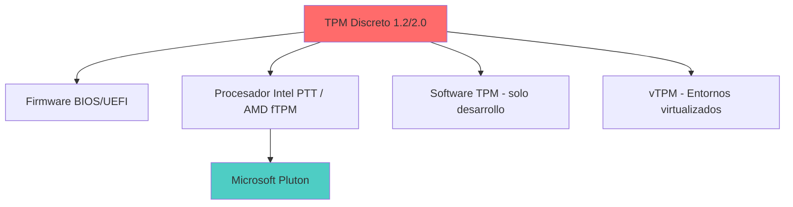
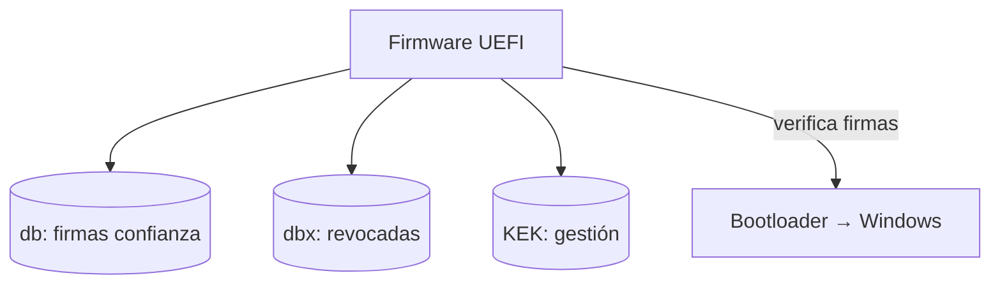
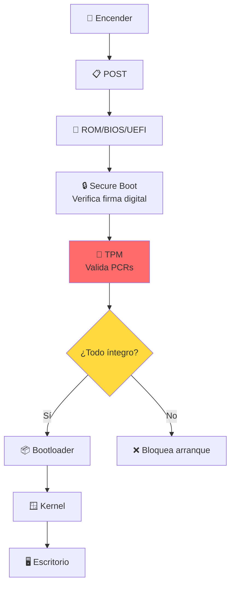
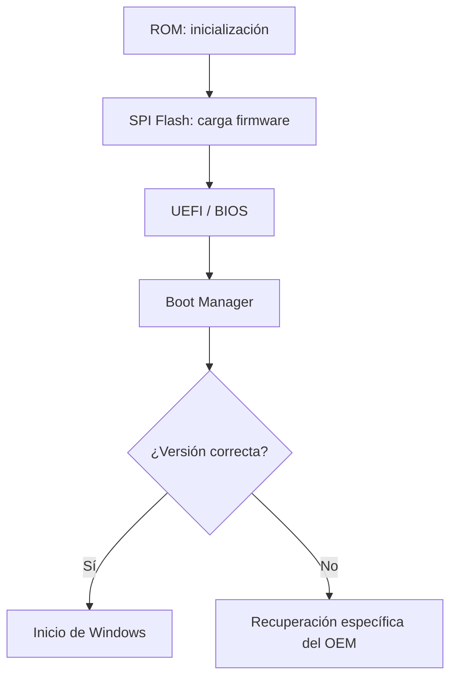
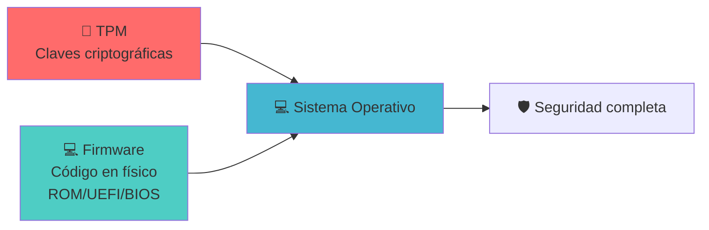
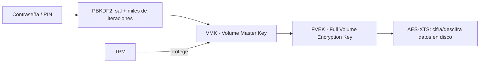

# 🔐 TPM — Trusted Platform Module

> [!info] Módulo
> **Clase 2** — TPM y Sistemas de Archivos  
> **Tema:** Trusted Platform Module  
> **Ver también:** [[02-Sistemas-de-Archivos|💾 Sistemas de archivos]], [[03-Arranque-y-Seguridad|🛡️ Arranque y seguridad]]

> [!tip] Prerrequisitos
> - Conceptos básicos de hardware
> - Qué es un sistema operativo
> - Conceptos básicos de criptografía (opcional)

---

## 📋 Tabla de contenidos

- [[#¿Qué-es-el-TPM]]
- [[#Funciones-principales]]
- [[#Implementaciones-físicas]]
- [[#Flujo-de-arranque-con-TPM-+-Secure-Boot]]
- [[#BitLocker-y-TPM]]
- [[#Criptografía-conceptos-clave]]
- [[#Los-3-pilares-de-la-seguridad-del-sistema]]
- [[#Preguntas-frecuentes]]

---

## ¿Qué es el TPM?

> [!info] Ejemplo: Cifrado por sustitución
> El profesor usó un ejemplo simple para explicar **cifrado reversible** con 10 vocales (5 minúsculas + 5 mayúsculas):
>
> ```
> TABLA DE SUSTITUCIÓN (la "llave")
>  Minúsculas: a→0  e→1  i→2  o→3  u→4
>  Mayúsculas: A→5  E→6  I→7  O→8  U→9
> 
> Texto plano:  "Hola Mundo"
> Texto cifrado: "H8l3 M5nd8"
> 
> Verificación: Si hay una vocal donde debería haber un número,
> o viceversa, significa que el texto fue alterado.
> ```
>
> **Integridad:** Si alguien modifica el texto cifrado, al intentar descifrarlo aparecen caracteres que no corresponden a vocales → sabemos que fue alterado.

---

## Implementaciones físicas



| Tipo | Ubicación | Ejemplo | Seguridad |
|------|-----------|---------|-----------|
| **Discreto 1.2/2.0** | Chip en motherboard | STMicroelectronics, Infineon | Alta |
| **Firmware** | Dentro del BIOS/UEFI | fTPM de AMD, PTT de Intel | Media-Alta |
| **Procesador** | Dentro del CPU | Intel Pluton (Surface, Azure) | Alta |
| **Software** | Emulado por SO | TPM 2.0 de Windows | Baja (solo desarrollo) |
| **vTPM** | Dentro de VM | Hyper-V, VMware, QEMU | Media |

> [!info] Captura del profesor: TPM físico
> La diapositiva "Físicamente" muestra dos fotos de hardware real, lado a lado:
> - **Izquierda, etiquetada "TPN Integrado"** (TPM integrado): una placa pequeña
>   suelta con un chip cuadrado central, tornillos/pines dorados, marcada
>   "MADE IN CHINA".
> - **Derecha, etiquetada "TPM Discreto"**: una esquina de motherboard mostrando
>   un chip TPM soldado junto a los puertos USB (etiquetados "USB910"/"USB1112"
>   en la placa), con un pin-header de 20 pines cerca — el punto de conexión
>   físico para un módulo TPM discreto add-on.

> [!warning] Nota histórica
> Intel Pluton y AMD fTPM surgieron como respuesta a vulnerabilidades encontradas en implementaciones anteriores de TPM discreto, donde se detectaron canales de comunicación entre el TPM y otros componentes que podían ser explotados.

---

## TCG y arranque seguro (Secure Boot)

**TCG (Trusted Computing Group):** consorcio de 200+ empresas (IBM, HP, AMD, Microsoft, Intel, Lenovo, Cisco…) que define especificaciones abiertas de *Computación confiable*. Creado en 2003 como sucesor del TCPA (1999). Establece **perfiles (PPP)** que configuran el comportamiento del TPM según el sistema.

### Bases de datos de Secure Boot (en NV-RAM del firmware)
- **db** (signature database): firmas/claves de confianza del OEM.
- **dbx** (revoked): firmas revocadas (claves comprometidas).
- **KEK** (Key Exchange Key): clave para administrar db/dbx.



### Protección de memoria (kernel)
- **Integridad de memoria / aislamiento del kernel:** revisar controladores incompatibles en memoria.
- **Protección de acceso a memoria (IOMMU):** evita ataques DMA por puertos Thunderbolt / USB4 / CFexpress.
- **Lista de bloqueo de controladores vulnerables** (desde Windows 11 2022): drivers con vulnerabilidades conocidas o firmados con certificados usados para malware.

> [!warning] Nota
> La protección contra DMA de kernel **no** cubre 1394/FireWire, PCMCIA ni CardBus/ExpressCard.

---

## Flujo de arranque con TPM + Secure Boot



### ¿Qué son los PCRs?

> [!info] Platform Configuration Registers
> Registros dentro del TPM que almacenan **mediciones hash** de cada componente del arranque:
>
> | PCR | Componente |
> |-----|-----------|
> | 0 | Firmware (BIOS/UEFI) |
> | 2 | Opciones de firmware |
> | 4 | MBR / Bootloader |
> | 8 | Sistema operativo |

> Si cualquiera de estos valores cambia (por un virus o modificación), el TPM lo detecta.

---

## Características de Windows que usan el TPM

Varias funciones de Windows dependen del TPM. La tabla resume qué características lo requieren y su compatibilidad:

| Característica | ¿Requiere TPM? | TPM 1.2 | TPM 2.0 |
|---|---|---|---|
| Arranque medido (Measured Boot) | Sí | ✓ | ✓ |
| Cifrado de dispositivo / BitLocker | Sí | ✓ | ✓ |
| Device Encryption automática | Sí | — | ✓ |
| Credential Guard | Sí | — | ✓ |
| Windows Hello (biometría / PIN) | Sí (recomendado) | — | ✓ |
| Secure Boot | No (es del firmware) | — | — |

> [!note] TPM 2.0
> Es el requisito base de Windows 11; muchas funciones de seguridad modernas solo funcionan con 2.0.

### Flujo de carga del firmware



---

## BitLocker y TPM

```
CIFRADO DE DISCO CON BITLOCKER
━━━━━━━━━━━━━━━━━━━━━━━━━━━━━━━━━━━━━━━━━━━━━━━━━

  TPM genera clave maestra
           │
           ├──► Guarda clave en el chip TPM
           │
           ├──► Cifra disco con AES-256
           │
           └──► Si cambias hardware crítico:
                     │
                     ▼
               TPM detecta cambio
                     │
                     ▼
               Pide clave de recuperación
                     │
          ┌──────────┴──────────┐
          ▼                     ▼
    Cuenta Microsoft      Clave local / USB
    (si la asociaste)     (impresa o guardada)
```

### Configuración en Windows

> [!tip] Ruta
> `Configuración → Privacidad y seguridad → Seguridad de dispositivos → Procesador de seguridad`

Allí puedes ver:
- Fabricante (ej. STMicroelectronics)
- Versión del TPM
- Cumplimiento TCG
- Estado (activo/inactivo)

> [!info] Captura del profesor: "Detalles del procesador de seguridad"
> La pantalla de **Seguridad de Windows → Seguridad del dispositivo → Procesador de
> seguridad → Detalles del procesador de seguridad** muestra, en el ejemplo de la
> diapositiva:
>
> | Campo | Valor de ejemplo |
> |---|---|
> | **Fabricante** | Nuvoton Technology (NTC) |
> | **Versión del fabricante** | 7.2.1.0 |
> | **Versión de especificación** | 2.0 |
> | **Versión de especificación de PPP** (Platform Profile Parameters) | 1.3 |
> | **Subversión de la especificación del TPM** | 1.38 (lunes 8 enero 2018) |
> | **Versión del cliente del equipo** | 1.03 |
> | **Atestación** | Listo |
> | **Almacenamiento** | Listo |
>
> **PPP (Platform Profile Parameters):** detalles específicos de una versión de
> perfil TPM — definen cómo se configura y comporta el TPM en un sistema concreto
> (parámetros y ajustes que determinan capacidades y compatibilidad).
>
> La misma diapositiva también documenta el panel **Aislamiento del núcleo**
> (activado desde *Seguridad del dispositivo*): toggle **Integridad de memoria**
> (aparece "Desactivado" en el ejemplo, con botón "Examinar de nuevo" y enlace
> "Revisar controladores incompatibles"), sección **Protección de acceso a
> memoria** (protege contra DMA vía Thunderbolt/USB4/CFexpress), y **Lista de
> bloqueados de controladores vulnerables de Microsoft** (toggle "Activado").

### Clave de recuperación y BitLocker To Go

Al activar BitLocker se ofrecen tres formas de guardar la clave de recuperación:
- **Cuenta de Azure AD** (empresas/escuela) o **cuenta Microsoft** (consumo).
- **Archivo** (en una unidad distinta y no cifrada).
- **Imprimir** la clave (muchas empresas la archivan en cajas fuertes).

El archivo contiene el **identificador** del disco (SSD/HDD), la clave de recuperación y un enlace de gestión. En unidades **extraíbles** (BitLocker To Go) siempre se pide contraseña o tarjeta inteligente (p. ej. YubiKey) al conectarse.

> [!warning] BitLocker no es infalible
> En equipos vulnerables un atacante puede extraer la *Volume Master Key* (VMK) mediante **sniffing de hardware** durante el arranque (p. ej. con una Raspberry Pi Pico en ~43 s). Mitígalo con TPM 2.0 + Secure Boot + arranque medido y firmware actualizado.

### Habilitar TPM en el BIOS/UEFI por fabricante

> [!info] Desde la Introducción (Clase 1)
> Si el TPM no aparece como activo, suele haber que habilitarlo en el firmware. La ruta varía por
> fabricante, pero el patrón es siempre: **cambiar la opción de Disable a Enable y guardar/reiniciar**.

| Fabricante | Ruta en BIOS/UEFI | Opción a habilitar |
|------------|-------------------|--------------------|
| **ASUS** | Opciones avanzadas (Advanced) → *Trusted Computing* | `TPM Support` → Enable |
| **MSI** | Opciones avanzadas → *Trusted Computing* | `Security Device Support` → Enable |
| **Lenovo** | Menú *Seguridad* → *Security Chip Selection* | Elegir `Intel PTT` o `PSP fTMP` (AMD) |
| **HP** | Opciones de seguridad | `TPM State` → Enable |
| **Dell** | Opciones de seguridad → *Firmware TPM* | Disable → Enable |

Recursos para habilitar TPM 2.0:
- <https://support.microsoft.com/es-es/windows/habilitar-tpm-2-0-en-el-equipo-1fd5a332-360d-4f46-a1e7-ae6b0c90645c>
- <https://learn.microsoft.com/es-mx/windows/security/hardware-security/tpm/trusted-platform-module-overview>
- <https://support.lenovo.com/co/es/solutions/ht512598>

> [!warning] Antes de habilitar
> Verifica la compatibilidad de tu equipo con Windows 11:
> <https://www.microsoft.com/es-mx/windows/windows-11-specifications>. También puedes comprobar el
> estado del TPM en Windows con **`tpm.msc`**.

> [!tip] Del laboratorio (Clase 1)
> El profesor comenta que, con el truco adecuado, **se puede instalar Windows 11 con un solo núcleo
> a 1 GHz y sin TPM** — algo que califica de *«violación cátedra»*. Esa brecha desaparece poco a
> poco: **Plutón** (Intel) y **fTPM/PSP** (AMD/others) ya integran el TPM *dentro del procesador*,
> y las nuevas placas no dejan pasar el TPC (Trusted Platform Component) por Software.
> A cambio, los chipsets **Puente Norte/Sur** se fueron integrando en el propio CPU (ver
> [[07-Introduccion-SO|📘 Introducción a los S.O.]] → *Componentes de hardware*).

---

## Criptografía: conceptos clave

| Concepto | Icono | Descripción |
|----------|-------|-------------|
| **Cifrado reversible** | 🔓🔒 | Se puede descifrar con la llave correcta (BitLocker) |
| **Hash irreversible** | 🔒❌ | No se puede recuperar el original (contraseñas bien almacenadas) |
| **Integridad** | ✅ | El dato no fue modificado |
| **Autenticación** | 👤 | Verificación de identidad |

> [!warning] Error común
> Si el sistema te muestra tu contraseña anterior, está almacenada de forma reversible → **no es seguro**. Un hash bien implementado solo permite verificar, no recuperar.

---

## Los 3 pilares de la seguridad del sistema



> [!important] Resumen: Los 3 pilares
> 1. **TPM** — Genera y protege claves criptográficas
> 2. **Firmware** — Código en físico que arranca el hardware
> 3. **Sistema Operativo** — Gestiona recursos y aplicaciones
>
> Los tres trabajan en conjunto para garantizar la seguridad del sistema.

---

## Preguntas frecuentes

```flipcard
¿Puedo mover un disco cifrado con BitLocker a otro equipo?
---
Solo si el TPM destino tiene la clave, o introduces la clave manualmente.
```

```flipcard
¿Qué pasa si pierdo la clave de recuperación?
---
Si está asociada a tu cuenta de Microsoft → la recuperas desde ahí. Si no → datos perdidos.
```

```flipcard
¿El TPM protege contra todos los virus?
---
❌ No. Solo protege el **arranque** y los datos en reposo. Una vez el SO está en RAM, necesitas antivirus.
```

---

## Profundidad criptográfica de BitLocker

BitLocker = **AES + PBKDF2**. El cifrado real de los datos lo hace AES; PBKDF2 solo se usa para *derivar* la clave maestra a partir de tu contraseña/PIN.



- **PBKDF2** (Password-Based Key Derivation Function 2): mezcla la contraseña con una *sal* y aplica un hash miles de veces → genera una clave derivada resistente a fuerza bruta.
- **VMK** (Volume Master Key): clave que protege a la FVEK; puede guardarse cifrada dentro del TPM (si está disponible).
- **FVEK** (Full Volume Encryption Key): la clave que **AES-XTS** usa para cifrar y descifrar los datos en tiempo real al leer/escribir el disco.
- **AES-XTS**: modo de cifrado por bloques (128/256 bits) usado por BitLocker en Windows 11.

### Gestionar BitLocker desde CMD (`manage-bde`)
```cmd
manage-bde -status                      :: estado de las unidades
manage-bde -on F: -RecoveryPassword     :: activar BitLocker en F:
manage-bde -off F:                      :: desactivar BitLocker en F:
```

> [!info] Captura del profesor: salida real de `manage-bde -status`
> La diapositiva muestra la consola `Administrador: Símbolo del sistema` tras
> ejecutar `manage-bde.exe -status`, con dos volúmenes reales:
>
> **Volumen C: [Windows]** (volumen del sistema operativo)
> - Tamaño: 951,65 GB · Versión de BitLocker: 2.0
> - Estado de conversión: Cifrado solo de espacio usado (100,0%)
> - Método de cifrado: **XTS-AES 128**
> - Estado de protección: Protección activada · Estado de bloqueo: Desbloqueado
> - Protectores de clave: **Contraseña numérica** + **TPM**
>
> **Volumen D: [BLACK1TB]** (volumen de datos)
> - Tamaño: 931,50 GB · Método de cifrado: AES 128
> - Desbloqueo automático: Deshabilitado
> - Protectores de clave: **Contraseña** + **Contraseña numérica** (sin TPM — es
>   un volumen de datos, no el de arranque)
>
> La diapositiva también muestra `manage-bde /?` completo (lista de parámetros:
> `-status -on -off -pause -resume -lock -unlock -autounlock -protectors
> -SetIdentifier -ForceRecovery -changepassword -changepin -changekey
> -KeyPackage -upgrade -WipeFreeSpace -ComputerName`) con ejemplos reales:
> ```cmd
> manage-bde -on C: -RecoveryPassword -RecoveryKey F:\
> manage-bde -unlock E: -RecoveryKey F:\84E151C1...7A62067A512.bek
> ```

---

## 📝 Autoevaluación

Haz clic en cada tarjeta para voltearla y ver la respuesta:

```flipcard
**Pregunta 1 — Cifrado reversible vs hashing**
¿Cuál es la diferencia entre cifrado reversible y hashing irreversible?
---
| Característica | Cifrado reversible | Hashing irreversible |
|------------------|-------------------|---------------------|
| **Recuperación** | Se recupera con llave | ❌ No se recupera |
| **Ejemplo** | BitLocker | Contraseñas almacenadas |
| **Uso** | Datos que necesitas leer | Verificación de identidad |
```

```flipcard
**Pregunta 2 — TPM 2.0 en Windows 11**
¿Por qué Windows 11 requiere TPM 2.0?
---
- Secure Boot
- BitLocker
- Windows Hello
- Protección contra firmware malicioso

**Sin TPM 2.0**, Windows 11 no puede garantizar la integridad del arranque ni proteger los datos en reposo.
```

```flipcard
**Pregunta 3 — Limitaciones del TPM**
¿El TPM protege contra todos los virus?
---
| Etapa | Protección |
|-------|-----------|
| Arranque (boot) | ✅ TPM + Secure Boot |
| Datos en reposo | ✅ BitLocker |
| RAM activa | ❌ No protege |

**No.** El TPM solo protege el arranque y datos en reposo. No protege datos en RAM, phishing ni malware post-arranque.
```

---

## 🎯 Próximo paso

> [!info] Continuar con
> **[[02-Sistemas-de-Archivos|💾 Sistemas de archivos]]** — Aquí aprenderás cómo se organizan los datos en disco, qué es la FAT, NTFS, y por qué tu pendrive de 8 GB muestra 7.49 GB.

---

## ⚠️ Errores comunes

> [!warning] Error 1: Confundir firmware con software
> El firmware (BIOS/UEFI) es código **en físico** (chip en la placa madre), no es software que se actualiza como Windows.

> [!warning] Error 2: Pensar que TPM es solo un chip externo
> Hoy en día el TPM puede estar en el procesador (Intel PTT, AMD fTPM, Pluton) o en el firmware. No necesariamente es un chip discreto.

> [!warning] Error 3: Formato rápido = seguro
> El formato rápido solo borra la tabla de asignación. Los datos siguen en disco y son recuperables con herramientas forenses.

---

## Referencias

> [!info] Recursos externos
> - [Trusted Computing Group — TPM](https://trustedcomputinggroup.org/work-groups/trusted-platform-module/)
> - [Microsoft — TPM en Windows 11](https://learn.microsoft.com/en-us/windows-hardware/design/minimum/supported/windows-11-supported-intel-platforms)
> - [Microsoft — BitLocker](https://learn.microsoft.com/en-us/windows/security/information-protection/bitlocker/bitlocker-overview)
> - [Microsoft — Core Isolation](https://learn.microsoft.com/en-us/windows-hardware/design/device-experiences/windows-defender-application-control/core-isolation)
