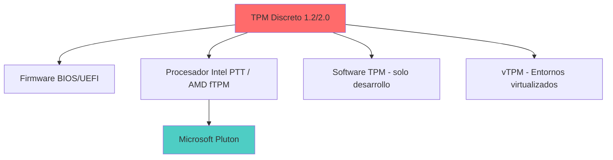
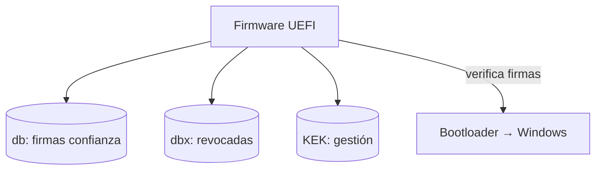
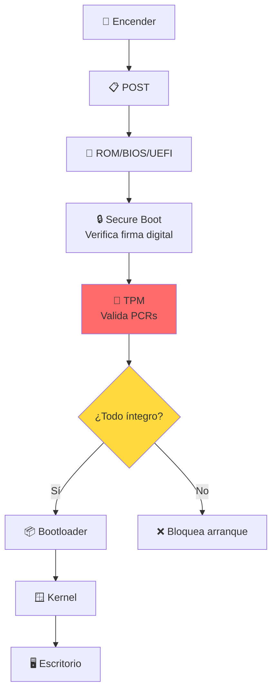
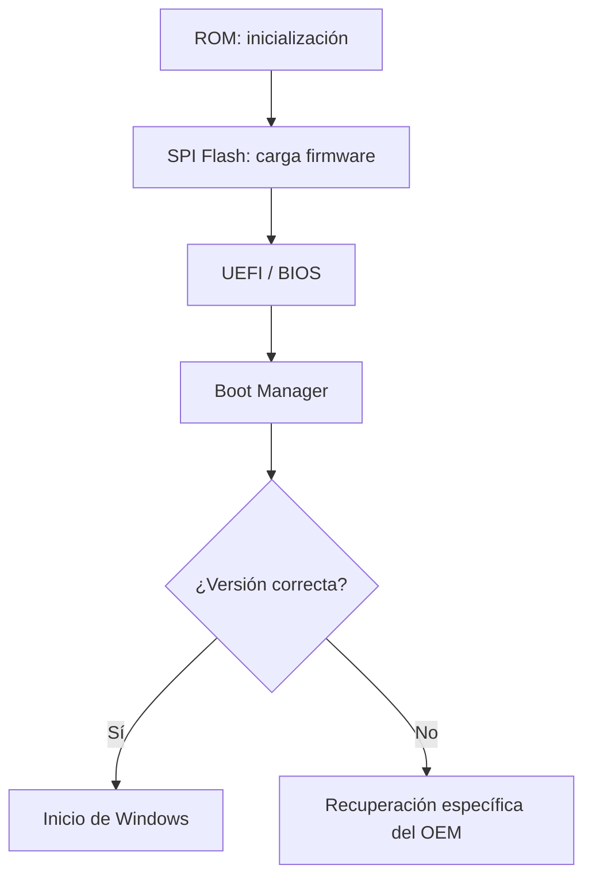

# 🔐 TPM — Trusted Platform Module

> [!info] Módulo
> **Unidad 2 — Almacenamiento y Arranque**
> **Tema:** Trusted Platform Module
> **Ver también:** [[02-Sistemas-de-Archivos|💾 Sistemas de archivos]], [[03-Arranque-y-Seguridad|🛡️ Arranque y seguridad]]

> [!tip] Prerrequisitos
> - Conceptos básicos de hardware
> - Qué es un sistema operativo
> - Conceptos básicos de criptografía (opcional)

---

## 📋 Tabla de contenidos

- [[#¿Qué-es-el-TPM]]
- [[#Funciones-principales]]
- [[#Implementaciones-físicas]]
- [[#Flujo-de-arranque-con-TPM-+-Secure-Boot]]
- [[#BitLocker-y-TPM]]
- [[#Criptografía-conceptos-clave]]
- [[#Los-3-pilares-de-la-seguridad-del-sistema]]
- [[#Preguntas-frecuentes]]

---

## ¿Qué es el TPM?

> [!info] Ejemplo: Cifrado por sustitución
> El profesor usó un ejemplo simple para explicar **cifrado reversible** con 10 vocales (5 minúsculas + 5 mayúsculas):
>
> ```
> TABLA DE SUSTITUCIÓN (la "llave")
>  Minúsculas: a→0  e→1  i→2  o→3  u→4
>  Mayúsculas: A→5  E→6  I→7  O→8  U→9
> 
> Texto plano:  "Hola Mundo"
> Texto cifrado: "H8l3 M5nd8"
> 
> Verificación: Si hay una vocal donde debería haber un número,
> o viceversa, significa que el texto fue alterado.
> ```
>
> **Integridad:** Si alguien modifica el texto cifrado, al intentar descifrarlo aparecen caracteres que no corresponden a vocales → sabemos que fue alterado.

---

## Implementaciones físicas



| Tipo | Ubicación | Ejemplo | Seguridad |
|------|-----------|---------|-----------|
| **Discreto 1.2/2.0** | Chip en motherboard | STMicroelectronics, Infineon | Alta |
| **Firmware** | Dentro del BIOS/UEFI | fTPM de AMD, PTT de Intel | Media-Alta |
| **Procesador** | Dentro del CPU | Intel Pluton (Surface, Azure) | Alta |
| **Software** | Emulado por SO | TPM 2.0 de Windows | Baja (solo desarrollo) |
| **vTPM** | Dentro de VM | Hyper-V, VMware, QEMU | Media |

> [!info] Captura del profesor: TPM físico
> La diapositiva "Físicamente" muestra dos fotos de hardware real, lado a lado:
> - **Izquierda, etiquetada "TPN Integrado"** (TPM integrado): una placa pequeña
>   suelta con un chip cuadrado central, tornillos/pines dorados, marcada
>   "MADE IN CHINA".
> - **Derecha, etiquetada "TPM Discreto"**: una esquina de motherboard mostrando
>   un chip TPM soldado junto a los puertos USB (etiquetados "USB910"/"USB1112"
>   en la placa), con un pin-header de 20 pines cerca — el punto de conexión
>   físico para un módulo TPM discreto add-on.

> [!warning] Nota histórica
> Intel Pluton y AMD fTPM surgieron como respuesta a vulnerabilidades encontradas en implementaciones anteriores de TPM discreto, donde se detectaron canales de comunicación entre el TPM y otros componentes que podían ser explotados.

---

## TCG y arranque seguro (Secure Boot)

**TCG (Trusted Computing Group):** consorcio de 200+ empresas (IBM, HP, AMD, Microsoft, Intel, Lenovo, Cisco…) que define especificaciones abiertas de *Computación confiable*. Creado en 2003 como sucesor del TCPA (1999). Establece **perfiles (PPP)** que configuran el comportamiento del TPM según el sistema.

### Bases de datos de Secure Boot (en NV-RAM del firmware)
- **db** (signature database): firmas/claves de confianza del OEM.
- **dbx** (revoked): firmas revocadas (claves comprometidas).
- **KEK** (Key Exchange Key): clave para administrar db/dbx.



### Protección de memoria (kernel)
- **Integridad de memoria / aislamiento del kernel:** revisar controladores incompatibles en memoria.
- **Protección de acceso a memoria (IOMMU):** evita ataques DMA por puertos Thunderbolt / USB4 / CFexpress.
- **Lista de bloqueo de controladores vulnerables** (desde Windows 11 2022): drivers con vulnerabilidades conocidas o firmados con certificados usados para malware.

> [!warning] Nota
> La protección contra DMA de kernel **no** cubre 1394/FireWire, PCMCIA ni CardBus/ExpressCard.

---

## Flujo de arranque con TPM + Secure Boot



### ¿Qué son los PCRs?

> [!info] Platform Configuration Registers
> Registros dentro del TPM que almacenan **mediciones hash** de cada componente del arranque:
>
> | PCR | Componente |
> |-----|-----------|
> | 0 | Firmware (BIOS/UEFI) |
> | 2 | Opciones de firmware |
> | 4 | MBR / Bootloader |
> | 8 | Sistema operativo |

> Si cualquiera de estos valores cambia (por un virus o modificación), el TPM lo detecta.

---

## Características de Windows que usan el TPM

Varias funciones de Windows dependen del TPM. La tabla resume qué características lo requieren y su compatibilidad:

| Característica | ¿Requiere TPM? | TPM 1.2 | TPM 2.0 |
|---|---|---|---|
| Arranque medido (Measured Boot) | Sí | ✓ | ✓ |
| Cifrado de dispositivo / BitLocker | Sí | ✓ | ✓ |
| Device Encryption automática | Sí | — | ✓ |
| Credential Guard | Sí | — | ✓ |
| Windows Hello (biometría / PIN) | Sí (recomendado) | — | ✓ |
| Secure Boot | No (es del firmware) | — | — |

> [!note] TPM 2.0
> Es el requisito base de Windows 11; muchas funciones de seguridad modernas solo funcionan con 2.0.

### Flujo de carga del firmware



---
