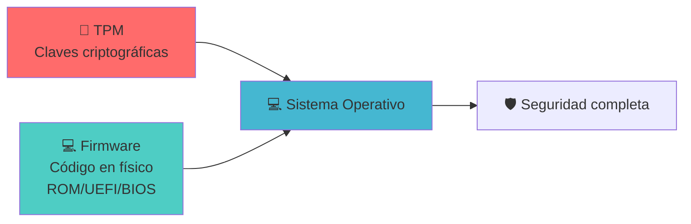
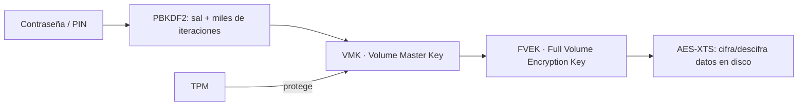

# 🔐 BitLocker y Criptografía

> [!info] Módulo
> **Unidad 2 — Almacenamiento y Arranque**
> **Tema:** BitLocker, cifrado y gestión de claves
> **Ver también:** [[01-TPM|🔐 TPM]], [[03-Arranque-y-Seguridad|🛡️ Arranque y seguridad]]

---

## BitLocker y TPM

```
CIFRADO DE DISCO CON BITLOCKER
━━━━━━━━━━━━━━━━━━━━━━━━━━━━━━━━━━━━━━━━━━━━━━━━━

  TPM genera clave maestra
           │
           ├──► Guarda clave en el chip TPM
           │
           ├──► Cifra disco con AES-256
           │
           └──► Si cambias hardware crítico:
                     │
                     ▼
               TPM detecta cambio
                     │
                     ▼
               Pide clave de recuperación
                     │
          ┌──────────┴──────────┐
          ▼                     ▼
    Cuenta Microsoft      Clave local / USB
    (si la asociaste)     (impresa o guardada)
```

### Configuración en Windows

> [!tip] Ruta
> `Configuración → Privacidad y seguridad → Seguridad de dispositivos → Procesador de seguridad`

Allí puedes ver:
- Fabricante (ej. STMicroelectronics)
- Versión del TPM
- Cumplimiento TCG
- Estado (activo/inactivo)

> [!info] Captura del profesor: "Detalles del procesador de seguridad"
> La pantalla de **Seguridad de Windows → Seguridad del dispositivo → Procesador de
> seguridad → Detalles del procesador de seguridad** muestra, en el ejemplo de la
> diapositiva:
>
> | Campo | Valor de ejemplo |
> |---|---|
> | **Fabricante** | Nuvoton Technology (NTC) |
> | **Versión del fabricante** | 7.2.1.0 |
> | **Versión de especificación** | 2.0 |
> | **Versión de especificación de PPP** (Platform Profile Parameters) | 1.3 |
> | **Subversión de la especificación del TPM** | 1.38 (lunes 8 enero 2018) |
> | **Versión del cliente del equipo** | 1.03 |
> | **Atestación** | Listo |
> | **Almacenamiento** | Listo |
>
> **PPP (Platform Profile Parameters):** detalles específicos de una versión de
> perfil TPM — definen cómo se configura y comporta el TPM en un sistema concreto
> (parámetros y ajustes que determinan capacidades y compatibilidad).
>
> La misma diapositiva también documenta el panel **Aislamiento del núcleo**
> (activado desde *Seguridad del dispositivo*): toggle **Integridad de memoria**
> (aparece "Desactivado" en el ejemplo, con botón "Examinar de nuevo" y enlace
> "Revisar controladores incompatibles"), sección **Protección de acceso a
> memoria** (protege contra DMA vía Thunderbolt/USB4/CFexpress), y **Lista de
> bloqueados de controladores vulnerables de Microsoft** (toggle "Activado").

### Clave de recuperación y BitLocker To Go

Al activar BitLocker se ofrecen tres formas de guardar la clave de recuperación:
- **Cuenta de Azure AD** (empresas/escuela) o **cuenta Microsoft** (consumo).
- **Archivo** (en una unidad distinta y no cifrada).
- **Imprimir** la clave (muchas empresas la archivan en cajas fuertes).

El archivo contiene el **identificador** del disco (SSD/HDD), la clave de recuperación y un enlace de gestión. En unidades **extraíbles** (BitLocker To Go) siempre se pide contraseña o tarjeta inteligente (p. ej. YubiKey) al conectarse.

> [!info] Captura del profesor: pantalla real de clave de recuperación
> **Corrección**: a diferencia de lo que se pensó en una revisión anterior, sí
> existe una captura de la clave de recuperación en el material fuente — está
> en `2 TPM introducción y seguridd del dispositivo.pdf` (no en el PDF
> separado de Bitlocker). Dos pantallas reales:
> - **Diálogo "Guardar clave de recuperación de BitLocker como"**: explorador
>   de archivos mostrando las unidades del equipo (Windows (C:), BLACK1TB
>   (D:)), con el nombre de archivo pre-rellenado en el formato
>   `Clave de recuperación de BitLocker F...-...-...-...` y tipo
>   `Archivos de texto (*.txt)`.
> - **El documento de texto impreso/guardado en sí**, con el formato oficial:
>   título "Clave de recuperación de Cifrado de unidad BitLocker", un campo
>   **Identificador** (dos bloques alfanuméricos) para verificar que coincide
>   con el que muestra el equipo, y la **Clave de recuperación** propiamente
>   dicha: **8 grupos de 6 dígitos** (el formato estándar de 48 dígitos de
>   BitLocker), más un enlace a `go.microsoft.com` si el identificador no
>   coincide.
> - **Pantalla de desbloqueo** (`BitLocker (E:)`): campo de contraseña, enlaces
>   "Menos opciones" / "Escribir clave de recuperación", checkbox
>   "Desbloquear automáticamente en este equipo", botón "Desbloquear".

> [!warning] BitLocker no es infalible
> En equipos vulnerables un atacante puede extraer la *Volume Master Key* (VMK) mediante **sniffing de hardware** durante el arranque (p. ej. con una Raspberry Pi Pico en ~43 s). Mitígalo con TPM 2.0 + Secure Boot + arranque medido y firmware actualizado.
>
> **Evidencia citada por el profesor** (mismo PDF): captura de
> `blog.elhacker.net` ("Rompen el cifrado BitLocker de Windows 10 y Windows 11
> en solo 43 segundos con una Raspberry Pi Pico") junto a una terminal real
> mostrando la salida de la herramienta de sniffing:
> ```
> Ready to sniff!
> +] BitLocker Volume Master Key found:
> +] 50 a7 10 14 d4 c8 2a 55  52 f6 d8 39 23 37 a3 26
> +] ce 65 03 c3 1a e2 5a 3c  d7 9c 5d 4f a1 00 29 f3
> ```
> (VMK de ejemplo/demostración, no una clave real de producción.)

### Habilitar TPM en el BIOS/UEFI por fabricante

> [!info] Desde la Introducción (Clase 1)
> Si el TPM no aparece como activo, suele haber que habilitarlo en el firmware. La ruta varía por
> fabricante, pero el patrón es siempre: **cambiar la opción de Disable a Enable y guardar/reiniciar**.

| Fabricante | Ruta en BIOS/UEFI | Opción a habilitar |
|------------|-------------------|--------------------|
| **ASUS** | Opciones avanzadas (Advanced) → *Trusted Computing* | `TPM Support` → Enable |
| **MSI** | Opciones avanzadas → *Trusted Computing* | `Security Device Support` → Enable |
| **Lenovo** | Menú *Seguridad* → *Security Chip Selection* | Elegir `Intel PTT` o `PSP fTMP` (AMD) |
| **HP** | Opciones de seguridad | `TPM State` → Enable |
| **Dell** | Opciones de seguridad → *Firmware TPM* | Disable → Enable |

Recursos para habilitar TPM 2.0:
- <https://support.microsoft.com/es-es/windows/habilitar-tpm-2-0-en-el-equipo-1fd5a332-360d-4f46-a1e7-ae6b0c90645c>
- <https://learn.microsoft.com/es-mx/windows/security/hardware-security/tpm/trusted-platform-module-overview>
- <https://support.lenovo.com/co/es/solutions/ht512598>

> [!warning] Antes de habilitar
> Verifica la compatibilidad de tu equipo con Windows 11:
> <https://www.microsoft.com/es-mx/windows/windows-11-specifications>. También puedes comprobar el
> estado del TPM en Windows con **`tpm.msc`**.

> [!tip] Del laboratorio (Clase 1)
> El profesor comenta que, con el truco adecuado, **se puede instalar Windows 11 con un solo núcleo
> a 1 GHz y sin TPM** — algo que califica de *«violación cátedra»*. Esa brecha desaparece poco a
> poco: **Plutón** (Intel) y **fTPM/PSP** (AMD/others) ya integran el TPM *dentro del procesador*,
> y las nuevas placas no dejan pasar el TPC (Trusted Platform Component) por Software.
> A cambio, los chipsets **Puente Norte/Sur** se fueron integrando en el propio CPU (ver
> [[07-Introduccion-SO|📘 Introducción a los S.O.]] → *Componentes de hardware*).

---

## Criptografía: conceptos clave

| Concepto | Icono | Descripción |
|----------|-------|-------------|
| **Cifrado reversible** | 🔓🔒 | Se puede descifrar con la llave correcta (BitLocker) |
| **Hash irreversible** | 🔒❌ | No se puede recuperar el original (contraseñas bien almacenadas) |
| **Integridad** | ✅ | El dato no fue modificado |
| **Autenticación** | 👤 | Verificación de identidad |

> [!warning] Error común
> Si el sistema te muestra tu contraseña anterior, está almacenada de forma reversible → **no es seguro**. Un hash bien implementado solo permite verificar, no recuperar.

---

## Los 3 pilares de la seguridad del sistema



> [!important] Resumen: Los 3 pilares
> 1. **TPM** — Genera y protege claves criptográficas
> 2. **Firmware** — Código en físico que arranca el hardware
> 3. **Sistema Operativo** — Gestiona recursos y aplicaciones
>
> Los tres trabajan en conjunto para garantizar la seguridad del sistema.

---

## Preguntas frecuentes

```flipcard
¿Puedo mover un disco cifrado con BitLocker a otro equipo?
---
Solo si el TPM destino tiene la clave, o introduces la clave manualmente.
```

```flipcard
¿Qué pasa si pierdo la clave de recuperación?
---
Si está asociada a tu cuenta de Microsoft → la recuperas desde ahí. Si no → datos perdidos.
```

```flipcard
¿El TPM protege contra todos los virus?
---
❌ No. Solo protege el **arranque** y los datos en reposo. Una vez el SO está en RAM, necesitas antivirus.
```

---

## Profundidad criptográfica de BitLocker

BitLocker = **AES + PBKDF2**. El cifrado real de los datos lo hace AES; PBKDF2 solo se usa para *derivar* la clave maestra a partir de tu contraseña/PIN.



- **PBKDF2** (Password-Based Key Derivation Function 2): mezcla la contraseña con una *sal* y aplica un hash miles de veces → genera una clave derivada resistente a fuerza bruta.
- **VMK** (Volume Master Key): clave que protege a la FVEK; puede guardarse cifrada dentro del TPM (si está disponible).
- **FVEK** (Full Volume Encryption Key): la clave que **AES-XTS** usa para cifrar y descifrar los datos en tiempo real al leer/escribir el disco.
- **AES-XTS**: modo de cifrado por bloques (128/256 bits) usado por BitLocker en Windows 11.

### Gestionar BitLocker desde CMD (`manage-bde`)
```cmd
manage-bde -status                      :: estado de las unidades
manage-bde -on F: -RecoveryPassword     :: activar BitLocker en F:
manage-bde -off F:                      :: desactivar BitLocker en F:
```

> [!info] Captura del profesor: salida real de `manage-bde -status`
> La diapositiva muestra la consola `Administrador: Símbolo del sistema` tras
> ejecutar `manage-bde.exe -status`, con dos volúmenes reales:
>
> **Volumen C: [Windows]** (volumen del sistema operativo)
> - Tamaño: 951,65 GB · Versión de BitLocker: 2.0
> - Estado de conversión: Cifrado solo de espacio usado (100,0%)
> - Método de cifrado: **XTS-AES 128**
> - Estado de protección: Protección activada · Estado de bloqueo: Desbloqueado
> - Protectores de clave: **Contraseña numérica** + **TPM**
>
> **Volumen D: [BLACK1TB]** (volumen de datos)
> - Tamaño: 931,50 GB · Método de cifrado: AES 128
> - Desbloqueo automático: Deshabilitado
> - Protectores de clave: **Contraseña** + **Contraseña numérica** (sin TPM — es
>   un volumen de datos, no el de arranque)
>
> La diapositiva también muestra `manage-bde /?` completo (lista de parámetros:
> `-status -on -off -pause -resume -lock -unlock -autounlock -protectors
> -SetIdentifier -ForceRecovery -changepassword -changepin -changekey
> -KeyPackage -upgrade -WipeFreeSpace -ComputerName`) con ejemplos reales:
> ```cmd
> manage-bde -on C: -RecoveryPassword -RecoveryKey F:\
> manage-bde -unlock E: -RecoveryKey F:\84E151C1...7A62067A512.bek
> ```

---

## 📝 Autoevaluación

Haz clic en cada tarjeta para voltearla y ver la respuesta:

```flipcard
**Pregunta 1 — Cifrado reversible vs hashing**
¿Cuál es la diferencia entre cifrado reversible y hashing irreversible?
---
| Característica | Cifrado reversible | Hashing irreversible |
|------------------|-------------------|---------------------|
| **Recuperación** | Se recupera con llave | ❌ No se recupera |
| **Ejemplo** | BitLocker | Contraseñas almacenadas |
| **Uso** | Datos que necesitas leer | Verificación de identidad |
```

```flipcard
**Pregunta 2 — TPM 2.0 en Windows 11**
¿Por qué Windows 11 requiere TPM 2.0?
---
- Secure Boot
- BitLocker
- Windows Hello
- Protección contra firmware malicioso

**Sin TPM 2.0**, Windows 11 no puede garantizar la integridad del arranque ni proteger los datos en reposo.
```

```flipcard
**Pregunta 3 — Limitaciones del TPM**
¿El TPM protege contra todos los virus?
---
| Etapa | Protección |
|-------|-----------|
| Arranque (boot) | ✅ TPM + Secure Boot |
| Datos en reposo | ✅ BitLocker |
| RAM activa | ❌ No protege |

**No.** El TPM solo protege el arranque y datos en reposo. No protege datos en RAM, phishing ni malware post-arranque.
```

---

## 🎯 Próximo paso

> [!info] Continuar con
> **[[02-Sistemas-de-Archivos|💾 Sistemas de archivos]]** — Aquí aprenderás cómo se organizan los datos en disco, qué es la FAT, NTFS, y por qué tu pendrive de 8 GB muestra 7.49 GB.

---

## ⚠️ Errores comunes

> [!warning] Error 1: Confundir firmware con software
> El firmware (BIOS/UEFI) es código **en físico** (chip en la placa madre), no es software que se actualiza como Windows.

> [!warning] Error 2: Pensar que TPM es solo un chip externo
> Hoy en día el TPM puede estar en el procesador (Intel PTT, AMD fTPM, Pluton) o en el firmware. No necesariamente es un chip discreto.

> [!warning] Error 3: Formato rápido = seguro
> El formato rápido solo borra la tabla de asignación. Los datos siguen en disco y son recuperables con herramientas forenses.

---

## Referencias

> [!info] Recursos externos
> - [Trusted Computing Group — TPM](https://trustedcomputinggroup.org/work-groups/trusted-platform-module/)
> - [Microsoft — TPM en Windows 11](https://learn.microsoft.com/en-us/windows-hardware/design/minimum/supported/windows-11-supported-intel-platforms)
> - [Microsoft — BitLocker](https://learn.microsoft.com/en-us/windows/security/information-protection/bitlocker/bitlocker-overview)
> - [Microsoft — Core Isolation](https://learn.microsoft.com/en-us/windows-hardware/design/device-experiences/windows-defender-application-control/core-isolation)
