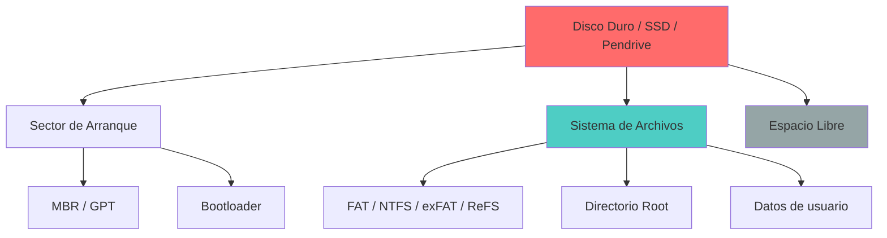
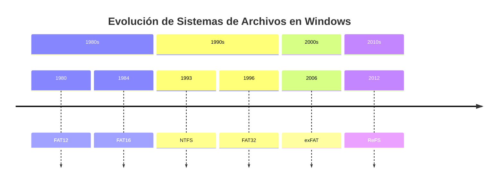
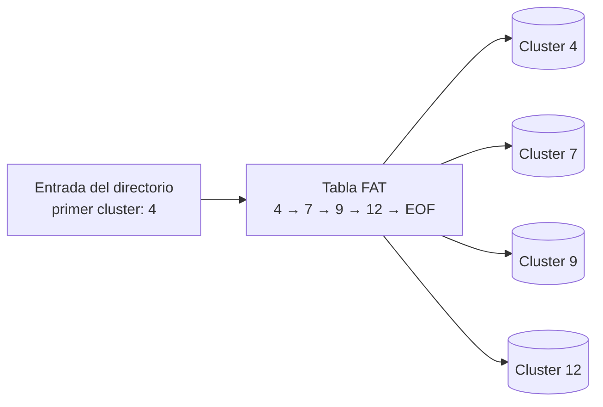
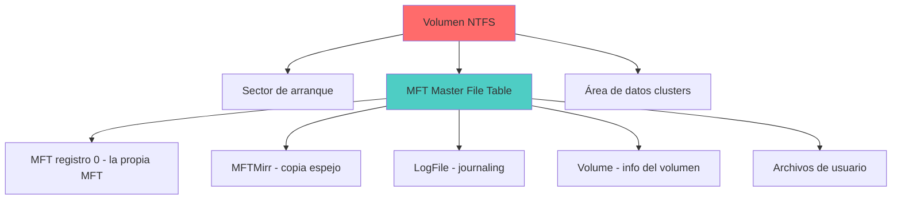
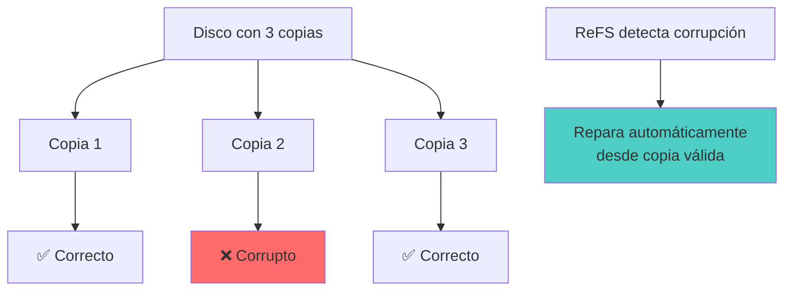
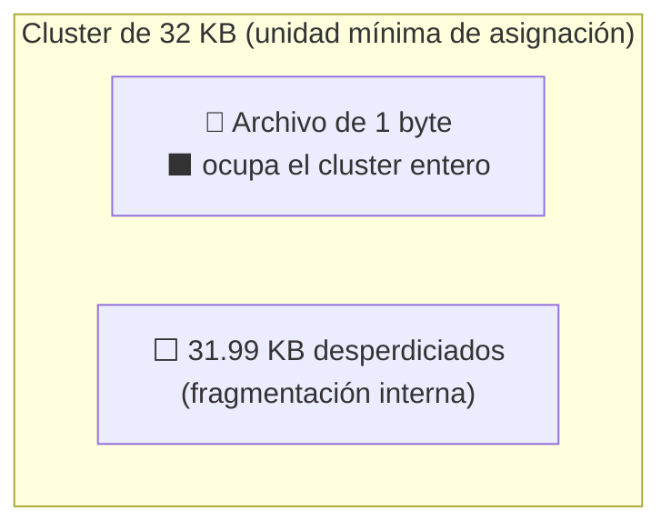
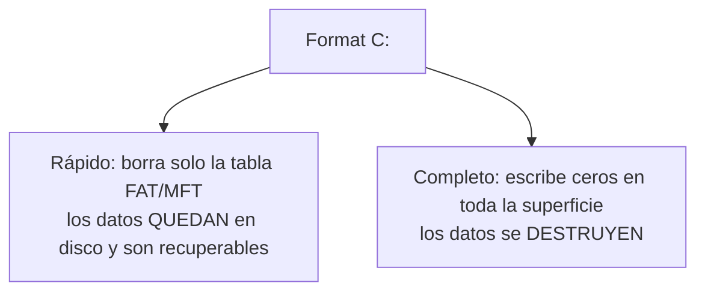

# 💾 Sistemas de Archivos

> [!info] Módulo
> **Clase 2** — TPM y Sistemas de Archivos  
> **Tema:** Sistemas de Archivos (FAT, NTFS, ReFS, exFAT)  
> **Ver también:** [[01-TPM|🔐 TPM]], [[03-Arranque-y-Seguridad|🛡️ Arranque y seguridad]]

> [!tip] Prerrequisitos
> - Conceptos de almacenamiento (disco, SSD, USB)
> - Qué es un byte / bit
> - Conceptos básicos de matemáticas (potencias de 2)

---

## 📋 Tabla de contenidos

- [[#Estructura-de-un-medio-de-almacenamiento]]
- [[#¿Por-qué-500-GB-no-son-500-GB]]
- [[#Evolución-de-sistemas-de-archivos]]
- [[#FAT-=-File-Allocation-Table]]
- [[#NTFS-=-New-Technology-File-System]]
- [[#ReFS-=-Resilient-File-System]]
- [[#Atributos-de-archivos]]
- [[#Tamaño-de-unidad-de-asignación-(Cluster)]]
- [[#Formato-rápido-vs.-Formato-completo]]
- [[#Nombres-de-archivo-y-extensiones]]

---

## Estructura de un medio de almacenamiento



---

## ¿Por qué 500 GB no son 500 GB?

> [!info] Sociedad vs Sistema Operativo
> La sociedad usa **base 10**, pero los sistemas operativos usan **base 2**.
>
> | Unidad | Cálculo | Valor |
> |--------|---------|-------|
> | 1 GB (fabricante) | $10^9$ | 1,000,000,000 bytes |
> | 1 GiB (SO) | $2^{30}$ | 1,073,741,824 bytes |
>
> Por eso un SSD de 500 GB se muestra como **~465 GiB** en Windows.

$$ \text{Espacio visible} = \frac{\text{Capacidad fabricante}}{2^{30}} $$

> [!tip] Regla mnemotécnica
> La sociedad piensa en decimal (10 dedos), el SO en binario (bits). Mientras la sociedad odie el Wii, nosotros trabajamos en base 2.

---

## Evolución de sistemas de archivos



### Comparativa rápida

| Sistema | Año | Cluster mínimo | Permisos | Journaling | Uso actual |
|---------|-----|---------------|----------|------------|------------|
| **FAT12** | 1980 | — | ❌ | ❌ | Floppies |
| **FAT16** | 1984 | 512 B | ❌ | ❌ | USB viejos |
| **FAT32** | 1996 | 512 B | ❌ | ❌ | USB, compatibilidad |
| **exFAT** | 2006 | 4 KB | ❌ | ❌ | USB grandes |
| **NTFS** | 1993 | 512 B | ✅ | ✅ | Discos internos |
| **ReFS** | 2012 | 64 KB | ✅ | ✅ | Servidores |

---

## FAT = File Allocation Table


> Cada entrada de directorio apunta al **primer cluster**; la FAT guarda la cadena de clusters siguientes hasta `EOF`. Recorrer un archivo = seguir la cadena en la tabla.

> [!note] FAT
> **File Allocation Table** — Tabla de Asignación de Archivos.
>
> La tabla es un índice que registra en qué clusters está almacenado cada archivo. Si se corrompe la FAT, se pierde la capacidad de leer los archivos.

```
CÓMO FUNCIONA LA FAT
━━━━━━━━━━━━━━━━━━━━━━━━━━━━━━━━━━━━━━━━━━━━━━━━━

  Archivo: "foto.jpg" (3 clusters)
  
  FAT Table:
  ┌──────┬───────────┐
  │ 0    │ Libre     │
  │ 1    │ Libre     │
  │ 2    │ Ocupado ──┼──► Cluster 2 en disco
  │ 3    │ Ocupado ──┼──► Cluster 5 en disco
  │ 4    │ Ocupado ──┼──► Cluster 9 en disco
  │ 5    │ Fin (EOF) │
  └──────┴───────────┘
  
  Para leer "foto.jpg": FAT → [2 → 5 → 9 → fin]
```

> [!warning] Problema
> Si se corrompe la FAT, se pierden todos los punteros.

> [!important] Resumen: FAT
> - **Ventaja:** Simple, rápido, compatible con todo.
> - **Desventaja:** Sin journaling, sin permisos, se fragmenta fácilmente.
> - **Uso actual:** USB de poca capacidad, compatibilidad con dispositivos antiguos.

---

## NTFS = New Technology File System



> [!info] Características clave
> - **Journaling**: Registra cambios antes de escribirlos → recuperación ante fallos.
> - **Permisos granulares**: ACL (Access Control Lists) por archivo/carpeta.
> - **Compresión transparente**: El SO comprime/descomprime al vuelo.
> - **Cifrado EFS**: Encrypting File System por usuario.

> [!important] Resumen: NTFS
> - **Ventaja:** Robusto, seguro, con journaling y permisos granulares.
> - **Desventaja:** Más complejo, overhead de rendimiento.
> - **Uso actual:** Discos internos de Windows, servidores.

---

## ReFS = Resilient File System



> [!quote] Filosofía
> "Si un miembro falla, el sistema es capaz de devolverse a un estado anterior válido."

---

## Atributos de archivos

### En consola (CMD / PowerShell)

| Atributo | Símbolo | Significado |
|----------|---------|-------------|
| Archive | `A` | Modificado desde último backup |
| Read-only | `R` | Solo lectura |
| Hidden | `H` | Oculto |
| System | `S` | Protegido por el sistema |
| Not indexed | `I` | No indexado por Windows Search |

### Directorios = Archivos especiales

```
EN UNIX/LINUX TODO ES ARCHIVO
━━━━━━━━━━━━━━━━━━━━━━━━━━━━━━━━━━━━━━━━━━━━━━━━━

  /home/usuario/
  ├── 📄 tesis.docx        ← archivo regular
  ├── 🖼️ foto.jpg          ← archivo regular
  ├── 📁 Documentos/       ← archivo especial (directorio)
  │   ├── 📄 informe.pdf
  │   └── 📄 presupuesto.xlsx
  └── 📁 .config/          ← archivo oculto (directorio)
      └── ⚙️ settings.conf
```

> [!info] ¿Por qué?
> Un directorio es un archivo que contiene nombres + números de inodo/cluster + permisos. Esto permite rutas jerárquicas como `/home/usuario/documento.txt`.

---

## Tamaño de unidad de asignación (Cluster)


> El espacio se asigna por cluster completo aunque el archivo ocupe menos: un archivo de 1 byte en un cluster de 32 KB **ocupa 32 KB** en disco.

### Problema del cluster grande

```
PENDRIVE DE 8 GB, CLUSTER DE 32 KB
━━━━━━━━━━━━━━━━━━━━━━━━━━━━━━━━━━━━━━━━━━━━━━━━━

  Si guardas 1 archivo de 1 byte:
  
  ┌──────────────────────────────────┐
  │  Cluster de 32 KB                │
  │  ┌────────────────────────────┐  │
  │  │ A (1 byte)                 │  │
  │  │                           │  │
  │  │ 31,999 bytes VACÍOS       │  │
  │  │  ← desperdicio            │  │
  │  └────────────────────────────┘  │
  └──────────────────────────────────┘
```

$$ \text{Desperdicio} = \frac{\text{cluster} - \text{tamaño\_archivo}}{\text{cluster}} \times 100\% $$

> [!example] Analogía del profesor
> Alquilar un auditorio de 32,000 puestos para que habite una sola estudiante.

### Cluster óptimo por tipo de archivo

| Tipo de archivo | Cluster recomendado |
|-----------------|---------------------|
| Documentos de texto | 4 KB |
| Fotos, música | 32–64 KB |
| Videos, imágenes grandes | 128–256 KB |

> [!important] Resumen: Cluster size
> - **Cluster pequeño (4 KB):** Mejor para documentos pequeños, más operaciones I/O.
> - **Cluster grande (128-256 KB):** Mejor para videos, menos desperdicio en archivos grandes.
> - **Regla de oro:** Mientras más pequeño el archivo promedio, más pequeño el cluster.

---

## Formato rápido vs. Formato completo




| Tipo | Acción | Recuperación de datos |
|------|--------|----------------------|
| **Rápido** | Borra solo la tabla de asignación (FAT) | ✅ Los datos siguen en disco |
| **Completo** | Escribe ceros en toda la superficie | ❌ Datos destruidos |

> [!warning] Advertencia forense
> El formato rápido **no elimina datos**. Un especialista puede recuperarlos con herramientas como `photorec`, `testdisk`, o análisis forense.

---

## Nombres de archivo y extensiones

### Límites históricos

| Sistema | Nombre | Extensión | Ejemplo |
|---------|--------|-----------|---------|
| FAT16 | 8 caracteres | 3 caracteres | `TESIS.DOC` |
| FAT32 / NTFS | 255 caracteres | 255 caracteres | `mi_tesis_doctoral_v2_final.docx` |

### Extensiones y formatos

| Extensión | Tipo | Formato |
|-----------|------|---------|
| `.txt` | Documento | Texto plano |
| `.docx` | Documento | Word (XML comprimido) |
| `.xlsx` | Hoja de cálculo | Excel (XML comprimido) |
| `.pptx` | Presentación | PowerPoint (XML comprimido) |
| `.html` / `.htm` | Web | HyperText Markup Language |
| `.js` | Web | JavaScript |
| `.php` | Web | PHP preprocesado |
| `.mp3` | Audio | MPEG-1 Audio Layer 3 |
| `.mp4` | Video | MPEG-4 Part 14 (contenedor) |
| `.jpg` | Imagen | JPEG comprimido |
| `.png` | Imagen | PNG sin pérdida |

> [!info] Nota técnica
> MP4 **no** es una evolución de MP3. MP4 es un **contenedor** que puede incluir audio, video, subtítulos y metadatos.

---

## Límite de longitud de ruta (260 caracteres)

Por defecto Windows limita la ruta a **260 caracteres** (p. ej. `C:\Carpeta\Subcarpeta\Archivo.txt`). Rigen dos reglas independientes:

- Cada componente (carpeta/archivo) ≤ **255** caracteres.
- Ruta total ≤ **32.767** caracteres (pero el límite de 260 aplica si no se activa la opción larga).

Para habilitar rutas largas:

```cmd
reg query HKLM\SYSTEM\CurrentControlSet\Control\FileSystem /v LongPathsEnabled
reg add  HKLM\SYSTEM\CurrentControlSet\Control\FileSystem /v LongPathsEnabled /t REG_DWORD /d 1 /f
```

Y usar el prefijo `\\?\` para copiar rutas muy largas sin recortar:

```cmd
robocopy "\\?\C:\LAB_LONGPATH" "C:\DESTINO_LARGO" /E /COPYALL /R:1 /W:1
```

> [!warning] Caracteres prohibidos
> En nombres y rutas nunca uses: `\ / : * ? " < > |`

---

## Sistemas de archivos según la versión de Windows

> [!info] Desde la Introducción (Clase 1)
> La evolución de los sistemas de archivos refleja la evolución de Windows. Las tablas siguientes
> mapean cada versión con los sistemas de archivos que soporta y el predeterminado/recomendado.

### Escritorio (Desktop)

| Versión de Windows | Año | Sistemas de archivos soportados | Predeterminado / recomendado |
|--------------------|-----|--------------------------------|------------------------------|
| Windows 1.0 | 1985 | FAT12 | FAT12 |
| Windows 2.0 | 1987 | FAT12 | FAT12 |
| Windows 3.0 | 1990 | FAT12, FAT16 | FAT16 |
| Windows 3.1 | 1992 | FAT16 | FAT16 |
| Windows 95 | 1995 | FAT16 | FAT16 |
| Windows 95 OSR2 | 1996 | FAT16, FAT32 | FAT32 |
| Windows 98 | 1998 | FAT16, FAT32 | FAT32 |
| Windows ME | 2000 | FAT16, FAT32 | FAT32 |
| Windows NT 3.1 | 1993 | FAT16, NTFS 1.0 | NTFS |
| Windows NT 4.0 | 1996 | FAT16, FAT32, NTFS | NTFS |
| Windows 2000 | 2000 | FAT16, FAT32, NTFS 3.0 | NTFS |
| Windows XP | 2001 | FAT16, FAT32, NTFS 3.1 | NTFS |
| Windows Vista | 2007 | FAT16, FAT32, NTFS, exFAT | NTFS |
| Windows 7 | 2009 | FAT16, FAT32, NTFS, exFAT | NTFS |
| Windows 8 | 2012 | FAT16, FAT32, NTFS, exFAT, ReFS | NTFS |
| Windows 8.1 | 2013 | FAT16, FAT32, NTFS, exFAT, ReFS | NTFS |
| Windows 10 | 2015 | FAT16, FAT32, NTFS, exFAT, ReFS | NTFS |
| Windows 11 | 2021 | FAT16, FAT32, NTFS, exFAT, ReFS (ReFS en ediciones/escenarios concretos) | NTFS |

### Servidor (Windows Server)

| Versión de Windows Server | Año | Sistemas de archivos soportados | Recomendado |
|---------------------------|-----|--------------------------------|-------------|
| Windows NT Server 3.1 | 1993 | FAT16, NTFS 1.0 | NTFS |
| Windows NT Server 3.5 | 1994 | FAT16, NTFS | NTFS |
| Windows NT Server 3.51 | 1995 | FAT16, NTFS | NTFS |
| Windows NT Server 4.0 | 1996 | FAT16, FAT32, NTFS | NTFS |
| Windows 2000 Server | 2000 | FAT16, FAT32, NTFS 3.0 | NTFS |
| Windows Server 2003 | 2003 | FAT16, FAT32, NTFS 3.1 | NTFS |
| Windows Server 2008 | 2008 | FAT16, FAT32, NTFS, exFAT | NTFS |
| Windows Server 2008 R2 | 2009 | FAT16, FAT32, NTFS, exFAT | NTFS |
| Windows Server 2012 | 2012 | FAT16, FAT32, NTFS, exFAT, ReFS | NTFS / ReFS |
| Windows Server 2012 R2 | 2013 | NTFS, exFAT, ReFS | NTFS / ReFS |
| Windows Server 2016 | 2016 | NTFS, exFAT, ReFS | NTFS / ReFS |
| Windows Server 2019 | 2018 | NTFS, exFAT, ReFS | NTFS / ReFS |
| Windows Server 2022 | 2021 | NTFS, exFAT, ReFS | NTFS / ReFS |
| Windows Server 2025 | 2024 | NTFS, exFAT, ReFS | NTFS / ReFS |

> [!note] Observación
> NTFS se consolidó como predeterminado desde Windows NT. **ReFS** aparece desde Windows 8/Server
> 2012 orientado a servidores y virtualización; en escritorio Windows 11 solo está disponible en
> ediciones y escenarios concretos.

---

## Límites de nombre y longitud de ruta

> [!info] Del laboratorio (Clase 3)
> Hay dos límites relacionados: el **nombre del archivo** y la **longitud total de la ruta**.

| Límite | FAT (8.3) | FAT16/FAT32 | NTFS |
|--------|-----------|-------------|------|
| Nombre | 8 caracteres + extensión 3 | Hasta 255 (pero la ruta cuenta) | Hasta 255 (pero la ruta cuenta) |
| Ruta completa | — | 260 (predeterminado) | 260 (predeterminado) |
| Ruta larga | — | — | Hasta 32.767 (32 k) vía directiva |

> [!example] El problema del gerente
> La ruta completa `C:\Users\MIFA\Documentos\...` **cuenta** para los 255 caracteres, no solo el nombre. Por eso un archivo "Junta directiva primer semestre 2016 informe final revisado por junta fiscal…" no cabe: la ruta supera el límite. Se resuelve **acortando** el nombre. En NTFS también se puede ampliar el límite a **32.767** habilitando *"Long Paths"* en Directivas de grupo o el Registro (ver [[03-Arranque-y-Seguridad|🛡️ Arranque y seguridad]]).

> [!warning] Errores comunes
> No todo lo que "cabe" en 255 es ruta válida: el Windows antiguo se niega por la longitud total. El 8.3 (`ARCHIV~1`) es el formato heredado de FAT que aún NTFS genera por compatibilidad.

## Sistemas de archivos vs. Estructuras de datos

| Sistema de archivos | Estructura de datos | Aplicación |
|---------------------|---------------------|-------------|
| FAT16/32 | Array indexado | Tabla de asignación |
| NTFS (MFT) | Árbol B+ | Búsqueda eficiente de archivos |
| exFAT | Array + clusters | Tabla simplificada |
| Directorios | Árboles jerárquicos | Rutas de carpetas |
| Asignación de clusters | Listas enlazadas | Encadenamiento de bloques |

Ver detalles en [[04-Estructuras-de-Datos|📊 Estructuras de datos]].

---

## 📝 Autoevaluación

<details>
<summary>📦 Abrir preguntas y respuestas</summary>

### Pregunta 1 — 500 GB vs 465 GiB
¿Por qué 500 GB no son 500 GB en Windows?

```
SOCIEDAD (Base 10)          SISTEMA OPERATIVO (Base 2)
━━━━━━━━━━━━━━━━━━━━━━━━━━━━━━━━━━━━━━━━━━━━━━━━━

  1 GB = 1,000,000,000 bytes    1 GiB = 1,073,741,824 bytes
     (10⁹)                           (2³⁰)
```

> **Respuesta:** La sociedad usa base 10 (1 GB = 10⁹ bytes) pero el SO usa base 2 (1 GiB = 2³⁰ bytes). Por eso 500 GB ≈ 465 GiB.

---

### Pregunta 2 — Fragmentación interna
¿Qué es la fragmentación interna y cómo se mitiga?

```
CLUSTER DE 32 KB
┌──────────────────────────────┐
│ A (1 byte)                   │
├──────────────────────────────┤
│ 31,999 bytes VACÍOS          │
│ ← FRAGMENTACIÓN INTERNA      │
└──────────────────────────────┘
```

> **Respuesta:** Es el espacio desperdiciado **dentro** de un cluster cuando el archivo es más pequeño que el cluster. Se mitiga eligiendo el tamaño de cluster adecuado al tipo de archivo.

---

### Pregunta 3 — NTFS vs FAT32
¿Qué ventaja tiene NTFS sobre FAT32?

| Característica | FAT32 | NTFS |
|----------------|-------|------|
| Journaling | ❌ | ✅ |
| Permisos granulares | ❌ | ✅ |
| Cifrado EFS | ❌ | ✅ |
| Tamaño máximo archivo | 4 GB | 16 TB |

> **Respuesta:** NTFS tiene journaling, permisos granulares (ACL), compresión y cifrado EFS. FAT32 carece de estas características.

</details>

</details>

---

## 🎯 Próximo paso

> [!info] Continuar con
> **[[03-Arranque-y-Seguridad|🛡️ Arranque y seguridad]]** — Ahora que entiendes cómo se organizan los datos en disco, verás cómo se protege el arranque del sistema.

---

## ⚠️ Errores comunes

> [!warning] Error 1: Confundir MP4 con evolución de MP3
> MP4 no es "mejor MP3". MP4 es un **contenedor** que puede incluir video, audio, subtítulos y metadatos. MP3 es solo audio.

> [!warning] Error 2: Formato rápido = datos borrados
> El formato rápido solo marca la FAT como "libre". Los datos siguen en disco hasta ser sobrescritos. Un forense puede recuperarlos.

> [!warning] Error 3: Un directorio es una "carpeta" especial
> En sistemas tipo UNIX, un directorio **es un archivo** que contiene nombres + inodos. No es un concepto mágico, es una estructura de datos.

> [!warning] Error 4: Cluster = tamaño de archivo
> Un archivo de 1 byte en un cluster de 32 KB **ocupa 32 KB** en disco. El espacio se asigna por cluster, no por byte.

---

## Referencias

> [!info] Recursos externos
> - [Microsoft — Sistemas de archivos](https://learn.microsoft.com/en-us/windows/storage/file-systems/)
> - [Microsoft — NTFS](https://learn.microsoft.com/en-us/windows/storage/file-systems/ntfs)
> - [Microsoft — ReFS](https://learn.microsoft.com/en-us/windows/storage/refs/refs-overview)
> - [Microsoft — Formatos Office](https://learn.microsoft.com/en-us/office/troubleshoot/office-file-format)
