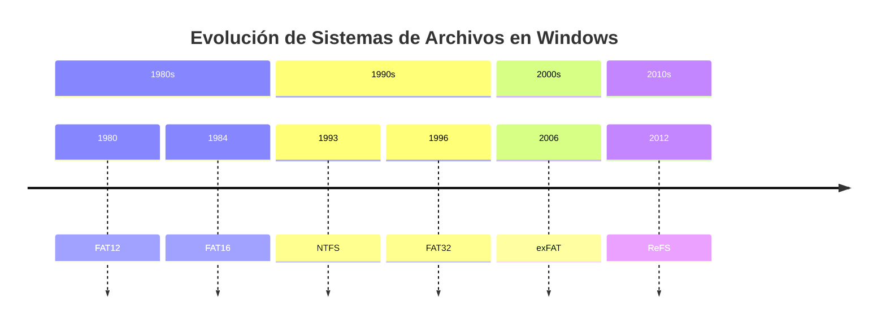

# 💾 Sistemas de Archivos

> [!info] Módulo
> **Unidad 2 — Almacenamiento y Arranque**
> **Tema:** Sistemas de Archivos (FAT, NTFS, ReFS, exFAT)
> **Ver también:** [[01-TPM|🔐 TPM]], [[03-Arranque-y-Seguridad|🛡️ Arranque y seguridad]]

> [!tip] Prerrequisitos
> - Conceptos de almacenamiento (disco, SSD, USB)
> - Qué es un byte / bit
> - Conceptos básicos de matemáticas (potencias de 2)

---

## 📋 Tabla de contenidos

- [[#Estructura-de-un-medio-de-almacenamiento]]
- [[#¿Por-qué-500-GB-no-son-500-GB]]
- [[#Evolución-de-sistemas-de-archivos]]

---

## Estructura de un medio de almacenamiento
graph TD
    A[Disco Duro / SSD / Pendrive] --> B[Sector de Arranque]
    A --> C[Sistema de Archivos]
    A --> D[Espacio Libre]
    
    B --> B1[MBR / GPT]
    B --> B2[Bootloader]
    
    C --> C1[FAT / NTFS / exFAT / ReFS]
    C --> C2[Directorio Root]
    C --> C3[Datos de usuario]
    
    style A fill:#ff6b6b
    style C fill:#4ecdc4
    style D fill:#95a5a6
```

### Métodos de acceso a archivos

| Método | Cómo funciona |
|---|---|
| **Secuencial** | Se lee/escribe en orden, desde el principio, byte a byte o registro a registro (ej. cintas magnéticas, logs). |
| **Directo (aleatorio)** | Se accede directamente a cualquier posición del archivo sin recorrer las anteriores (posible gracias a que el disco es direccionable por bloque). |
| **Indexado** | Un índice separado guarda punteros a bloques del archivo, permitiendo búsquedas rápidas sin recorrerlo completo (ej. bases de datos). |

---

## Límites de nombres y rutas (límite de 260 caracteres)

> [!info] Captura del profesor: "Limite 260 caracteres RUTAS" (diapositiva GUI / SHELL / S.O.)
> Diapositiva con el disco gris rotulado **S.O.** en el centro; encima, de pie,
> dos figuras de *Matrix*: la de la izquierda etiquetada **GUI**, la de la
> derecha etiquetada **SHELL**; en el centro del disco, Morfeo con las dos
> pastillas (roja y azul). Título a la derecha: **"Limite 260 caracteres RUTAS"**.
>
> Texto de la derecha, verbatim:
> - **Ruta:** `C:\Carpeta\Subcarpeta\Archivo.txt`
> - *Que pasa con cada uno* → `Carpeta` · `Subcarpeta` · `Archivo`, con el
>   número **255** en rojo grande al lado de "Subcarpeta".
> - *Ejemplo:* **252 caracteres** · Más `".pdf"` (**4 caracteres**) ·
>   **Total = 256 es inválido.** ("inválido" en rojo.)

> [!info] Captura del profesor: tabla "Sistema / Límite por nombre / Límite por ruta"
> Tabla blanca de 3 columnas y 3 filas de datos, en este orden exacto:
>
> | Sistema | Límite por nombre | Límite por ruta |
> |---|---|---|
> | NTFS | 255 caracteres | ~32,767 |
> | FAT32 | 255 | 260 (práctico) |
> | ext4 (Linux) | 255 bytes | ~4096 bytes |
>
> Texto de la misma diapositiva, verbatim:
> - *Ejemplo: Supongamos: 100 carpetas de 200 caracteres cada una. Cada una es
>   válida individualmente (<255)*
> - **Pero** *la suma total puede exceder 32,767 entonces* **falla**
>   ("Pero" y "falla" en rojo).
> - *Tenemos entonces dos validaciones independientes:*
>   - **Regla 1:** Cada componente ≤ 255
>   - **Regla 2:** Ruta total ≤ 32,767
> - *Para TODO esta prohibido, el uso de:* `\ / : * ? " < > |` (en rojo, grande).

> [!info] Captura del profesor: las dos tablas de límites (8.3 histórico vs actual)
> Diapositiva con **dos tablas apiladas a la izquierda** (Elemento / Límite) y
> la tabla NTFS-FAT32-ext4 repetida a la derecha.
>
> Tabla superior (esquema histórico **8.3**):
>
> | Elemento | Límite |
> |---|---|
> | Nombre base | 8 caracteres |
> | Extensión | 3 caracteres |
> | Total visible | 12 (incluye punto) |
> | Ruta completa | 66 a 128 (según versión) |
>
> Tabla inferior (esquema actual):
>
> | Elemento | Límite |
> |---|---|
> | Nombre individual (carpeta o archivo) | 255 caracteres |
> | Extensión | Parte del nombre |
> | Ruta total | 260 (histórico Win32) |
> | Ruta total con LongPathsEnabled | ~32,767 |

> [!info] Captura del profesor: habilitar rutas largas en el Registro (LongPathsEnabled)
> Dos diapositivas consecutivas con captura del **Editor del Registro** en
> `Equipo\HKEY_LOCAL_MACHINE\SYSTEM\CurrentControlSet\Control\FileSystem`.
> En la lista de valores aparece **`LongPathsEnabled`** de tipo **REG_DWORD**;
> encima se abre el cuadro *"Editar valor de DWORD (32 bits)"* con
> *Nombre de valor:* `LongPathsEnabled`, *Información del valor:* **0** en la
> primera captura y **1** en la segunda, con **Base: Hexadecimal** seleccionado
> (Decimal sin marcar) y los botones *Aceptar* / *Cancelar*.
>
> Comandos rotulados en la diapositiva, verbatim:
> - **Por CMD:** `reg query HKLM\SYSTEM\CurrentControlSet\Control\FileSystem /v LongPathsEnabled`
> - `reg add HKLM\SYSTEM\CurrentControlSet\Control\FileSystem /v LongPathsEnabled /t REG_DWORD /d 1 /f`
> - `robocopy "\\?\C:\LAB_LONGPATH" "C:\DESTINO_LARGO" /E /COPYALL /R:1 /W:1`
>   (el prefijo `\\?\` aparece con el `?` en rojo).

> [!warning] Para memorizar — riesgo de examen (los dos números se confunden)
> Reconstrucción en orden:
> 1. **255** = límite de **un componente** (nombre de archivo o de carpeta) —
>    vale para NTFS, FAT32 y ext4 (en ext4 son 255 **bytes**, no caracteres).
> 2. **260** = límite **histórico Win32 de la ruta completa** — es el que da
>    nombre a la diapositiva y el que rompe el ejemplo de 252 + `.pdf` = 256…
>    **no**: el ejemplo falla por la regla del componente, no por los 260.
> 3. **32,767** = ruta completa **con `LongPathsEnabled = 1`** (y también el
>    límite de ruta nativo de NTFS).
> 4. **~4096 bytes** = ruta en **ext4 (Linux)**.
>
> Trampas frecuentes:
> - Poner 260 donde va 255 (o al revés): 255 es **por nombre**, 260 es **por ruta**.
> - Creer que FAT32 llega a 32,767 — no: FAT32 se queda en **260 (práctico)**.
> - Olvidar que **la extensión cuenta dentro de los 255** en el esquema actual
>   (en el 8.3 antiguo iba aparte: 8 + 3 = 12 con el punto).
> - Los caracteres prohibidos son **nueve**: `\ / : * ? " < > |`.

---

## ¿Por qué 500 GB no son 500 GB?

> [!info] Sociedad vs Sistema Operativo
> La sociedad usa **base 10**, pero los sistemas operativos usan **base 2**.
>
> | Unidad | Cálculo | Valor |
> |--------|---------|-------|
> | 1 GB (fabricante) | $10^9$ | 1,000,000,000 bytes |
> | 1 GiB (SO) | $2^{30}$ | 1,073,741,824 bytes |
>
> Por eso un SSD de 500 GB se muestra como **~465 GiB** en Windows.

$$ \text{Espacio visible} = \frac{\text{Capacidad fabricante}}{2^{30}} $$

> [!tip] Regla mnemotécnica
> La sociedad piensa en decimal (10 dedos), el SO en binario (bits). Mientras la sociedad odie el Wii, nosotros trabajamos en base 2.

---

## Evolución de sistemas de archivos



### Comparativa rápida

| Sistema | Año | Cluster mínimo | Permisos | Journaling | Uso actual |
|---------|-----|---------------|----------|------------|------------|
| **FAT12** | 1980 | — | ❌ | ❌ | Floppies |
| **FAT16** | 1984 | 512 B | ❌ | ❌ | USB viejos |
| **FAT32** | 1996 | 512 B | ❌ | ❌ | USB, compatibilidad |
| **exFAT** | 2006 | 4 KB | ❌ | ❌ | USB grandes |
| **NTFS** | 1993 | 512 B | ✅ | ✅ | Discos internos |
| **ReFS** | 2012 | 64 KB | ✅ | ✅ | Servidores |

---

> [!info] Temas relacionados
> - [[02a-FAT|💾 FAT — File Allocation Table]]
> - [[02b-NTFS|💾 NTFS — New Technology File System]]
> - [[02c-ReFS-y-atributos|💾 ReFS, Atributos y Conceptos]]

