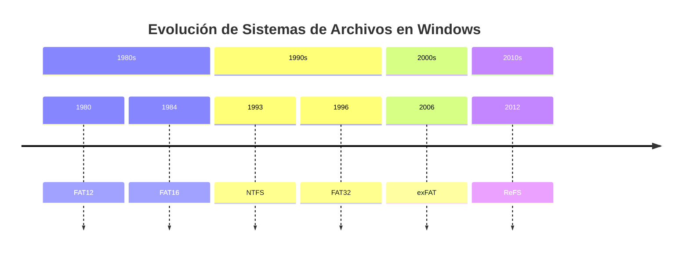

# 💾 Sistemas de Archivos

> [!info] Módulo
> **Unidad 2 — Almacenamiento y Arranque**
> **Tema:** Sistemas de Archivos (FAT, NTFS, ReFS, exFAT)
> **Ver también:** [[01-TPM|🔐 TPM]], [[03-Arranque-y-Seguridad|🛡️ Arranque y seguridad]]

> [!tip] Prerrequisitos
> - Conceptos de almacenamiento (disco, SSD, USB)
> - Qué es un byte / bit
> - Conceptos básicos de matemáticas (potencias de 2)

---

## 📋 Tabla de contenidos

- [[#Estructura-de-un-medio-de-almacenamiento]]
- [[#¿Por-qué-500-GB-no-son-500-GB]]
- [[#Evolución-de-sistemas-de-archivos]]

---

## Estructura de un medio de almacenamiento
graph TD
    A[Disco Duro / SSD / Pendrive] --> B[Sector de Arranque]
    A --> C[Sistema de Archivos]
    A --> D[Espacio Libre]
    
    B --> B1[MBR / GPT]
    B --> B2[Bootloader]
    
    C --> C1[FAT / NTFS / exFAT / ReFS]
    C --> C2[Directorio Root]
    C --> C3[Datos de usuario]
    
    style A fill:#ff6b6b
    style C fill:#4ecdc4
    style D fill:#95a5a6
```

### Métodos de acceso a archivos

| Método | Cómo funciona |
|---|---|
| **Secuencial** | Se lee/escribe en orden, desde el principio, byte a byte o registro a registro (ej. cintas magnéticas, logs). |
| **Directo (aleatorio)** | Se accede directamente a cualquier posición del archivo sin recorrer las anteriores (posible gracias a que el disco es direccionable por bloque). |
| **Indexado** | Un índice separado guarda punteros a bloques del archivo, permitiendo búsquedas rápidas sin recorrerlo completo (ej. bases de datos). |

---

## ¿Por qué 500 GB no son 500 GB?

> [!info] Sociedad vs Sistema Operativo
> La sociedad usa **base 10**, pero los sistemas operativos usan **base 2**.
>
> | Unidad | Cálculo | Valor |
> |--------|---------|-------|
> | 1 GB (fabricante) | $10^9$ | 1,000,000,000 bytes |
> | 1 GiB (SO) | $2^{30}$ | 1,073,741,824 bytes |
>
> Por eso un SSD de 500 GB se muestra como **~465 GiB** en Windows.

$$ \text{Espacio visible} = \frac{\text{Capacidad fabricante}}{2^{30}} $$

> [!tip] Regla mnemotécnica
> La sociedad piensa en decimal (10 dedos), el SO en binario (bits). Mientras la sociedad odie el Wii, nosotros trabajamos en base 2.

---

## Evolución de sistemas de archivos



### Comparativa rápida

| Sistema | Año | Cluster mínimo | Permisos | Journaling | Uso actual |
|---------|-----|---------------|----------|------------|------------|
| **FAT12** | 1980 | — | ❌ | ❌ | Floppies |
| **FAT16** | 1984 | 512 B | ❌ | ❌ | USB viejos |
| **FAT32** | 1996 | 512 B | ❌ | ❌ | USB, compatibilidad |
| **exFAT** | 2006 | 4 KB | ❌ | ❌ | USB grandes |
| **NTFS** | 1993 | 512 B | ✅ | ✅ | Discos internos |
| **ReFS** | 2012 | 64 KB | ✅ | ✅ | Servidores |

---

> [!info] Temas relacionados
> - [[02a-FAT|💾 FAT — File Allocation Table]]
> - [[02b-NTFS|💾 NTFS — New Technology File System]]
> - [[02c-ReFS-y-atributos|💾 ReFS, Atributos y Conceptos]]

