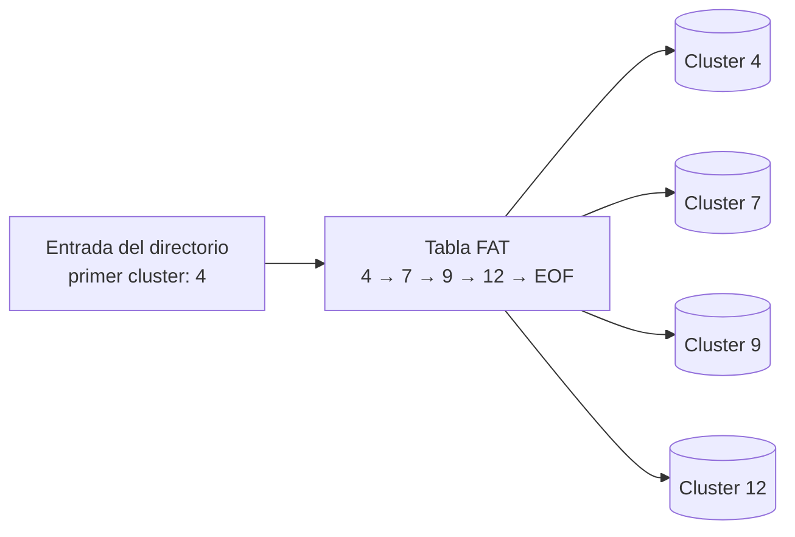

# 💾 FAT — File Allocation Table

> [!info] Módulo
> **Clase 2** — Sistemas de Archivos (FAT, NTFS, ReFS, exFAT)
> **Tema:** 💾 FAT — File Allocation Table
> **Ver también:** [[02-Sistemas-de-Archivos|💾 Sistemas de Archivos]]

> [!tip] Prerrequisitos
> - Conceptos básicos de sistemas operativos
> - [[02-Sistemas-de-Archivos|💾 Sistemas de Archivos]] — visión general

---

> [!info] Anterior
> [[02-Sistemas-de-Archivos|💾 Sistemas de Archivos]] — visión general


> Cada entrada de directorio apunta al **primer cluster**; la FAT guarda la cadena de clusters siguientes hasta `EOF`. Recorrer un archivo = seguir la cadena en la tabla.

> [!note] FAT
> **File Allocation Table** — Tabla de Asignación de Archivos.
>
> La tabla es un índice que registra en qué clusters está almacenado cada archivo. Si se corrompe la FAT, se pierde la capacidad de leer los archivos.

```
CÓMO FUNCIONA LA FAT
━━━━━━━━━━━━━━━━━━━━━━━━━━━━━━━━━━━━━━━━━━━━━━━━━

  Archivo: "foto.jpg" (3 clusters)
  
  FAT Table:
  ┌──────┬───────────┐
  │ 0    │ Libre     │
  │ 1    │ Libre     │
  │ 2    │ Ocupado ──┼──► Cluster 2 en disco
  │ 3    │ Ocupado ──┼──► Cluster 5 en disco
  │ 4    │ Ocupado ──┼──► Cluster 9 en disco
  │ 5    │ Fin (EOF) │
  └──────┴───────────┘
  
  Para leer "foto.jpg": FAT → [2 → 5 → 9 → fin]
```

> [!warning] Problema
> Si se corrompe la FAT, se pierden todos los punteros.

> [!important] Resumen: FAT
> - **Ventaja:** Simple, rápido, compatible con todo.
> - **Desventaja:** Sin journaling, sin permisos, se fragmenta fácilmente.
> - **Uso actual:** USB de poca capacidad, compatibilidad con dispositivos antiguos.

---

