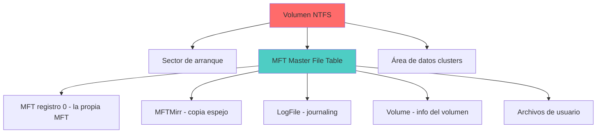

# 💾 NTFS — New Technology File System

> [!info] Módulo
> **Clase 2** — Sistemas de Archivos (FAT, NTFS, ReFS, exFAT)
> **Tema:** 💾 NTFS — New Technology File System
> **Ver también:** [[02-Sistemas-de-Archivos|💾 Sistemas de Archivos]]

> [!tip] Prerrequisitos
> - Conceptos básicos de sistemas operativos
> - [[02-Sistemas-de-Archivos|💾 Sistemas de Archivos]] — visión general

---

> [!info] Anterior
> [[02-Sistemas-de-Archivos|💾 Sistemas de Archivos]] — visión general

> [!info] Características clave
> - **Journaling**: Registra cambios antes de escribirlos → recuperación ante fallos.
> - **Permisos granulares**: ACL (Access Control Lists) por archivo/carpeta.
> - **Compresión transparente**: El SO comprime/descomprime al vuelo.
> - **Cifrado EFS**: Encrypting File System por usuario.

> [!important] Resumen: NTFS
> - **Ventaja:** Robusto, seguro, con journaling y permisos granulares.
> - **Desventaja:** Más complejo, overhead de rendimiento.
> - **Uso actual:** Discos internos de Windows, servidores.

---

