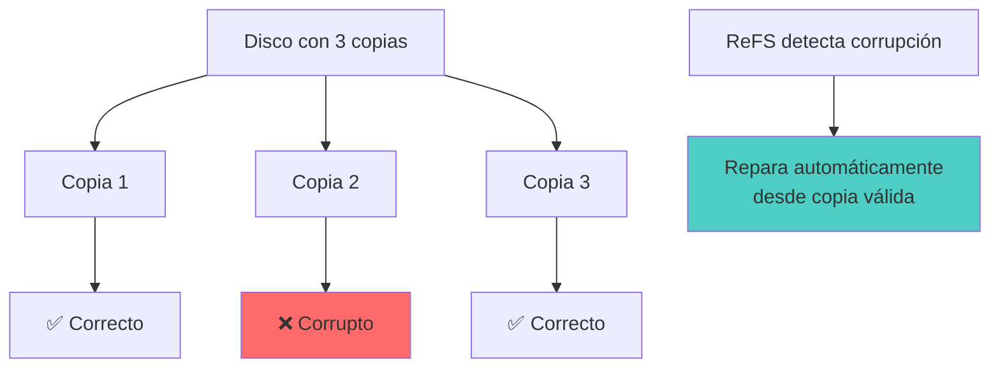
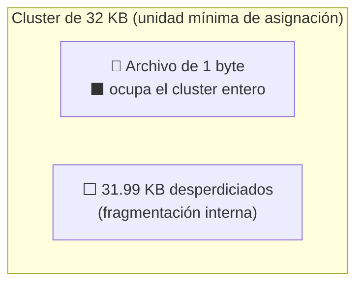
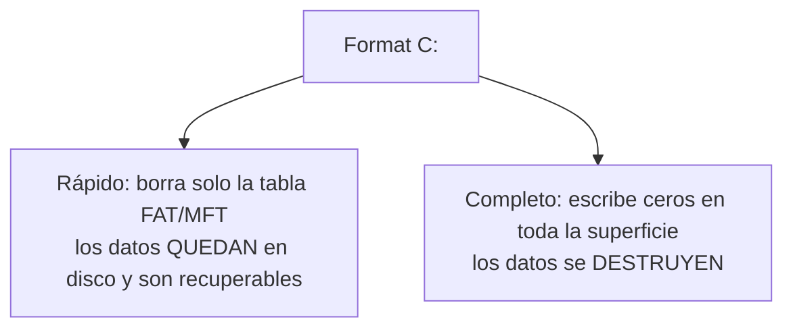

# 💾 ReFS, Atributos y Conceptos

> [!info] Módulo
> **Clase 2** — Sistemas de Archivos (FAT, NTFS, ReFS, exFAT)
> **Tema:** 💾 ReFS, Atributos y Conceptos
> **Ver también:** [[02-Sistemas-de-Archivos|💾 Sistemas de Archivos]]

> [!tip] Prerrequisitos
> - Conceptos básicos de sistemas operativos
> - [[02-Sistemas-de-Archivos|💾 Sistemas de Archivos]] — visión general

---

> [!info] Anterior
> [[02-Sistemas-de-Archivos|💾 Sistemas de Archivos]] — visión general



> [!quote] Filosofía
> "Si un miembro falla, el sistema es capaz de devolverse a un estado anterior válido."

---

## Atributos de archivos

### En consola (CMD / PowerShell)

| Atributo | Símbolo | Significado |
|----------|---------|-------------|
| Archive | `A` | Modificado desde último backup |
| Read-only | `R` | Solo lectura |
| Hidden | `H` | Oculto |
| System | `S` | Protegido por el sistema |
| Not indexed | `I` | No indexado por Windows Search |

### Directorios = Archivos especiales

```
EN UNIX/LINUX TODO ES ARCHIVO
━━━━━━━━━━━━━━━━━━━━━━━━━━━━━━━━━━━━━━━━━━━━━━━━━

  /home/usuario/
  ├── 📄 tesis.docx        ← archivo regular
  ├── 🖼️ foto.jpg          ← archivo regular
  ├── 📁 Documentos/       ← archivo especial (directorio)
  │   ├── 📄 informe.pdf
  │   └── 📄 presupuesto.xlsx
  └── 📁 .config/          ← archivo oculto (directorio)
      └── ⚙️ settings.conf
```

> [!info] ¿Por qué?
> Un directorio es un archivo que contiene nombres + números de inodo/cluster + permisos. Esto permite rutas jerárquicas como `/home/usuario/documento.txt`.

---

## Tamaño de unidad de asignación (Cluster)


> El espacio se asigna por cluster completo aunque el archivo ocupe menos: un archivo de 1 byte en un cluster de 32 KB **ocupa 32 KB** en disco.

### Problema del cluster grande

```
PENDRIVE DE 8 GB, CLUSTER DE 32 KB
━━━━━━━━━━━━━━━━━━━━━━━━━━━━━━━━━━━━━━━━━━━━━━━━━

  Si guardas 1 archivo de 1 byte:
  
  ┌──────────────────────────────────┐
  │  Cluster de 32 KB                │
  │  ┌────────────────────────────┐  │
  │  │ A (1 byte)                 │  │
  │  │                           │  │
  │  │ 31,999 bytes VACÍOS       │  │
  │  │  ← desperdicio            │  │
  │  └────────────────────────────┘  │
  └──────────────────────────────────┘
```

$$ \text{Desperdicio} = \frac{\text{cluster} - \text{tamaño\_archivo}}{\text{cluster}} \times 100\% $$

> [!example] Analogía del profesor
> Alquilar un auditorio de 32,000 puestos para que habite una sola estudiante.

### Cluster óptimo por tipo de archivo

| Tipo de archivo | Cluster recomendado |
|-----------------|---------------------|
| Documentos de texto | 4 KB |
| Fotos, música | 32–64 KB |
| Videos, imágenes grandes | 128–256 KB |

> [!important] Resumen: Cluster size
> - **Cluster pequeño (4 KB):** Mejor para documentos pequeños, más operaciones I/O.
> - **Cluster grande (128-256 KB):** Mejor para videos, menos desperdicio en archivos grandes.
> - **Regla de oro:** Mientras más pequeño el archivo promedio, más pequeño el cluster.

---

## Formato rápido vs. Formato completo




| Tipo | Acción | Recuperación de datos |
|------|--------|----------------------|
| **Rápido** | Borra solo la tabla de asignación (FAT) | ✅ Los datos siguen en disco |
| **Completo** | Escribe ceros en toda la superficie | ❌ Datos destruidos |

> [!warning] Advertencia forense
> El formato rápido **no elimina datos**. Un especialista puede recuperarlos con herramientas como `photorec`, `testdisk`, o análisis forense.

---

## Nombres de archivo y extensiones

### Límites históricos

| Sistema | Nombre | Extensión | Ejemplo |
|---------|--------|-----------|---------|
| FAT16 | 8 caracteres | 3 caracteres | `TESIS.DOC` |
| FAT32 / NTFS | 255 caracteres | 255 caracteres | `mi_tesis_doctoral_v2_final.docx` |

### Extensiones y formatos

| Extensión | Tipo | Formato |
|-----------|------|---------|
| `.txt` | Documento | Texto plano |
| `.docx` | Documento | Word (XML comprimido) |
| `.xlsx` | Hoja de cálculo | Excel (XML comprimido) |
| `.pptx` | Presentación | PowerPoint (XML comprimido) |
| `.html` / `.htm` | Web | HyperText Markup Language |
| `.js` | Web | JavaScript |
| `.php` | Web | PHP preprocesado |
| `.mp3` | Audio | MPEG-1 Audio Layer 3 |
| `.mp4` | Video | MPEG-4 Part 14 (contenedor) |
| `.jpg` | Imagen | JPEG comprimido |
| `.png` | Imagen | PNG sin pérdida |

> [!info] Nota técnica
> MP4 **no** es una evolución de MP3. MP4 es un **contenedor** que puede incluir audio, video, subtítulos y metadatos.

---

## Límite de longitud de ruta (260 caracteres)

Por defecto Windows limita la ruta a **260 caracteres** (p. ej. `C:\Carpeta\Subcarpeta\Archivo.txt`). Rigen dos reglas independientes:

- Cada componente (carpeta/archivo) ≤ **255** caracteres.
- Ruta total ≤ **32.767** caracteres (pero el límite de 260 aplica si no se activa la opción larga).

Para habilitar rutas largas:

```cmd
reg query HKLM\SYSTEM\CurrentControlSet\Control\FileSystem /v LongPathsEnabled
reg add  HKLM\SYSTEM\CurrentControlSet\Control\FileSystem /v LongPathsEnabled /t REG_DWORD /d 1 /f
```

Y usar el prefijo `\\?\` para copiar rutas muy largas sin recortar:

```cmd
robocopy "\\?\C:\LAB_LONGPATH" "C:\DESTINO_LARGO" /E /COPYALL /R:1 /W:1
```

> [!warning] Caracteres prohibidos
> En nombres y rutas nunca uses: `\ / : * ? " < > |`

---

