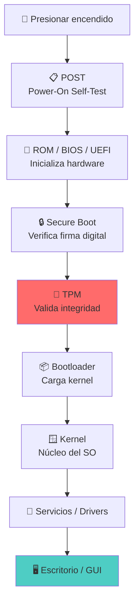
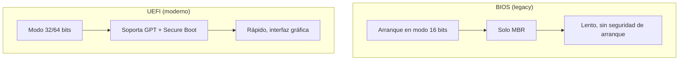
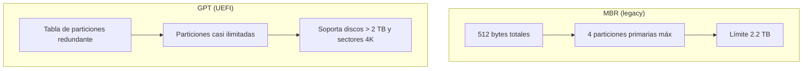
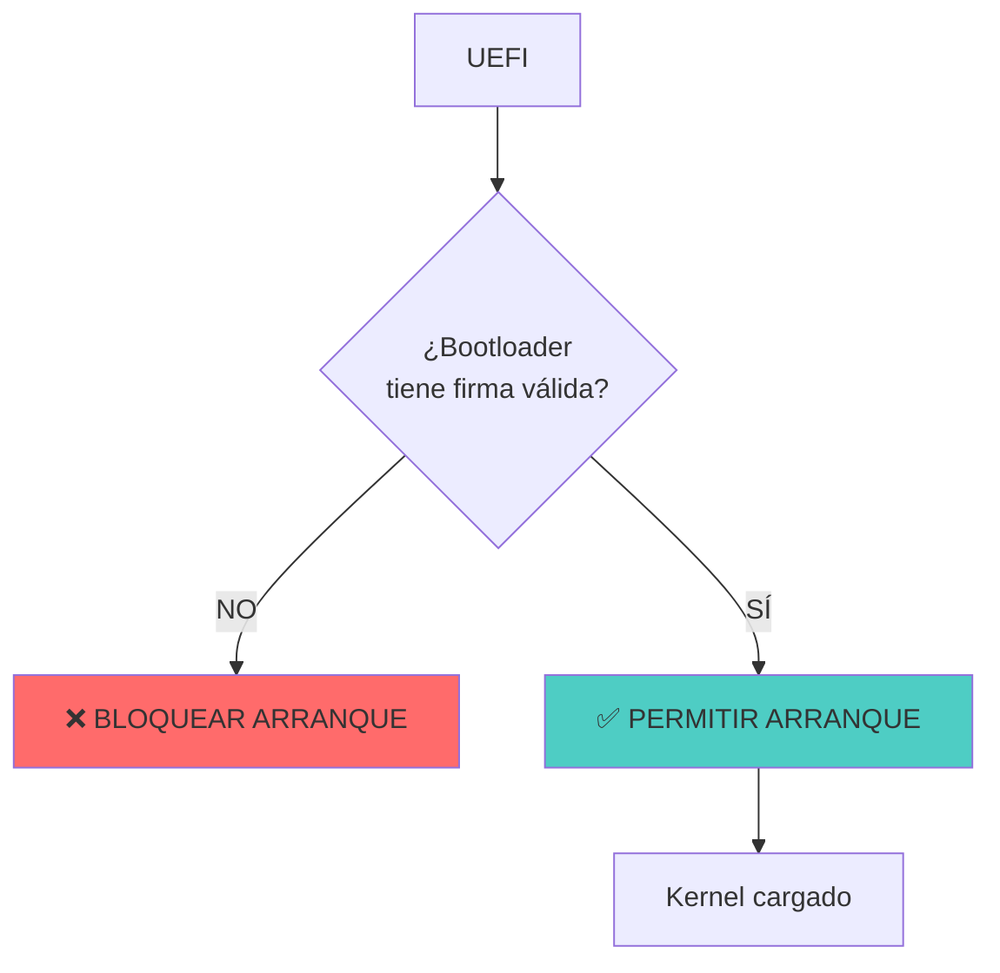
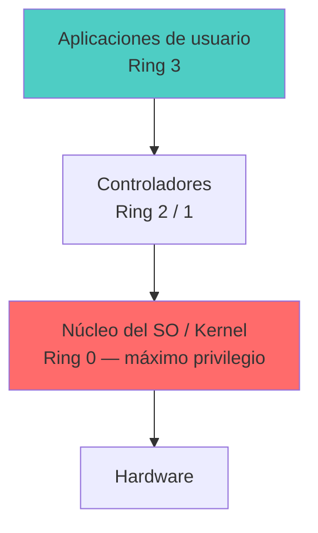
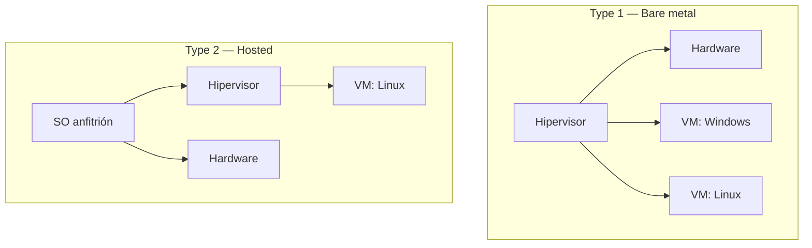
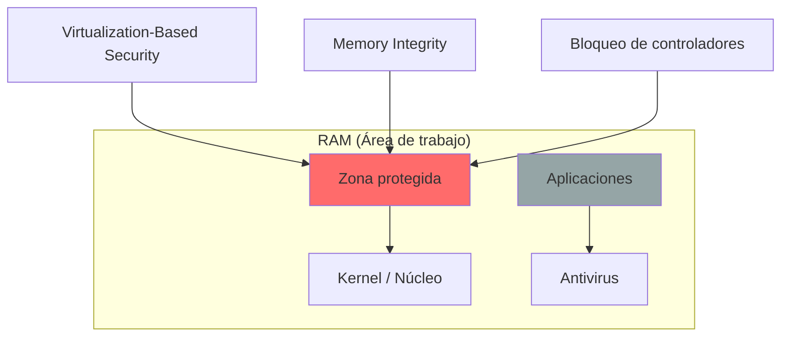

# 🛡️ Arranque y Seguridad

> [!info] Módulo
> **Unidad 2 — Almacenamiento y Arranque**
> **Tema:** Arranque y Seguridad (POST, UEFI, Secure Boot, Core Isolation)
> **Ver también:** [[01-TPM|🔐 TPM]], [[02-Sistemas-de-Archivos|💾 Sistemas de archivos]]

> [!tip] Prerrequisitos
> - TPM (funciones y propósito)
> - Sistemas de archivos (FAT, NTFS)
> - Conceptos de firmware (ROM, BIOS, UEFI)

---

## 📋 Tabla de contenidos

- [[#Secuencia-de-arranque]]
- [[#ROM-BIOS-vs-UEFI]]
- [[#Secure-Boot-—-La-guardería-del-sistema]]
- [[#Aislamiento-de-núcleo-(Core-Isolation)]]
- [[#BitLocker]]
- [[#EFS-—-cifrado-por-archivo-(Encrypting-File-System)]]
- [[#Registro-de-Windows-(regedit)]]
- [[#Contraseñas-cifradas-vs-encriptadas]]
- [[#Malware-clásico-Virus-de-sector-de-arranque]]
- [[#Ataques-DMA-(Direct-Memory-Access)]]
- [[#Ciclo-de-vida-completo-de-una-sesión]]

---

## Secuencia de arranque



> [!warning] Regla de oro
> Todo se carga en la **RAM** (área de trabajo del procesador). Si la RAM se llena, el sistema se vuelve lento.

> [!info] Captura del profesor: arquitectura y flujo de arranque de Microsoft Pluton
> Fuente: `2 TPM introducción y seguridd del dispositivo.pdf`, diapositiva
> "Flujo de Carga del FIRMWARE". Dos diagramas:
>
> **Diagrama de arquitectura** (dos bloques apilados con doble flecha entre
> ellos):
> - **Bloque de software** (arriba): caja "Sistema operativo Windows"
>   contiene dos sub-cajas lado a lado: `Controladores de Plutón` y
>   `Firmware de Plutón`. Nota al lado: *"Durante el inicio de Windows, se
>   utiliza en su lugar la última versión del firmware de Plutón, si está
>   disponible."*
> - **Bloque de hardware y firmware** (abajo): caja "CPU (sistema en chip)"
>   contiene: `Procesador de seguridad Plutón`, un icono de `CPU Núcleos`, y
>   (resaltado en naranja) `Firmware de Microsoft Plutón`. Nota al lado:
>   *"En el arranque del sistema, el firmware de Microsoft Plutón se carga
>   desde el almacenamiento Flash."*
>
> **Flujo de arranque** (secuencia lineal con una decisión):
> ```
> [Encender] (ícono de power)
>       ↓
> Hardware de Plutón e Inicialización de ROM
>       ↓
> Cargar Firmware de Plutón del almacenamiento flash SPI
>       ↓
> UEFI: Arranque en CPU
>       ↓
> Entrega de UEFI a Boot Manager y winload (cargador del SO)
>       ↓
> ¿Versión actualizada de firmware de Plutón disponible en Windows? (decisión)
>       ├─ Sí → Cargar Firmware Plutón de Windows ──┐
>       └─ No → Usar el firmware de Plutón de flash SPI ─┤
>                                                          ↓
>                                                   Iniciar en Windows
> ```

> [!warning] Para memorizar — orden exacto del flujo Pluton
> El orden es: **Hardware Plutón + ROM → Firmware desde SPI flash → UEFI en
> CPU → Boot Manager/winload → decisión de versión de firmware → Windows**.
> El punto que más se confunde: la decisión ocurre **después** de que UEFI
> entrega el control a winload, no antes — es decir, el sistema ya está
> arrancando Windows cuando decide qué firmware de Plutón usar.

---

## ROM BIOS vs UEFI



| Característica | BIOS | UEFI |
|----------------|------|------|
| Dirección de arranque | `0x7C00` (fija) | Variable (GUID) |
| Particiones | MBR (4 primarias) | GPT (ilimitadas) |
| Tamaño máximo disco | 2 TB | 9.4 ZB |
| Interfaz | Texto | Gráfica + mouse |
| Secure Boot | ❌ No | ✅ Sí |
| Velocidad | Lenta | Rápida |

### MBR vs GPT



| Característica | MBR | GPT |
|----------------|-----|-----|
| Sector 0 | MBR | GPT Header |
| Tabla | Sectores 1-33 | Sectores 1-33 |
| Particiones | 4 primarias | 128+ |
| Tamaño máximo | 2 TB | 9.4 ZB |

> [!info] Nota
> El TPM debe habilitarse desde ROM BIOS/UEFI antes de instalar el sistema operativo. Si está deshabilitado en firmware, Windows no podrá usarlo.

---

## Secure Boot — La guardería del sistema

> [!example] Analogía del profesor
> **❌ Sin Secure Boot** (años 90): El papá deja al niño en la puerta del colegio y se va. Cualquiera podría llevárselo.
>
> **✅ Con Secure Boot** (hoy): El papá entrega el niño personalmente a la profesora, quien lo acompaña al salón.



> [!warning] Limitación
> Secure Boot protege **solo el arranque**. Una vez en el sistema operativo, el malware puede ejecutarse igual.

---

## Aislamiento de núcleo (Core Isolation)

### Niveles de privilegio (Anillos de protección)


> El kernel corre en **Ring 0** (acceso total al hardware); las apps en **Ring 3** (sin acceso directo). Una app pide al SO (syscall) para tocar hardware.

### Tipos de hipervisor (virtualización)





> [!info] ¿Por qué es necesario?
> - El kernel se ejecuta con privilegios máximos.
> - Si un malware infecta el kernel, tiene control total del equipo.
> - Core Isolation usa **VBS (Virtualization-Based Security)** para crear una región especial en RAM donde el kernel está protegido de modificaciones.

### Funciones activadas

| Función | Protege contra |
|---------|----------------|
| **Integridad de memoria** | Modificación del kernel en RAM |
| **Protección de excepción** | Corrupción de memoria (buffer overflows) |
| **Bloqueo de controladores** | Drivers maliciosos o vulnerables |

> [!warning] Conflicto común
> En el aula, el profesor mencionó conflictos con VirtualBox cuando estas funciones están activas — el hipervisor necesita acceso directo a memoria.

---
