# 🛡️ Arranque y Seguridad

> [!info] Módulo
> **Clase 2** — TPM y Sistemas de Archivos  
> **Tema:** Arranque y Seguridad (POST, UEFI, Secure Boot, BitLocker)  
> **Ver también:** [[01-TPM|🔐 TPM]], [[02-Sistemas-de-Archivos|💾 Sistemas de archivos]]

> [!tip] Prerrequisitos
> - TPM (funciones y propósito)
> - Sistemas de archivos (FAT, NTFS)
> - Conceptos de firmware (ROM, BIOS, UEFI)

---

## 📋 Tabla de contenidos

- [[#Secuencia-de-arranque]]
- [[#ROM-BIOS-vs-UEFI]]
- [[#Secure-Boot-—-La-guardería-del-sistema]]
- [[#Aislamiento-de-núcleo-(Core-Isolation)]]
- [[#BitLocker]]
- [[#EFS-—-cifrado-por-archivo-(Encrypting-File-System)]]
- [[#Registro-de-Windows-(regedit)]]
- [[#Contraseñas-cifradas-vs-encriptadas]]
- [[#Malware-clásico-Virus-de-sector-de-arranque]]
- [[#Ataques-DMA-(Direct-Memory-Access)]]
- [[#Ciclo-de-vida-completo-de-una-sesión]]

---

## Secuencia de arranque

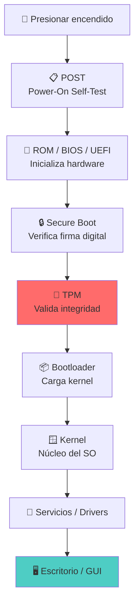

> [!warning] Regla de oro
> Todo se carga en la **RAM** (área de trabajo del procesador). Si la RAM se llena, el sistema se vuelve lento.

---

## ROM BIOS vs UEFI

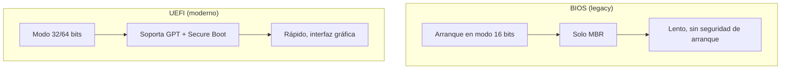

| Característica | BIOS | UEFI |
|----------------|------|------|
| Dirección de arranque | `0x7C00` (fija) | Variable (GUID) |
| Particiones | MBR (4 primarias) | GPT (ilimitadas) |
| Tamaño máximo disco | 2 TB | 9.4 ZB |
| Interfaz | Texto | Gráfica + mouse |
| Secure Boot | ❌ No | ✅ Sí |
| Velocidad | Lenta | Rápida |

### MBR vs GPT

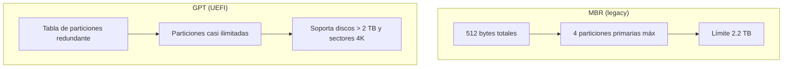

| Característica | MBR | GPT |
|----------------|-----|-----|
| Sector 0 | MBR | GPT Header |
| Tabla | Sectores 1-33 | Sectores 1-33 |
| Particiones | 4 primarias | 128+ |
| Tamaño máximo | 2 TB | 9.4 ZB |

> [!info] Nota
> El TPM debe habilitarse desde ROM BIOS/UEFI antes de instalar el sistema operativo. Si está deshabilitado en firmware, Windows no podrá usarlo.

---

## Secure Boot — La guardería del sistema

> [!example] Analogía del profesor
> **❌ Sin Secure Boot** (años 90): El papá deja al niño en la puerta del colegio y se va. Cualquiera podría llevárselo.
>
> **✅ Con Secure Boot** (hoy): El papá entrega el niño personalmente a la profesora, quien lo acompaña al salón.

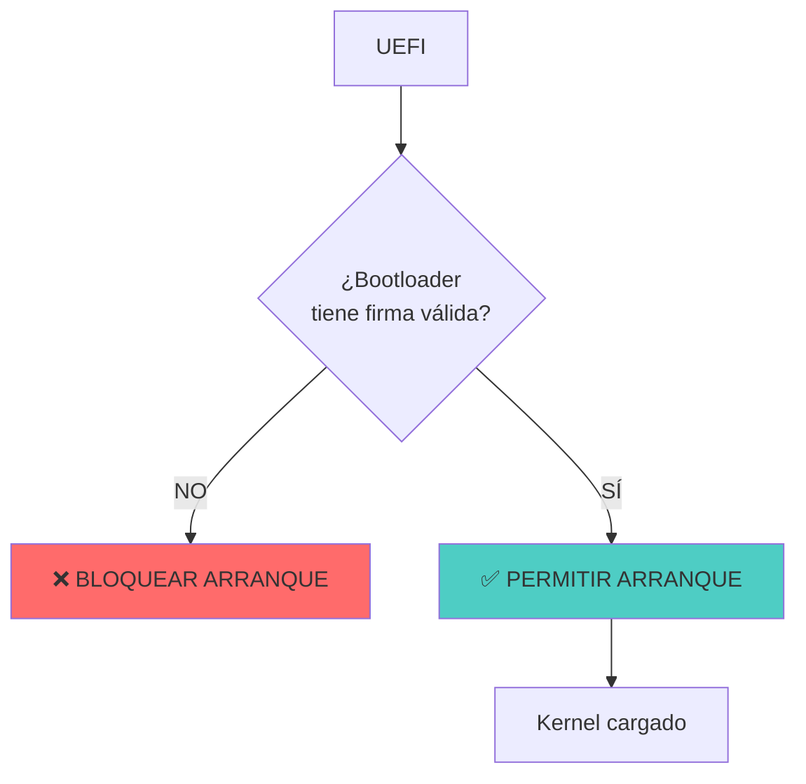

> [!warning] Limitación
> Secure Boot protege **solo el arranque**. Una vez en el sistema operativo, el malware puede ejecutarse igual.

---

## Aislamiento de núcleo (Core Isolation)

### Niveles de privilegio (Anillos de protección)

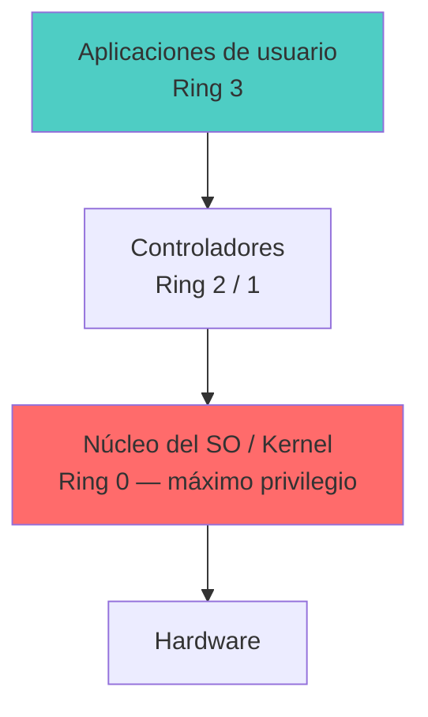
> El kernel corre en **Ring 0** (acceso total al hardware); las apps en **Ring 3** (sin acceso directo). Una app pide al SO (syscall) para tocar hardware.

### Tipos de hipervisor (virtualización)

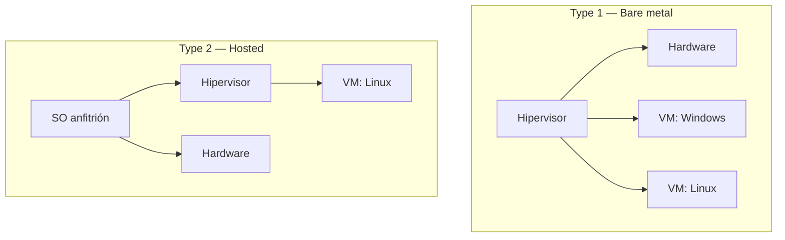

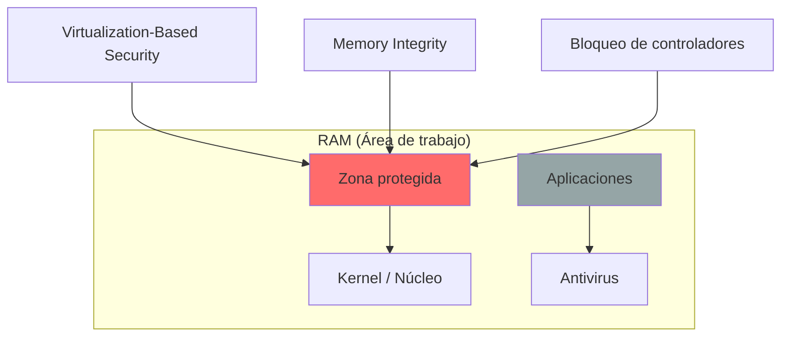

> [!info] ¿Por qué es necesario?
> - El kernel se ejecuta con privilegios máximos.
> - Si un malware infecta el kernel, tiene control total del equipo.
> - Core Isolation usa **VBS (Virtualization-Based Security)** para crear una región especial en RAM donde el kernel está protegido de modificaciones.

### Funciones activadas

| Función | Protege contra |
|---------|----------------|
| **Integridad de memoria** | Modificación del kernel en RAM |
| **Protección de excepción** | Corrupción de memoria (buffer overflows) |
| **Bloqueo de controladores** | Drivers maliciosos o vulnerables |

> [!warning] Conflicto común
> En el aula, el profesor mencionó conflictos con VirtualBox cuando estas funciones están activas — el hipervisor necesita acceso directo a memoria.

---

## BitLocker

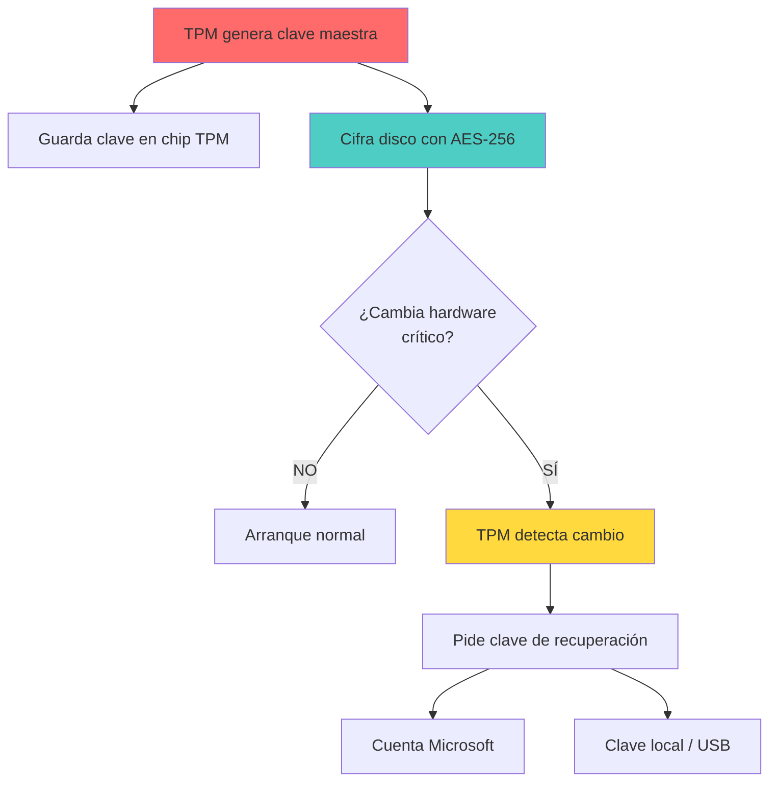

### ¿Dónde se usa contraseña?

| Unidad | Contraseña directa | Clave de recuperación |
|--------|-------------------|----------------------|
| **Sistema (C:)** | ❌ No | ✅ Sí (cuenta Microsoft / TPM) |
| **Datos fijos (D:, E:)** | ✅ Sí | ✅ Sí |
| **USB extraíble** | ✅ Sí | ✅ Sí |

> [!info] ¿Por qué no contraseña en C:?
> Es un problema de huevo y gallina: necesitas acceder al sistema para escribir la contraseña... pero el sistema está en el disco cifrado. Por eso se usa el TPM.

---

## EFS — cifrado por archivo (Encrypting File System)

> [!info] Del laboratorio (Clase 3)
> **EFS** cifra **archivos o carpetas individuales** (no el volumen entero como BitLocker).

| | BitLocker | EFS |
|---|---|---|
| Alcance | Volumen/disco completo | Archivo o carpeta |
| Llave | TPM (VMK/FMK) | **Local**, asociada a tu cuenta |
| Portabilidad | El disco se descifra con el TPM | El archivo lleva su cifrado; en otro equipo: *"no tiene permisos"* |
| Robustez | Alta (hardware + TPM) | Menor — *"tendencia a morir"* |

Para activarlo: `Propiedades` del archivo → `Avanzadas` → **Cifrar contenido para proteger los datos**. El cifrado queda ligado a tu usuario de Windows: si llevas el archivo a la PC de otro, no podrás abrirlo.

> [!warning] EFS ≠ BitLocker
> EFS protege archivos sueltos con una llave local; BitLocker protege todo el volumen usando el TPM. No son intercambiables.

---

## Registro de Windows (`regedit`)

El **Registro** es el *"árbol genealógico de Windows"*: base central de configuración del SO.

> [!tip] Lo que se puede hacer desde el Registro
> - Establecer **políticas de seguridad** (p. ej. que el navegador pida clave al abrir).
> - **Apagar la telemetría**.
> - **Bloquear puertos USB**.
> - Ampliar el **límite de longitud de ruta** de archivos (ver [[02-Sistemas-de-Archivos|💾 Sistemas de archivos]]).

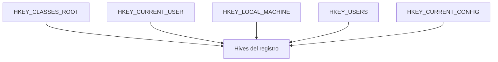

> [!warning] Toca con cuidado
> Un valor mal puesto puede dejar el equipo inutilizable. Mejor practicar en una **máquina virtual**.

---

## Contraseñas: cifradas vs encriptadas

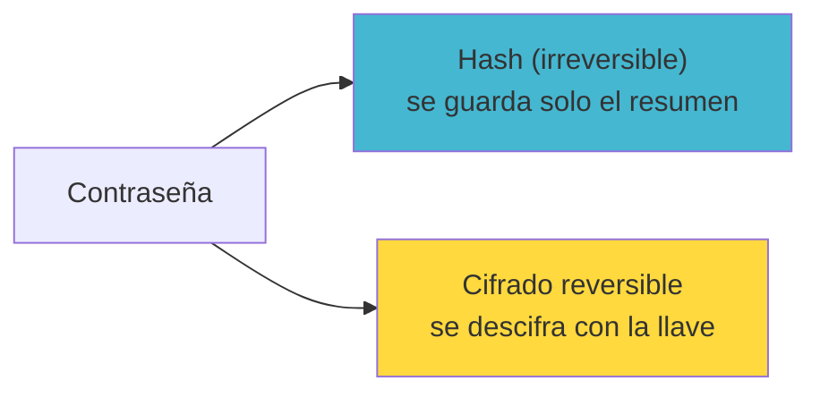

> [!warning] Error común
> Si el sistema te muestra tu contraseña anterior, está almacenada de forma reversible → **no es seguro**.
>
> | Tipo | Descripción | Ejemplo |
> |------|-------------|---------|
> | **Cifrado reversible** | Se puede descifrar | ❌ Contraseñas en texto claro o reversible |
> | **Hash irreversible** | No se puede recuperar | ✅ NTLM, bcrypt, SHA-256 |

> El profesor corrigió a un estudiante en clase: las contraseñas deben ser **hasheadas**, no cifradas.

---

## Malware clásico: Virus de sector de arranque

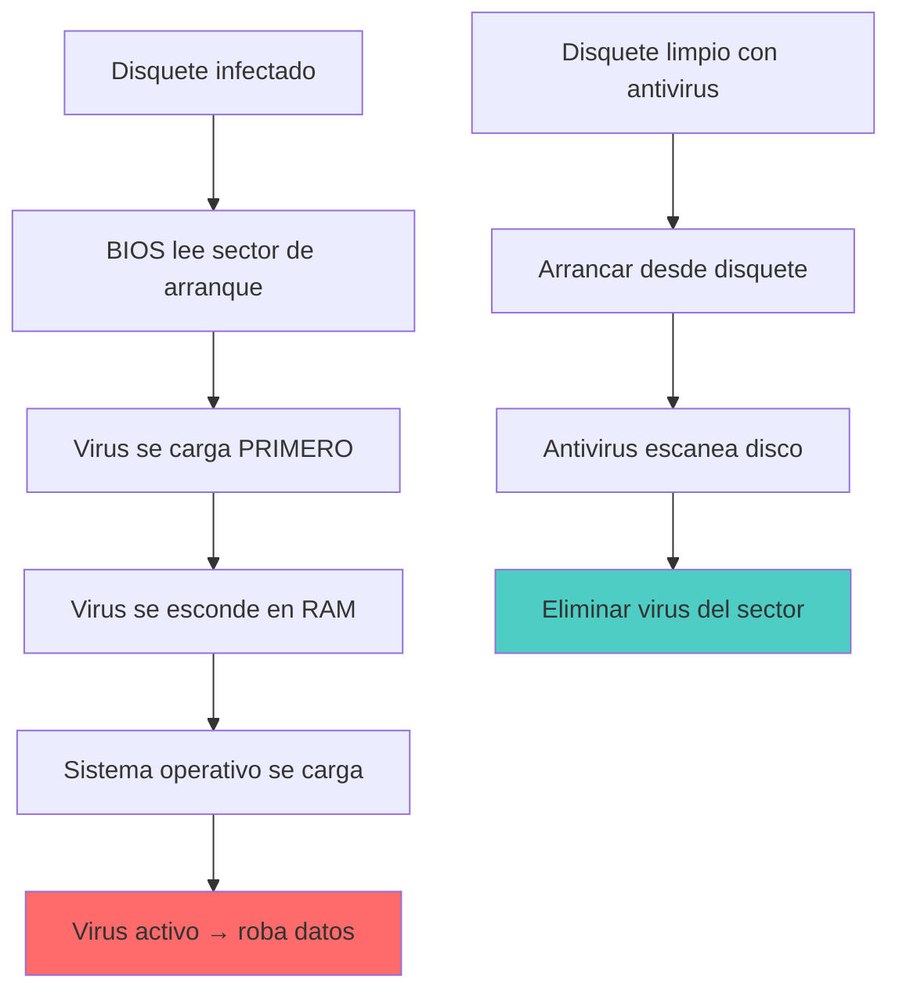

> [!info] Mitigación moderna
> Secure Boot + TPM detectan si el sector de arranque fue modificado y bloquean la ejecución. Ya no necesitamos disquetes.

---

## Ataques DMA (Direct Memory Access)

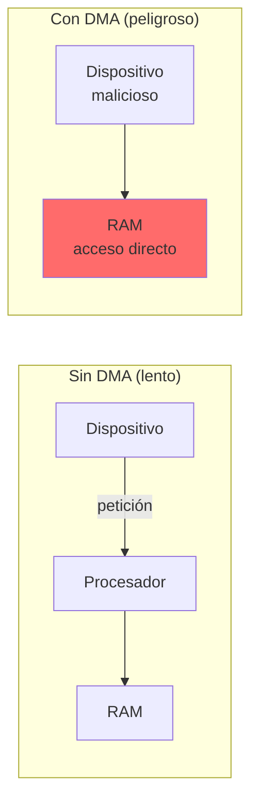

| Puerto | Riesgo |
|--------|--------|
| 🔴 FireWire (IEEE 1394) | Acceso directo a RAM |
| 🔴 Thunderbolt | Acceso directo a RAM |
| 🔴 PCI Express (sin IOMMU) | Acceso directo a RAM |

> [!warning] Peligro
> Un dispositivo malicioso puede **leer o escribir memoria RAM directamente**, bypasseando el sistema operativo.

---

## Ciclo de vida completo de una sesión

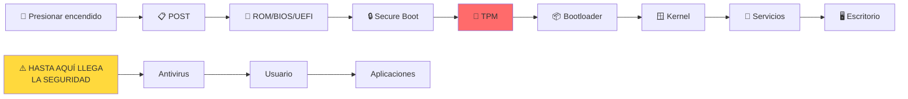

> [!info] Importante
> La seguridad se garantiza hasta el paso 6 (kernel cargado). Después de eso, depende del usuario (antivirus, buenas prácticas, actualizaciones).

---

## Instalación en máquina virtual (VirtualBox + Windows 11)

Para practicar sin arriesgar el equipo real, instala Windows 11 dentro de **VirtualBox**. Como el anfitrión puede no tener TPM, Windows permite saltarse las comprobaciones durante el asistente de instalación.

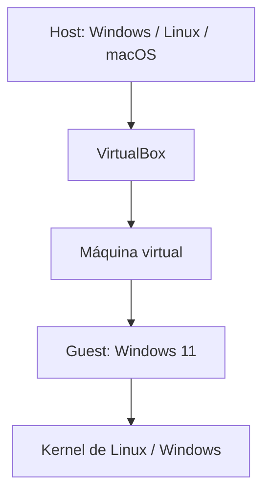

### Saltar la verificación de TPM / RAM / Secure Boot
En el paso de verificación, `SHIFT+F10` abre la consola. En el Registro:
1. `HKEY_LOCAL_MACHINE\System\Setup` → nueva clave **LabConfig**.
2. Dentro, crea tres valores **DWORD de 32 bits** con valor `1`:
   - `BypassTPMCheck`
   - `BypassRAMCheck`
   - `BypassSecureBootCheck`
3. Vuelve al asistente y elige la versión de Windows.

### Saltar la cuenta Microsoft / conexión a Internet
En el paso de red: `SHIFT+F10` → `oobe\bypassnro` (reinicia y permite crear un usuario local sin internet).

> [!warning] Solo para laboratorio
> Estos *bypass* son para prácticas en VM. En equipo real, Windows 11 **requiere** TPM 2.0 y Secure Boot.

---

## 📝 Autoevaluación

<details>
<summary>📦 Abrir preguntas y respuestas</summary>

### Pregunta 1 — Secure Boot
¿Qué es Secure Boot y qué protege?

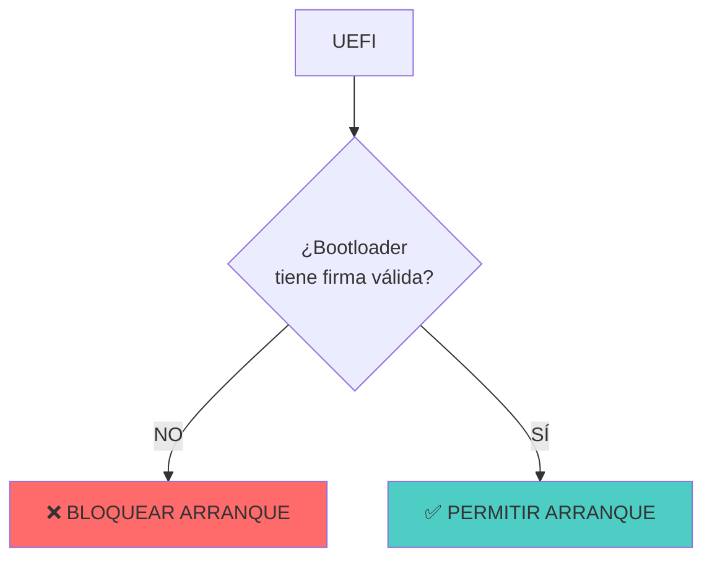

> **Respuesta:** Secure Boot verifica la firma digital del bootloader. **Solo protege el arranque**, no el SO cargado.

---

### Pregunta 2 — BitLocker en C:
¿Por qué no se puede poner contraseña directa a la unidad C: en BitLocker?

```
PROBLEMA DEL HUEVO Y LA GALLINA
┌──────────────────────────────────┐
│ ❌ Necesitas acceder a C:       │
│ ❌ Pero C: está cifrada         │
│ ✅ TPM guarda la clave automáticamente │
└──────────────────────────────────┘
```

> **Respuesta:** Es problema de huevo/gallina: accedes al sistema cifrado para escribir la contraseña. Por eso se usa TPM.

---

### Pregunta 3 — Core Isolation
¿Qué es Core Isolation y por qué es necesaria?

| Sin Core Isolation | Con Core Isolation |
|-------------------|-------------------|
| Kernel en RAM expuesto | Kernel en región protegida |
| Malware puede modificarlo | Solo lectura para el resto |

> **Respuesta:** Aísla el kernel en RAM protegida usando virtualización. Protege contra modificaciones por malware.

</details>

---

## 🎯 Próximo paso

> [!info] Continuar con
> **[[04-Estructuras-de-Datos|📊 Estructuras de datos]]** — Ahora entenderás cómo las estructuras de datos (arrays, listas, árboles) son la base de todo lo que vimos en sistemas de archivos y arranque.

---

## ⚠️ Errores comunes

> [!warning] Error 1: Secure Boot = antivirus
> Secure Boot solo verifica el bootloader. No protege contra malware que se ejecuta después del arranque del sistema operativo.

> [!warning] Error 2: DMA es solo para redes
> DMA (Direct Memory Access) permite a dispositivos como FireWire, Thunderbolt o PCIe acceder a la RAM directamente, sin pasar por el procesador. Es un riesgo de seguridad físico.

> [!warning] Error 3: Arranque seguro = sistema limpio
> El arranque seguro garantiza que el bootloader es legítimo. Una vez en el SO, el usuario puede instalar malware igual.

> [!warning] Error 4: TPM = protección total
> TPM protege el arranque y datos en reposo. No protege contra phishing, ingeniería social, o malware en ejecución.

---

## Referencias

> [!info] Recursos externos
> - [Microsoft — Secure Boot](https://learn.microsoft.com/en-us/windows-hardware/drivers/install/secure-boot)
> - [Microsoft — Core Isolation](https://learn.microsoft.com/en-us/windows-hardware/design/device-experiences/windows-defender-application-control/core-isolation)
> - [Microsoft — BitLocker](https://learn.microsoft.com/en-us/windows/security/information-protection/bitlocker)
> - [TCG — TPM Specification](https://trustedcomputinggroup.org/work-groups/trusted-platform-module/)
