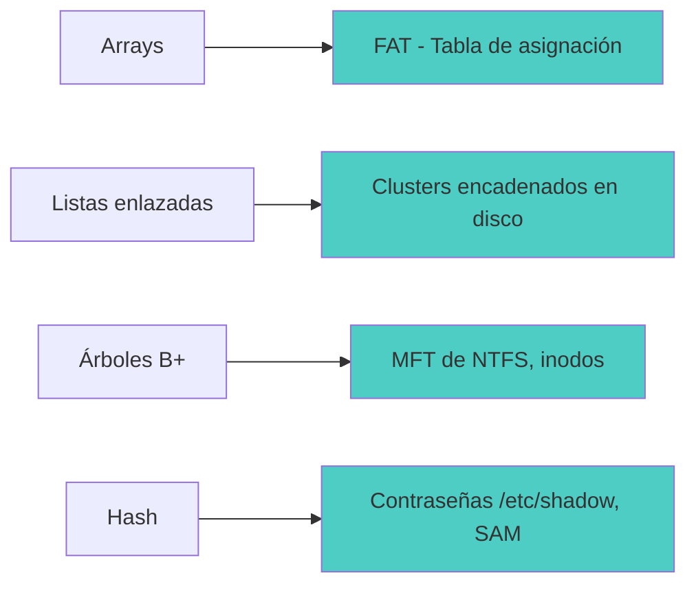
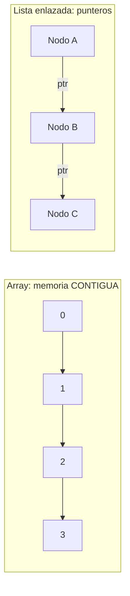
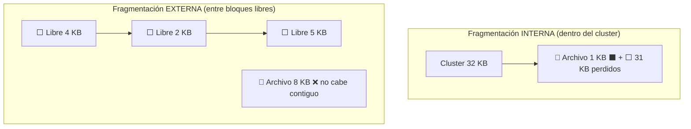
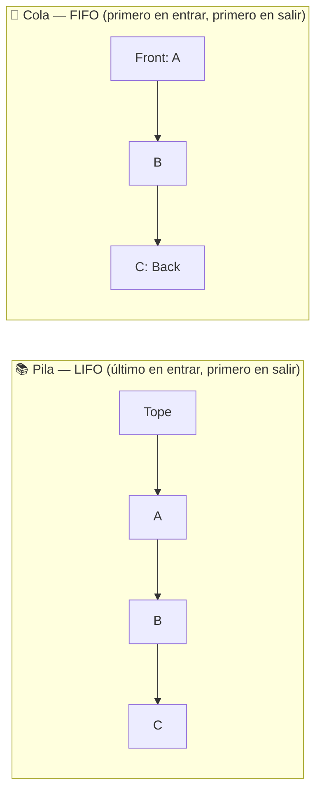
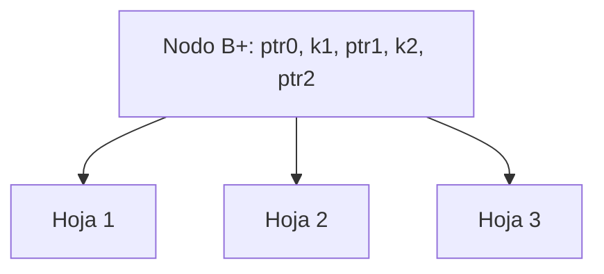
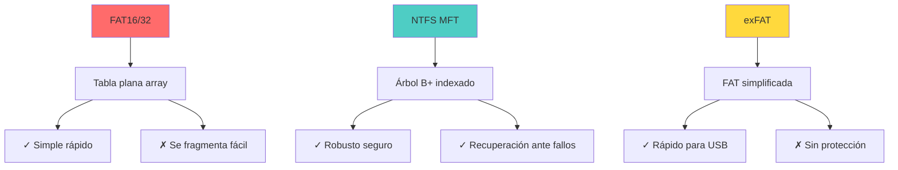
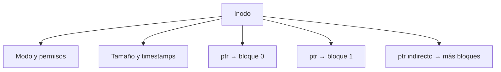
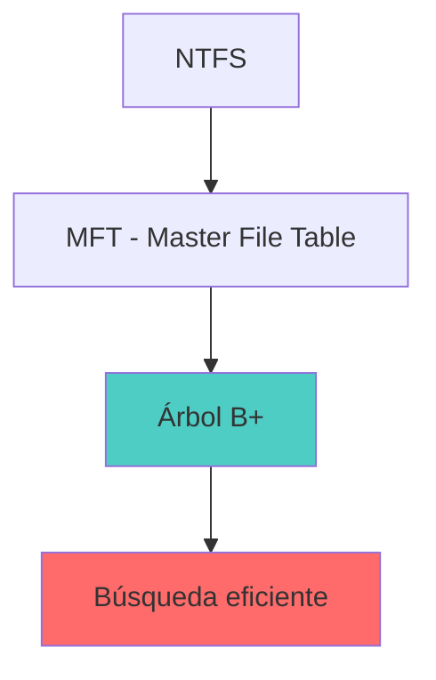

# 📊 Estructuras de Datos y Sistemas de Archivos

> [!info] Módulo
> **Unidad 2 — Almacenamiento y Arranque**
> **Tema:** Estructuras de Datos aplicadas a Sistemas de Archivos
> **Ver también:** [[02-Sistemas-de-Archivos|💾 Sistemas de archivos]], [[01-TPM|🔐 TPM]]

> [!tip] Prerrequisitos
> - Conceptos básicos de programación
> - Arrays y listas enlazadas
> - Sistemas de archivos (FAT, NTFS)

---

## 📋 Tabla de contenidos

- [[#Conexión-entre-materias]]
- [[#Array-vs-Lista-enlazada]]
- [[#Fragmentación]]
- [[#Aplicación-en-sistemas-de-archivos]]
- [[#Ejemplo-práctico-Clusters-y-archivos-pequeños]]
- [[#Directorios-como-archivos]]

---

## Conexión entre materias

> [!quote] Profesor Fabián Robles
> "Asocien materias. No aprendas estructuras de datos aisladas — son la base de cómo el SO organiza la información."



---

## Array vs Lista enlazada


> El array reserva celdas contiguas (rápido de indexar, costoso de insertar); la lista enlazada reparte nodos por la memoria y los enlaza con punteros.

| Característica | Array (Arreglo) | Lista enlazada |
|----------------|-----------------|----------------|
| **Memoria** | Contigua | Dispersa |
| **Acceso** | O(1) por índice | O(n) secuencial |
| **Inserción** | Costosa (desplazamiento) | O(1) en cabeza |
| **Eliminación** | Costosa (desplazamiento) | O(1) si tienes el nodo |

### En el contexto de discos

| Característica | Array (FAT) | Lista enlazada (clusters) |
|----------------|-------------|---------------------------|
| **Ubicación** | Contigua | Dispersa en el disco |
| **Acceso** | Directo por índice | Secuencial (saltos) |
| **Velocidad** | ⚡ Rápida | 🐢 Más lenta |
| **Fragmentación** | Baja si contiguo | Alta (archivos dispersos) |

> [!warning] Pregunta de examen (del profesor)
> **¿Una RAID puede estar seguida en memoria?**
>
> **NO.** Una RAID (lista) siempre está dispersa.
>
> Si dices que sí → **¡Cae!**

---

## Fragmentación



**Pilas y colas (estructuras básicas):**



### Interna

```
CLUSTER DE 32 KB
━━━━━━━━━━━━━━━━━━━━━━━━━━━━━━━━━━━━━━━━━━━━━━━━━

  Archivo: "A.txt" (1 byte)
  
  ┌──────────────────────────────┐
  │ A (1 byte)                   │
  ├──────────────────────────────┤
  │ 31,999 bytes VACÍOS          │
  │ ← FRAGMENTACIÓN INTERNA      │
  └──────────────────────────────┘
  
  Espacio usado: 32 KB
  Espacio real:  1 byte
  Desperdicio:   31,999 bytes (99.996%)
```

### Externa

```
DISCO CON FRAGMENTACIÓN EXTERNA
━━━━━━━━━━━━━━━━━━━━━━━━━━━━━━━━━━━━━━━━━━━━━━━━━

  Archivo A: [Cluster 1][Cluster 5][Cluster 12]
  Archivo B: [Cluster 2][Cluster 6][Cluster 13]
  Archivo C: [Cluster 3][Cluster 7][Cluster 14]

  Espacios libres entre clusters → desperdicio
  Tiempo de lectura → mayor (cabezal salta)
```

> [!info] Solución
> **Desfragmentación**: Reorganiza clusters para que cada archivo esté contiguo.

---

## Aplicación en sistemas de archivos


> NTFS indexa la MFT con un **árbol B+**: pocos niveles bastan para millones de archivos y la búsqueda es O(log n).



---

## Ejemplo práctico: Clusters y archivos pequeños

```
ESCENARIO: Pendrive de 8 GB, cluster de 32 KB
━━━━━━━━━━━━━━━━━━━━━━━━━━━━━━━━━━━━━━━━━━━━━━━━━

  Si guardas 10,000 archivos de 1 byte cada uno:

  Espacio teórico: 10,000 bytes ≈ 10 KB
  Espacio real:    10,000 × 32 KB = 312,500 KB ≈ 305 MB

  ¡10 KB se convirtieron en 305 MB!
  Desperdicio: 3,050,000%
```

### Fórmula

$$ \text{Espacio en disco} = \text{número\_de\_archivos} \times \text{tamaño\_de\_cluster} $$

> [!tip] Conclusión
> El tamaño de cluster debe elegirse según el tipo de archivo que predominará en el volumen.

---

## Directorios como archivos


> En UNIX un **directorio es un archivo** que mapea (nombre → inodo). El inodo guarda metadatos y los punteros a los bloques de datos.

```
EN UNIX/LINUX TODO ES ARCHIVO
━━━━━━━━━━━━━━━━━━━━━━━━━━━━━━━━━━━━━━━━━━━━━━━━━

  /home/usuario/
  ├── 📄 tesis.docx        ← archivo regular
  ├── 🖼️ foto.jpg          ← archivo regular
  ├── 📁 Documentos/       ← archivo especial directorio
  │   ├── 📄 informe.pdf
  │   └── 📄 presupuesto.xlsx
  └── 📁 .config/          ← archivo oculto directorio
      └── ⚙️ settings.conf
```

---

## Resumen comparativo

| Concepto | Estructura de datos | Aplicación en SO |
|----------|---------------------|------------------|
| Array | Arreglo contiguo | Tabla FAT |
| Lista enlazada | Nodos encadenados | Clusters de disco |
| Árbol B+ | Árbol balanceado | MFT de NTFS |
| Hash | Función irreversible | Contraseñas en /etc/shadow, SAM |
| Grafo | Nodos + aristas | Sistema de archivos (carpetas ↔ archivos) |

---

## 📝 Autoevaluación

<details>
<summary>📦 Abrir preguntas y respuestas</summary>

### Pregunta 1 — Array vs Lista enlazada
¿Cuál es la diferencia principal entre un array y una lista enlazada?

```
ARRAY                     LISTA ENLAZADA
[1][2][3][4][5]          ┌───┐    ┌───┐    ┌───┐
Contiguo en memoria      │ 1 │───▶│ 2 │───▶│ 3 │
Acceso O(1)              └───┘    └───┘    └───┘
```

> **Respuesta:** Un **array** es memoria contigua con acceso O(1) por índice. Una **lista enlazada** es dispersa con acceso O(n) secuencial pero inserciones O(1).

---

### Pregunta 2 — RAID en memoria
¿Por qué una RAID no puede estar "seguida" en memoria?

> **Respuesta:** Porque la RAID es una lista enlazada por definición. Siempre está dispersa en memoria, nunca contigua.

---

### Pregunta 3 — Estructura en NTFS
¿Qué estructura de datos usa NTFS para organizar archivos?



> **Respuesta:** El **MFT** usa un **árbol B+** para búsqueda eficiente. Combina rápido acceso, journaling y permisos granulares.
</details>

---

## 🎯 Próximo paso

> [!info] Continuar con
> **[[05-Historia-Windows|🪟 Historia de Windows]]** — Verás la evolución de Windows y entenderás por qué cada versión tuvo éxito o fracaso.

---

## ⚠️ Errores comunes

> [!warning] Error 1: Array = lista enlazada
> Un array es memoria contigua. Una lista enlazada usa punteros para conectar nodos dispersos. Son estructuras completamente diferentes.

> [!warning] Error 2: Fragmentación = espacio libre
> La fragmentación es espacio desperdiciado **dentro** o **entre** clusters. No es lo mismo que espacio libre disponible.

> [!warning] Error 3: Directorio = concepto abstracto
> En UNIX/Linux, un directorio **es un archivo** que contiene nombres + inodos. No es un contenedor mágico, es una estructura de datos.

---

## Referencias

> [!info] Recursos externos
> - [Microsoft — NTFS Overview](https://learn.microsoft.com/en-us/windows/storage/file-systems/ntfs)
> - [Microsoft — exFAT](https://learn.microsoft.com/en-us/windows/storage/exfat)
> - [Microsoft — FAT](https://learn.microsoft.com/en-us/windows/win32/fileio/using-the-fat-file-system)
