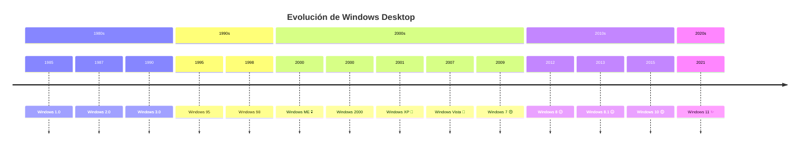
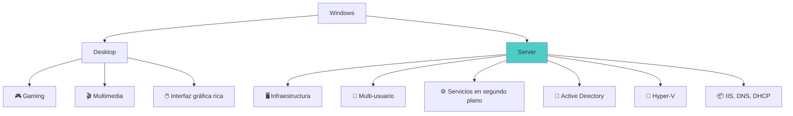
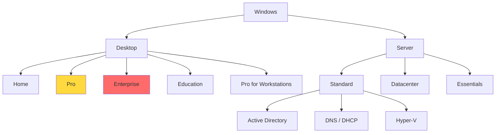
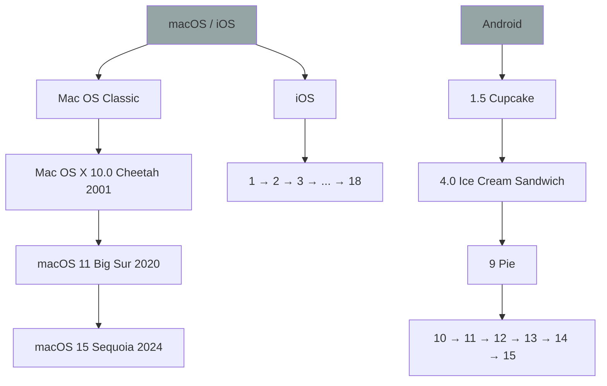

# 🪟 Historia de Windows

> [!info] Módulo
> **Clase 2** — Historia de Windows
> **Tema:** Historia de Windows (Desktop y Server)
> **Ver también:** [[06-Mercado-OS|📊 Mercado de OS]]

> [!tip] Prerrequisitos
> - Conceptos básicos de sistema operativo
> - Conocimiento de versiones de software

---

## 📋 Tabla de contenidos

- [[#Línea-de-tiempo-—-Windows-Desktop]]
- [[#Windows-Server]]
- [[#Ediciones-de-Windows]]
- [[#Otras-familias-de-sistemas-operativos]]

---

## Línea de tiempo — Windows Desktop



### Tabla detallada

| Versión | Año | Icono | Evaluación | Notas clave |
|---------|-----|-------|------------|-------------|
| **Windows 1.0** | 1985 | 🪟 | Experimental | Sobre MS-DOS, ventanas básicas |
| **Windows 2.0** | 1987 | 🪟 | Mejora | Ventanas superpuestas |
| **Windows 3.0/3.1** | 1990/92 | 🪟 | Éxito | 256 colores, popularización |
| **Windows 95** | 1995 | 🪟 | Revolucionario | Menú Inicio, barra de tareas, Plug and Play |
| **Windows 98** | 1998 | 🪟 | Bueno | USB, FAT32 |
| **Windows ME** | 2000 | 💀 | **PEOR** | Inestable, "Millennium" |
| **Windows 2000** | 2000 | 🏢 | Estable | NT para empresas |
| **Windows XP** | 2001 | 🎉 | Excelente | Muy longeva, mezcla NT + consumer |
| **Windows Vista** | 2007 | 😤 | Mala | Requisitos altos, cambios forzados |
| **Windows 7** | 2009 | 😍 | Muy buena | Estabilizó la línea NT |
| **Windows 8** | 2012 | 😕 | Regular | Eliminó botón Inicio, interfaz Metro |
| **Windows 8.1** | 2013 | 😐 | Mejora | Regresó botón Inicio parcialmente |
| **Windows 10** | 2015 | 😊 | Buena | Regreso completo del menú Inicio |
| **Windows 11** | 2021 | ✨ | Moderna | Rediseño, TPM 2.0, widgets |

> [!info] Curiosidad del profesor
> **Windows 11 es visualmente un Windows 10 con nuevo CSS** — mismo núcleo, nueva interfaz.

---

## Windows Server



### Línea de tiempo Server

| Versión | Año | Característica principal |
|---------|-----|--------------------------|
| NT 3.1 Advanced Server | 1993 | Primer servidor Windows NT |
| Windows 2000 Server | 2000 | Active Directory, DFS |
| Windows Server 2003 | 2003 | .NET, IIS 6 |
| Windows Server 2008 | 2008 | Hyper-V, Server Core |
| Windows Server 2012 | 2012 | PowerShell, SMB 3.0 |
| Windows Server 2016 | 2016 | Contenedores, Nano Server |
| Windows Server 2019 | 2018 | WSL, mejora en seguridad |
| Windows Server 2022 | 2021 | TLS 1.3, mejora en contenedores |

---

## Ediciones de Windows



| Edición | Uso | TPM |
|---------|-----|-----|
| **Home** | Consumo, hogar | No en versiones antiguas |
| **Pro** | PYMES, profesionales | ✅ Sí |
| **Enterprise** | Grandes empresas | ✅ Sí |
| **Education** | Universidades | ✅ Sí |

### Detalle de ediciones de escritorio (Home / Pro / Pro for Workstations)

> [!info] Desde la Introducción (Clase 1)
> Más allá de Home/Pro/Enterprise, la familia de escritorio incluye una edición de alto rendimiento.

| Edición | Perfil | Características distintivas |
|---------|--------|------------------------------|
| **Windows Home** | Hogar / usuario individual | Interfaz intuitiva, apps y juegos estándar, seguridad básica (Windows Defender), multimedia. Sin administración avanzada ni virtualización. |
| **Windows Pro** | Profesionales y PYMES | Directivas de grupo, escritorio remoto, unión a dominio, **BitLocker** (cifrado de disco), **Hyper-V** (virtualización). |
| **Windows Pro for Workstations** | Estaciones de trabajo de alto rendimiento | Soporte para hardware de servidor de gama alta, hasta **4 CPU y 6 TB de RAM**, sistema de archivos **ReFS**, procesamiento de gran volumen de datos. |

### Disponibilidad y audiencia por edición (captura de la clase)

> [!info] Desde la Introducción (Clase 1)
> Cuadro recuperado por OCR de la diapositiva de ediciones de Windows del PDF.

| Edición | Público | Disponibilidad |
|---------|---------|----------------|
| **Home** | Uso doméstico individual | Todos |
| **Pro** | PYMES y usuarios avanzados | Todos |
| **Pro for Workstations** | Requisitos avanzados de rendimiento y almacenamiento | Todos |
| **Enterprise** | Organizaciones empresariales de gran tamaño | Licencias por volumen, Contrato Enterprise, Microsoft Store para Educación o CSP |
| **LTSC** | Empresas con requisitos de cambio restrictivos | Licencias por volumen / Contrato Enterprise / CSP |
| **Pro Education** | Personal escolar, administradores, profesorado y estudiantes | Clientes académicos (licencias por volumen) |
| **Education** | Personal escolar, administradores, profesorado y estudiantes | Clientes académicos (licencias por volumen) |
| **IoT Core / Enterprise** | Dispositivos de uso fijo y embebidos | Distribuidores Windows IoT |

---

## Otras familias de sistemas operativos



### Familia Linux — distribuciones principales

| Distribución | Primera versión | Uso principal |
|--------------|-----------------|---------------|
| Debian | 1993 | Servidores y estabilidad |
| Red Hat Enterprise Linux | 2002 | Empresas y centros de datos |
| Fedora Linux | 2003 | Innovación y desarrollo |
| Ubuntu | 2004 | Escritorio, servidores y educación |
| Linux Mint | 2006 | Facilidad de uso para usuarios finales |
| CentOS | 2004 | Servidores empresariales (históricamente) |
| Arch Linux | 2002 | Usuarios avanzados y personalización |

### Familia macOS — versiones destacadas

| Versión | Año | Característica |
|---------|-----|----------------|
| Mac OS X Cheetah | 2001 | Primera versión basada en Unix |
| Mac OS X Tiger | 2005 | Mejoras en búsqueda e integración del sistema |
| Mac OS X Leopard | 2007 | Soporte para 64 bits |
| OS X Yosemite | 2014 | Rediseño visual importante |
| macOS Big Sur | 2020 | Adaptación a procesadores Apple Silicon |
| macOS Monterey | 2021 | Mayor integración con otros dispositivos Apple |
| macOS Ventura | 2022 | Mejoras en productividad y seguridad |
| macOS Sequoia | 2024 | Integración con IA y continuidad mejorada |

### Familia Android — versiones destacadas

| Versión | Año | Nombre |
|---------|-----|--------|
| Android 1.5 Cupcake | 2009 | Cupcake |
| Android 2.3 Gingerbread | 2010 | Gingerbread |
| Android 4.4 KitKat | 2013 | KitKat |
| Android 5.0 Lollipop | 2014 | Lollipop |
| Android 6.0 Marshmallow | 2015 | Marshmallow |
| Android 10 | 2019 | Cambio al esquema de numeración |
| Android 11 | 2020 | Mejoras en privacidad |
| Android 12 | 2021 | Diseño Material You |
| Android 13 | 2022 | Seguridad y permisos mejorados |
| Android 14 | 2023 | Optimización del rendimiento y accesibilidad |
| Android 15 | 2024 | Mejoras en productividad, seguridad y nuevos dispositivos |

### Familia iOS — versiones destacadas

| Versión | Año | Versión | Año |
|---------|-----|---------|-----|
| iPhone OS 1 | 2007 | iOS 13 | 2019 |
| iOS 4 | 2010 | iOS 15 | 2021 |
| iOS 7 | 2013 | iOS 17 | 2023 |
| iOS 10 | 2016 | iOS 18 | 2024 |

> [!note] Contexto de mercado
> Las cifras de cuota y tendencias por familia se analizan en [[06-Mercado-OS|📊 Mercado de OS]].

---

## 📝 Autoevaluación

```flipcard
**Pregunta 1 — Windows 11 ¿nuevo kernel?**
¿Por qué Windows 11 es considerado un "nuevo CSS" de Windows 10?
---
Usa el **mismo núcleo (kernel)** que Windows 10, solo cambia la interfaz visual. No es un sistema operativo completamente nuevo.
```

```flipcard
**Pregunta 2 — Desktop vs Server**
¿Cuál es la diferencia principal entre Windows Desktop y Windows Server?
---
| | Desktop | Server |
|---|---|---|
| Enfoque | Usuario, gaming, multimedia | Infraestructura, servicios |
| Características | 🎮 Interfaz rica | 🖥️ Multi-usuario, Active Directory |

**Desktop:** Experiencia de usuario, multimedia, gaming. **Server:** Servicios, concurrencia, Active Directory, Hyper-V.
```

```flipcard
**Pregunta 3 — Windows ME**
¿Qué es Windows ME y por qué es famoso?
---
| Versión | Año | Fama |
|---------|-----|------|
| Windows ME | 2000 | 💀 **PEOR** de la historia |

Windows Millennium Edition (2000) es considerado el peor Windows por inestabilidad. Se apodó "Windows Picheni".
```

---

## 🎯 Próximo paso

> [!info] Continuar con
> **[[06-Mercado-OS|📊 Mercado de OS]]** — Descubre cómo se distribuye Windows en el mundo y por qué cada mercado tiene sus propias reglas.

---

## ⚠️ Errores comunes

> [!warning] Error 1: Windows 11 = kernel nuevo
> Windows 11 comparte el mismo kernel que Windows 10. Es un cambio de interfaz, no una reescritura completa.

> [!warning] Error 2: Todas las versiones de Windows son iguales
> Windows Server y Windows Desktop son productos diferentes con objetivos distintos. Server no tiene interfaz gráfica rica ni está diseñado para gaming.

> [!warning] Error 3: Windows 8 fue un fracaso total
> Windows 8 tuvo una interfaz polémica (Metro) y eliminó el botón Inicio, pero su núcleo era sólido. Windows 8.1 corrigió muchos problemas.

---

---

## Referencias
> - [Microsoft — Windows Server](https://learn.microsoft.com/en-us/windows-server/get-started/windows-server-release-info)
> - [StatCounter — OS Market Share](https://gs.statcounter.com/os-version)
