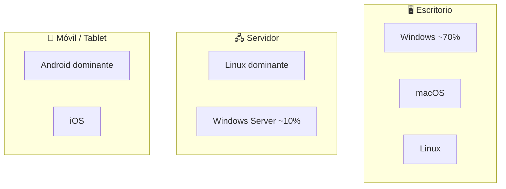
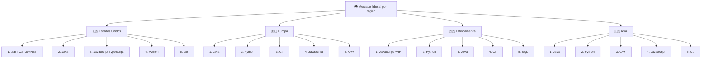
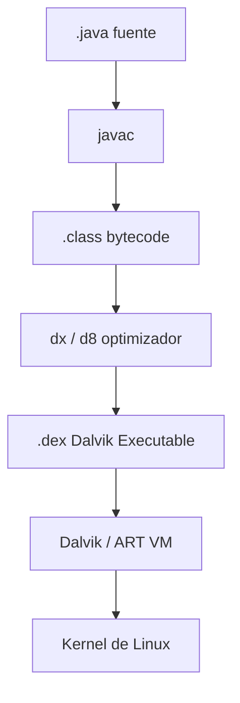

# 📊 Mercado de Sistemas Operativos

> [!info] Módulo
> **Clase 2** — TPM y Sistemas de Archivos  
> **Tema:** Mercado de Sistemas Operativos (cuota, tendencias, geopolítica)  
> **Ver también:** [[05-Historia-Windows|🪟 Historia de Windows]]

> [!tip] Prerrequisitos
> - Conceptos básicos de sistemas operativos
> - Conocimiento de plataformas (desktop, móvil, servidor)

---

## 📋 Tabla de contenidos

- [[#Contexto-La-respuesta-depende-del-segmento]]
- [[#Escritorio-(Desktop)]]
- [[#Móvil]]
- [[#Servidores]]
- [[#Mercado-laboral-por-región]]
- [[#Tendencias-actuales]]
- [[#Conceptos-clave-para-exámen]]

---

## Contexto: La respuesta depende del segmento


> "El SO más usado" depende del dispositivo: Windows en escritorio, Linux/Unix en servidores, Android en móviles.

> [!warning] Importante
> No existe "el sistema operativo más usado" sin contexto. La respuesta depende del dispositivo:

| Dispositivo | Sistema dominante | Cuota aproximada |
|-------------|-------------------|------------------|
| 📱 Móvil | Android | ~70% |
| 💻 Escritorio | Windows | ~70% |
| 🖥️ Servidor | Linux / Unix | ~90% |
| 🍎 Tabletas | iPadOS / Android | ~55% / ~45% |

---

## Escritorio (Desktop)

```
DISTRIBUCIÓN ESCRITORIO (~2026)
━━━━━━━━━━━━━━━━━━━━━━━━━━━━━━━━━━━━━━━━━━━━━━━━━

  Windows 11     ████████████████████████████████░░░░░  62–69%
  Windows 10     ████████████████░░░░░░░░░░░░░░░░░░░░░  30–36%
  macOS          ███░░░░░░░░░░░░░░░░░░░░░░░░░░░░░░░░░  10–15%
  Linux          ██░░░░░░░░░░░░░░░░░░░░░░░░░░░░░░░░░░  3–5%
  Chrome OS      █░░░░░░░░░░░░░░░░░░░░░░░░░░░░░░░░░░░  2–4%
```

> [!info] Dato clave
> La cuota de Windows 11 crece constantemente (datos StatCounter de las capturas de la clase, 2026):
> - Enero 2026: **62.16 %** de Windows 11 en escritorio
> - Junio 2026: **69.92 %** de Windows 11 en escritorio
>
> **Android NO es el SO de escritorio más usado** (aunque sí lo es en móviles).

---

## Móvil

```
DISTRIBUCIÓN MÓVIL
━━━━━━━━━━━━━━━━━━━━━━━━━━━━━━━━━━━━━━━━━━━━━━━━━

  Android  ████████████████████████████████████████░░  70–75%
  iOS      ████████████░░░░░░░░░░░░░░░░░░░░░░░░░░░░░  25–30%
```

### Datos StatCounter 2026 (capturas de la clase)

> [!info] Origen
> Cifras recuperadas por OCR de las capturas de StatCounter incluidas en el PDF de la clase
> (enero y junio de 2026). Confirman la tendencia de adopción de Windows 11.

**Sistema operativo — mundial (todas las plataformas):**

| SO | Ene 2026 | Jun 2026 |
|----|---------|----------|
| Android | 36.18 % | 36.21 % |
| Windows | 32.52 % | 26.67 % |
| iOS | 15.55 % | 16.62 % |
| Unknown | 7.38 % | 10.12 % |
| OS X | 3.38 % | 5.60 % |
| macOS | 2.28 % | 2.11 % |

**Windows por versión — escritorio mundial:**

| Versión | Ene 2026 | Jun 2026 |
|---------|---------|----------|
| Windows 11 | 62.16 % | 69.92 % |
| Windows 10 | 36.03 % | 28.10 % |
| Windows 7 | 1.05 % | 1.67 % |
| Windows XP | 0.42 % | 0.17 % |
| Windows 8.1 | 0.14 % | 0.09 % |
| Windows 8 | 0.16 % | 0.03 % |

**Windows 11 en Latinoamérica (escritorio):**

| Región | Ene 2026 | Jun 2026 |
|--------|---------|----------|
| Suramérica | 67.05 % | 70.36 % |
| Colombia | 71.28 % | 75.05 % |

**Android por versión — móvil/tablet (junio 2026, Suramérica):**

| Versión | Cuota |
|---------|-------|
| 16.0 | 18.12 % |
| 15.0 | 17.91 % |
| 14.0 | 15.12 % |
| 13.0 | 14.51 % |
| 12.0 | 7.87 % |
| 11.0 | 5.83 % |

> [!warning] Nota de precisión
> Las cifras se leyeron de imágenes por OCR; pueden diferir ligeramente de la página en vivo por
> la fecha de captura y el redondeo.

---

## Servidores

| Sistema | Cuota aproximada | Uso principal |
|---------|------------------|---------------|
| **Linux** | ~90% | Web, cloud, bases de datos |
| **Windows Server** | ~10% | Empresas .NET, Active Directory |
| **Unix** | <1% | Sistemas legacy, mainframes |

### Distribuciones Linux server más comunes

1. Amazon Linux (AWS)
2. Ubuntu Server
3. RHEL / CentOS / AlmaLinux
4. Debian
5. SUSE Linux Enterprise

---

## Mercado laboral por región



> [!tip] Implicación
> Si planeas migrar a otro país, aprende el stack tecnológico que demanda ese mercado.

---

## Tendencias actuales

### 1. 🤖 IA y energía

> [!info] Innovación china
> China está experimentando con:
> - **Energía undimotriz** (olas) para alimentar centros de datos.
> - **Servidores en el fondo del mar** para refrigeración natural.
> - **IA para optimizar consumo energético** en data centers.

### 2. 🌐 Geopolítica y recursos

- **Litio y tierras raras** → control de fabricación de baterías y chips.
- **Groenlandia** → recurso estratégico (¿por qué EE.UU. lo mira con interés?).
- **Huawei y sanciones** → ejemplo de cómo la geopolítica afecta la tecnología de consumo.

### 3. ☁️ Cloud-first

- Las licencias migran a **SaaS / suscripción** (Microsoft 365, Adobe Creative Cloud).
- Menos software local, más servicios en la nube.
- Implicación: **TPM y Secure Boot son más importantes** cuando el dispositivo no almacena todo localmente.

---

## Conceptos clave para exámen

| Pregunta frecuente | Respuesta correcta |
|--------------------|-------------------|
| ¿SO más usado en el mundo? | **Depende del dispositivo** |
| ¿SO más usado en móviles? | **Android** |
| ¿SO más usado en escritorio? | **Windows** |
| ¿SO más usado en servidores? | **Linux / Unix** |
| ¿Windows 11 es un nuevo kernel? | No, es Windows 10 con interfaz nueva |
| ¿Windows ME fue bueno? | No, es considerado el peor |

---

## Recursos para seguir el mercado

| Recurso | URL | Descripción |
|---------|-----|-------------|
| [StatCounter — OS Stats](https://gs.statcounter.com/os-version) | https://gs.statcounter.com/os-version | Cuota de mercado por SO, versión, país |
| [W3Counter](https://www.w3counter.com/global_stats.php) | https://www.w3counter.com/global_stats.php | Stats de navegadores y sistemas operativos |
| [Stack Overflow Survey](https://survey.stackoverflow.co/) | https://survey.stackoverflow.co/ | Encuesta anual a desarrolladores |
| [IEEE Spectrum](https://spectrum.ieee.org/top-programming-languages) | https://spectrum.ieee.org/top-programming-languages | Ranking de lenguajes |

---

## 🎯 Próximo paso

> [!info] Continuar con
> Repasa los módulos anteriores haciendo preguntas de autoevaluación. Ahora entiendes el contexto histórico y de mercado de los sistemas operativos.

---

## 📝 Autoevaluación

<details>
<summary>📦 Abrir preguntas y respuestas</summary>

### Pregunta 1 — SO más usado
¿Cuál es el sistema operativo más usado en el mundo?

> **Respuesta:** Depende del dispositivo. Android ~70% en móviles, Windows ~70% en escritorio, Linux ~90% en servidores.

---

### Pregunta 2 — Android en desktop
¿Por qué Android no es el SO de escritorio más usado?

> **Respuesta:** Android domina en móviles y tabletas, pero Windows sigue dominante en escritorios (~70%). Android está optimizado para interfaces táctiles, no para ratón/teclado.

---

### Pregunta 3 — Stack en EE.UU.
Si quieres migrar a Estados Unidos, ¿qué stack tecnológico deberías aprender?

| Región | Stack principal |
|--------|----------------|
| Latinoamérica | JavaScript, PHP |
| Estados Unidos | .NET, Java, JS/TS, Go |

> **Respuesta:** **\.NET (C#, ASP.NET), Java, JavaScript/TypeScript y Go** son más demandados en EE.UU. El stack varía por región.

</details>
## Arquitectura de Android y Dalvik

Android es el SO móvil dominante, pero su interior difiere de un SO de escritorio. En vez de la JVM, usa **Dalvik** (y su sucesor ART), una máquina virtual diseñada para recursos limitados.



- **JVM vs Dalvik:** en Java todas las apps corren sobre la *misma* VM; en Android **cada app corre en su propia VM aislada** (más aislamiento, más recursos).
- **`.dex`**: los `.class` se empaquetan en un único `.dex` (ocupa ~la mitad que el `.jar` equivalente) porque el móvil tiene recursos limitados.
- **Zygote**: una VM base precargada que arranca el resto de VMs de forma rápida.
- **SDK de Android ≠ JDK**: Android implementa los paquetes de Java de forma completa, parcial o nula (p. ej. **Swing** no existe en Android). Por eso algunas clases del JDK no están disponibles.

> [!warning] Android no es Java
> Aunque se programa con APIs de Java, Android **no es Java**: usa su propia VM (Dalvik/ART), su formato `.dex` y un subconjunto del JDK.

---

## ⚠️ Errores comunes

> [!warning] Error 1: Confundir cuota de mercado sin contexto
> "El SO más usado" es una pregunta tramposa sin especificar el dispositivo. Android no es el SO de escritorio más usado, aunque sí lo es en móviles.

> [!warning] Error 2: Linux no se usa en empresas
> Linux domina en servidores, cloud y supercomputadoras. Windows Server tiene ~10% del mercado, principalmente en entornos .NET.

> [!warning] Error 3: Las tendencias son universales
> El stack tecnológico varía por región. Lo que funciona en Latinoamérica (JavaScript, PHP) no es lo mismo que en EE.UU. (.NET, Java).

---

## Referencias

> [!info] Recursos externos
> - [StatCounter — Sistema Operativo](https://gs.statcounter.com/os-version)
> - [StatCounter — Versiones de Windows](https://gs.statcounter.com/vendor-market-share/microsoft/worldwide)
> - [Stack Overflow Developer Survey](https://survey.stackoverflow.co/)
> - [IEEE Spectrum — Top Programming Languages](https://spectrum.ieee.org/top-programming-languages)
