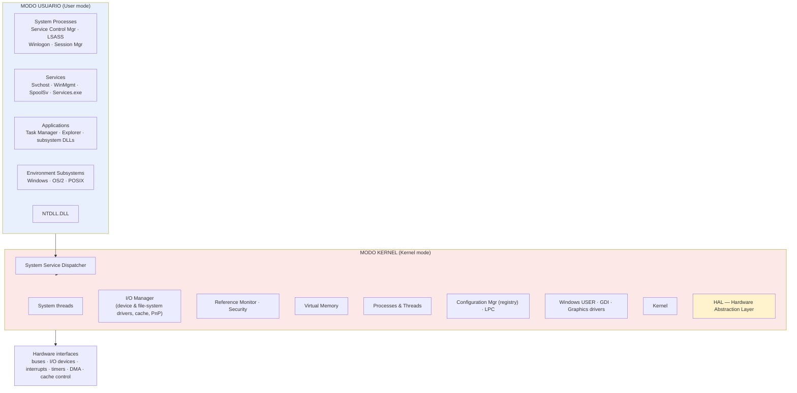
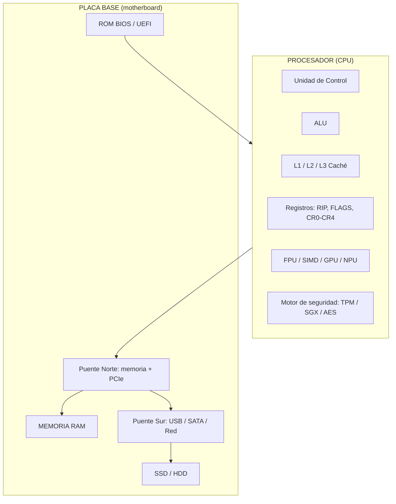
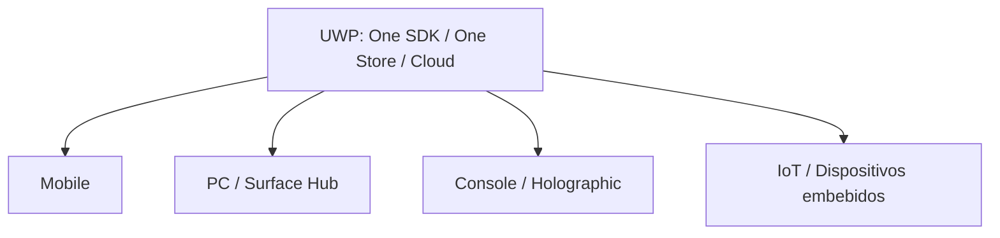
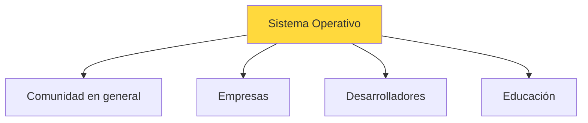
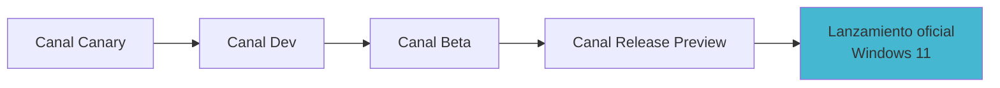
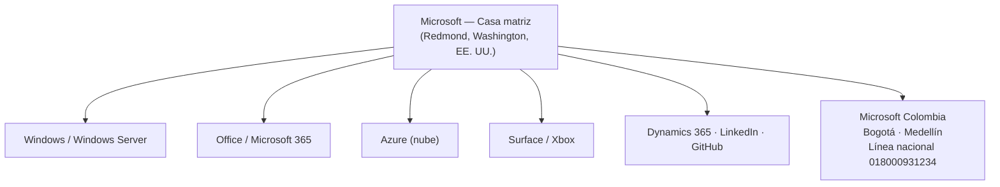
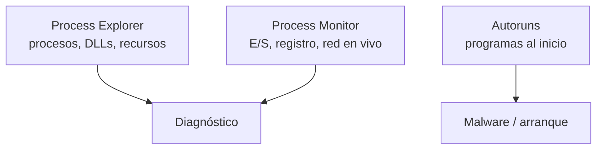
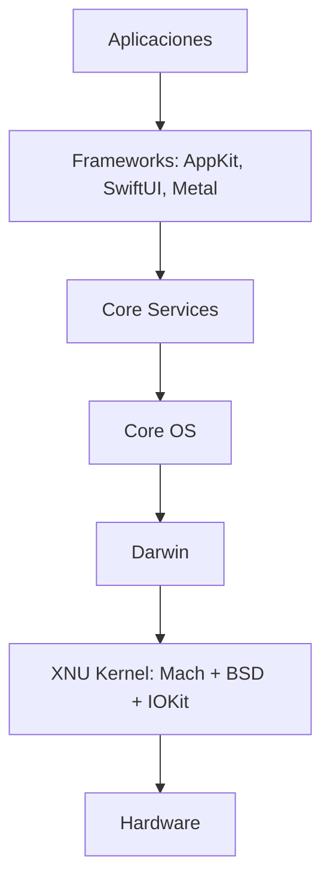
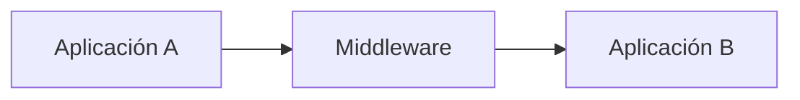

# 📘 Introducción a los Sistemas Operativos

> [!info] Módulo
> **Clase 1** — Introducción a los Sistemas Operativos  
> **Tema:** Presentación, definición, clasificación y ecosistema Windows  
> **Ver también:** [[01-TPM|🔐 TPM]], [[02-Sistemas-de-Archivos|💾 Sistemas de archivos]], [[05-Historia-Windows|🪟 Historia de Windows]], [[06-Mercado-OS|📊 Mercado de OS]]

> [!tip] Contexto
> Clase correspondiente a la presentación inicial del semestre **vacacional**. El objetivo es
> entender, comprender, optimizar y configurar un funcionamiento idóneo del administrador de los
> recursos del hardware a través del software en un computador: uso operativo, manejo (ingeniería)
> y programación de sistemas.

---

## 📋 Tabla de contenidos

- [[#Bienvenida-y-temas-generales]]
- [[#¿Qué-es-un-Sistema-Operativo]]
- [[#Arquitectura-de-un-Sistema-Operativo]]
- [[#Sistema-Operativo-a-manejar-Windows]]
- [[#Clasificación-general-del-SO]]
- [[#Compilaciones-y-canales-Windows-Insider]]
- [[#Casa-matriz-de-Microsoft]]
- [[#Suite-SysInternals]]
- [[#Compatibilidad-para-Windows-11]]
- [[#Tips-y-herramientas]]
- [[#Recursos-de-aprendizaje-Microsoft-Learn]]
- [[#Ser-miembro-Insider]]
- [[#Estadísticas-a-nivel-mundial]]

---

## Bienvenida y temas generales

Saludos respetados y apreciados estudiantes, bienvenidos a este semestre académico **vacacional**,
donde podrán entender, comprender, optimizar y configurar un idóneo funcionamiento y rendimiento
general del administrador de los recursos del hardware a través del software en un computador.

Temas generales que recorreremos en el curso:

1. Presentación y correo
2. PowerPoint e IA
3. Sistemas Operativos a manejar
4. Clasificación general del S.O.
5. Compilaciones (revisar los Updates)
6. Casa Matriz
7. SysInternals Suite
8. Compatibilidad del S.O.
9. Tips y herramientas
10. Ser miembro Insider
11. Estadísticas a nivel mundial del S.O.
12. Definición del Sistema Operativo e IA Generativas

> [!note] Ruta del curso
> Esta clase introductoria sienta las bases. Los módulos siguientes profundizan en
> [[01-TPM|🔐 TPM y seguridad]], [[02-Sistemas-de-Archivos|💾 sistemas de archivos]],
> [[03-Arranque-y-Seguridad|🛡️ arranque]], [[04-Estructuras-de-Datos|📊 estructuras de datos]],
> [[05-Historia-Windows|🪟 la historia de Windows]] y [[06-Mercado-OS|📊 el mercado de SO]].

---

## ¿Qué es un Sistema Operativo?

> [!info] Definición (IA generativa / ChatGPT)
> Un **Sistema Operativo (SO)** es el software fundamental que administra y coordina los recursos
> físicos y lógicos de un sistema de cómputo, proporcionando un entorno eficiente, seguro y
> controlado para la ejecución de aplicaciones y la interacción entre el hardware, el software y
> el usuario.

Su función principal es **abstraer la complejidad del hardware**, optimizar la utilización de los
recursos y garantizar que múltiples procesos puedan ejecutarse de manera concurrente mediante
mecanismos de planificación, sincronización, comunicación y protección.

Desde la Ingeniería de Sistemas, el SO es la capa de software más importante del computador,
responsable de gestionar el procesador, la memoria principal, los dispositivos de E/S, el sistema
de archivos, el almacenamiento secundario, las comunicaciones y la seguridad.

### Funciones clave de un Sistema Operativo

1. **Gestión de recursos** — Administra CPU, memoria RAM, disco duro y periféricos, asignándolos a las aplicaciones según se necesita.
2. **Interfaz de usuario** — Proporciona una GUI o una CLI para interactuar con la computadora.
3. **Administración de archivos** — Organiza y gestiona archivos y directorios (crear, eliminar, leer, escribir).
4. **Multitarea** — Permite que múltiples aplicaciones se ejecuten simultáneamente compartiendo recursos.
5. **Gestión de memoria** — Controla la asignación y liberación de RAM para que las aplicaciones no se interfieran.
6. **Control de dispositivos** — Facilita la comunicación con periféricos (impresoras, teclados, ratones, almacenamiento).
7. **Seguridad** — Protege el sistema y los datos contra accesos no autorizados (contraseñas, permisos, autenticación).
8. **Gestión de errores** — Supervisa y maneja fallos para evitar que una falla afecte todo el sistema.

> [!info] ¿Qué es Windows según Bing?
> Windows es un sistema operativo creado por Microsoft que permite la ejecución de los recursos de
> un ordenador: programas, archivos y dispositivos. Tiene una interfaz gráfica basada en ventanas,
> menús y controles, y es el sistema operativo más usado en el mundo de la informática personal.

---

## Arquitectura de un Sistema Operativo

Un SO se divide en dos modos de ejecución protegidos: **modo usuario** (donde corren las
aplicaciones) y **modo kernel** (donde el sistema tiene acceso total al hardware). El **HAL**
(*Hardware Abstraction Layer*) aísla al kernel del hardware concreto.



> [!note] Crédito
> Diagrama adaptado de *Inside Microsoft Windows 2000, 3rd Edition* (ISBN 0-7356-1021-5),
> © 2000 David A. Solomon y Mark E. Russinovich. Las aplicaciones nunca tocan el hardware
> directamente: pasan por `NTDLL.DLL` → *System Service Dispatcher* → modo kernel.

---

## Componentes de hardware: CPU y placa base

El SO abstrae el hardware, pero conviene conocerlo. El **procesador (CPU)** se compone de:

- **Unidad de Control (CU):** obtiene, decodifica y coordina instrucciones.
- **ALU:** operaciones aritméticas/lógicas y comparaciones.
- **Memoria caché:** L1 (por núcleo, ~32–128 KB), L2 (por clúster, 256 KB–2 MB), L3 (compartida, 2–64 MB+).
- **Registros:** generales (RAX, RBX…), IP/RIP (puntero de instrucción), FLAGS, de control (CR0–CR4: paginación/protección).
- **FPU, SIMD (SSE/AVX), GPU integrada, NPU** (IA) y **motor de seguridad** (SGX/TPM/AES).
- **Controlador de memoria** (DDR4/DDR5) y de **PCIe/NVMe**.

En la **placa base (board)** destacan: fuente, reloj, pila CMOS (BIOS/UEFI), ROM BIOS/UEFI, RAM, almacenamiento (SSD/HDD), slots PCIe, controladores I/O (USB, SATA, red) y los chipsets **Puente Norte** (memoria/PCIe/GPU, alto rendimiento) y **Puente Sur** (E/S: SATA, USB, audio, red).



---

## Sistema Operativo a manejar: Windows

Este curso se basa **netamente en el Sistema Operativo Windows de Microsoft** (nivel comercial).

- 🌐 Comercial: <https://www.microsoft.com/es-es/windows/?r=1>
- 🎓 Profesional / documentación técnica: <https://learn.microsoft.com/es-es/windows/>

> [!note] ¿Por qué Windows?
> Es el SO dominante en el escritorio (~70 % a nivel mundial, ver [[06-Mercado-OS|📊 Mercado de OS]]),
> y el entorno donde se concentran las herramientas que veremos (TPM, BitLocker, SysInternals, etc.).

### Universal Windows Platform (UWP)

UWP es el modelo de apps de Windows 10/11: una sola base (One SDK, One Store) que abarca muchas
familias de dispositivos. Sus servicios centrales incluyen UI adaptativa, entradas naturales,
servicios en la nube, configuración, seguridad, administración y actualizaciones.



---

## Clasificación general del S.O.


> El ecosistema se organiza según el perfil del usuario; cada perfil tiene recursos distintos (Microsoft Learn, training, etc.).

El ecosistema se organiza según el perfil del usuario al que va dirigido:

| Perfil | Público | Recursos |
|--------|---------|----------|
| **Comunidad en general** | Usuarios domésticos | Microsoft Learn (explorar) |
| **Empresas** | PYMES y corporaciones | <https://learn.microsoft.com/es-es/training/browse/> |
| **Desarrolladores** | Ingenieros de software | <https://learn.microsoft.com/es-es/training/career-paths/> |
| **Educación** | Estudiantes y docentes | <https://learn.microsoft.com/es-es/training/student-hub/> |

---

## Compilaciones y canales Windows Insider


> Flujo típico: una compilación baja por los canales (Canary → Dev → Beta → Release Preview) hasta convertirse en la versión estable.

Antes de instalar, conviene **revisar los Updates / compilaciones**. Las compilaciones de desarrollo
activo de Windows 11 reflejan el código de trabajo en curso. Más info en el
[Flight Hub](https://learn.microsoft.com/es-es/windows-insider/flight-hub/).

| Canal | Contenido | Frecuencia | Estabilidad |
|-------|-----------|------------|-------------|
| **Canary** | Cambios del kernel, APIs | Diaria / Alta | Muy baja |
| **Dev** | Nuevas funciones tempranas | Semanal / Media | Baja a moderada |
| **Beta** | Builds validadas, cerca de futura release | Semanal / Baja | Moderada / Alta |
| **RP** (Release Preview) | Builds finales previas al lanzamiento general | Esporádica / Baja | Alta |
| **SDK** | Kit de desarrollo compatible con estas builds | Según versión | — |
| **ISO** | Imagen de instalación del canal actual | Según build | — |

> [!note] Ejemplos de compilaciones (capturas de la clase, 2026)
> - **Experimental (Plataformas futuras):** `29617.1000` (26/06/2026), `29613.1000` (19/06/2026), `29610.1000` (12/06/2026)…
> - **Windows 11, versión 26H2 (canal Experimental):** `26300.8758` (26/06/2026), `26300.8697` (19/06/2026)…
> - Equipo del profesor (captura *Acerca de Windows*): **Windows 11 Pro, Versión 25H2, build 26200.7623**, n.º de serie `GM0XBKXZ`.

> [!warning] Rumor vs realidad
> Algunos llaman "Windows 12" a las builds `26200.x` del canal Experimental (26H2/25H2): es **especulación de la comunidad**, no un producto oficial. El profesor recibe esas actualizaciones primero porque está en el programa Insider (ver [[#Ser-miembro-Insider|Ser miembro Insider]]). Lo fiable es el nombre de la versión publicada en Microsoft Learn.

> [!tip] Aprendizaje
> Catálogo de formación de Microsoft Learn: <https://learn.microsoft.com/es-es/training/browse/?products=windows>

---

## Casa matriz de Microsoft

**Microsoft** es la **casa matriz** (empresa matriz) que desarrolla Windows. Su sede mundial está en
**Redmond, Washington, EE. UU.** (One Microsoft Way).



**Presencia en Colombia** (datos de la clase):
- 📍 Bogotá: Calle 92 # 11-51, Piso 10 — Tel. (571) 326 4700
- 📍 Medellín: Carrera 42 N.° 3 Sur-81, Of. 401, Torre 1 Piso 4 (Milla de Oro) — Tel. (604) 312 9020
- ☎️ Línea de atención al cliente nacional: **018000931234**

- 🏢 Campus de Redmond: <https://news.microsoft.com/redmond-campus/>
- 🌍 Presencia mundial de Microsoft: <https://www.microsoft.com/en-us/worldwide.aspx>

---

## Suite SysInternals

Conjunto de utilidades avanzadas de diagnóstico y monitoreo del sistema (Process Explorer,
Process Monitor, Autoruns, RAMMap, entre otras). Creada por Mark Russinovich en 1996.

> [!note] Catálogo (OCR de la captura de live.sysinternals.com)
> Herramientas destacadas de la Suite (~60 utilidades): **Process Explorer**, **Process Monitor**,
> **Autoruns** / **Autorunsc**, **AD Explorer**, **BgInfo**, **Coreinfo**, **ProcDump**, **ZoomIt**,
> **Contig**, **ClockRes**, **CacheSet**, **CPU Stress**, **Ctrl2Cap**, **AccessChk**, **ADInsight**,
> **Autologon**. Útiles para administrar, solucionar y diagnosticar sistemas Windows (y Linux).
>
> **Novedades recientes (captura, 2026):** Autoruns v14.3, ZoomIt v12.1, ProcDump v12.0 — utilidades que se actualizan con frecuencia.

- ℹ️ Información de la Suite: <https://learn.microsoft.com/es-es/sysinternals/>
- 📥 Descargar: <https://learn.microsoft.com/es-mx/sysinternals/downloads/>
- 🌐 Live (herramientas en línea): <https://live.sysinternals.com/>

> [!tip] Ejecutar sin instalar (SysInternals Live)
> En Explorador de Windows o CMD escribe la ruta UNC de la herramienta:
> `\\live.sysinternals.com\tools\<herramienta>` (p. ej. `\\live.sysinternals.com\tools\procexp.exe`).

### Herramientas clave



- **Process Explorer:** visualiza procesos activos, DLLs cargadas y dependencias; ideal para detectar procesos que consumen recursos excesivos.
- **Process Monitor:** monitorea en tiempo real la actividad de E/S, el registro de Windows y la red de cada proceso.
- **Autoruns:** identifica todo lo configurado para ejecutarse al inicio; esencial para detectar malware y optimizar el arranque.

> [!note] En el taller #2 veremos más información en detalle (véase [[01-TPM|🔐 TPM]] y
> [[03-Arranque-y-Seguridad|🛡️ Arranque y seguridad]]).

---

## Estructura de macOS

macOS desciende de NEXTSTEP → Rhapsody → OS X. Su núcleo **Darwin** (tipo Unix, código abierto) usa el kernel **XNU** (Mach + BSD + IOKit).



- **Cocoa / Carbon:** APIs de aplicación (Cocoa orientada a objetos; Carbon retrocompatible).
- **Xcode:** IDE de Apple para macOS/iOS/watchOS/tvOS.
- **Aqua:** interfaz gráfica (GUI); **POSIX**: estándar Unix de la capa de programación.

---

## Middleware

El **middleware** es el software intermediario entre aplicaciones/sistemas heterogéneos: facilita comunicación, integración, gestión de transacciones, seguridad y recursos.



Ejemplos: IBM WebSphere, Oracle Fusion Middleware, Azure Service Fabric, Red Hat JBoss, Apache Kafka, RabbitMQ, MuleSoft, Apache Tomcat, SAP NetWeaver.

---

## Evolución de los S.O. (generaciones)

| Gen. | Período | Característica |
|---|---|---|
| 1ª Batch (lotes) | 1945–54 | Tarjetas perforadas; monoprogramación; un solo proceso. |
| 2ª Batch + SPOOL | 1954–63 | Lotes en secuencia; particiones fijas/dinámicas; nace multiprogramación. |
| 3ª Multiprogramados | 1963–71 | CPU comparte tiempo entre procesos; UNIX/MULTICS; tiempo compartido. |
| 4ª Tiempo compartido | 1979– | Gestión de memoria/procesos/red/seguridad; sistemas distribuidos. |
| 5ª Móviles | 2000– | SO móviles, nube, virtualización. |
| 6ª Nuevas tecnologías | 2010– | Contenedores, IoT, Big Data, Blockchain, IA, VR/AR, computación cuántica. |

---

## Compatibilidad para Windows 11

Para tener Windows 11 se debe verificar la compatibilidad del equipo y, en particular, el **TPM 2.0**.

> [!info] Requisitos mínimos de Windows 11 (resumen)
> - **CPU:** 1 GHz o superior, 2+ núcleos, arquitectura de 64 bits
> - **RAM:** 4 GB mínimo
> - **Almacenamiento:** 64 GB mínimo
> - **Firmware:** UEFI con **Secure Boot** habilitado
> - **TPM:** versión **2.0**
> - **GPU:** compatible con DirectX 12 / WDDM 2.0
> - **Pantalla:** 9\" o mayor, resolución 720p, 8 bits por canal de color
>
> Detalles oficiales: <https://www.microsoft.com/es-mx/windows/windows-11-specifications>

- 🔎 Consultar compatibilidad: <https://www.microsoft.com/es-mx/windows/windows-11> ·
  <https://www.microsoft.com/es-mx/windows/windows-11-specifications>
- 🔐 Comprobar el TPM directamente: ejecutar **`tpm.msc`** (leer el documento complementario
  *0 TPM introducción y seguridad del dispositivo*).
- ⚙️ Ruta en Configuración de Windows:
  `Configuración → Privacidad y seguridad → Seguridad de Windows → Abrir Seguridad de Windows →
  Seguridad del dispositivo → Procesador de seguridad`.

URL complementarias para habilitar TPM:
- <https://support.microsoft.com/es-es/windows/habilitar-tpm-2-0-en-el-equipo-1fd5a332-360d-4f46-a1e7-ae6b0c90645c>
- <https://learn.microsoft.com/es-mx/windows/security/hardware-security/tpm/trusted-platform-module-overview>
- <https://support.lenovo.com/co/es/solutions/ht512598>

> [!warning] Habilitar TPM desde el BIOS/UEFI
> Los pasos por fabricante se detallan en el módulo [[01-TPM|🔐 TPM]]. Resumen: en ASUS y MSI buscar
> *Trusted Computing*; en Lenovo *Security Chip Selection* (Intel PTT o AMD PSP fTMP); en HP *TPM
> State*; en Dell *Firmware TPM*. En todos los casos: cambiar a **Enable** y guardar/reiniciar.

---

## Tips y herramientas

- 🔎 **Bing**: <https://www.bing.com> — búsqueda e IA integrada
  (<https://www.bing.com/search?form=MY02AT&OCID=MY02AT&q=Bing+AI&showconv=1>)
- 📱 **Enlace celular** (Phone Link): <https://www.microsoft.com/es-es/windows/sync-across-your-devices> — vincula el móvil con Windows para ver **llamadas, fotos, notificaciones y mensajes** en el escritorio.
- 🪟 **Snap** (organización de ventanas): funcionalidad nativa de Windows 11 para distribuir
  aplicaciones en el escritorio.
- 📹 **Grabación de pantalla:** `Windows + G` abre la **barra de juegos de Xbox**, que incluye captura y
  grabación de pantalla (funciona en cualquier app, no solo juegos); para grabación avanzada se usa **OBS**.
  El profesor señala que, aunque parezca de "Xbox", está integrado en el núcleo de Windows.
- 💡 Sugerencias y trucos: *Sugerencias y trucos para Windows 11* (Microsoft).

Canal de YouTube de referencia: <https://www.youtube.com/watch?v=6RqFPrCcWfY>

---

## Recursos de aprendizaje (Microsoft Learn)

Ruta de cursos gratuitos de Microsoft para estudiantes (captura de la clase, sección
*Esenciales para Estudiantes de Microsoft*):

- 🤖 **IA para principiantes** — redes neuronales y aprendizaje profundo en 12 semanas
- 📊 **Ciencia de datos para principiantes** — ética, preparación, análisis y visualización (12 semanas)
- 🧠 **Aprendizaje automático para principiantes** — métodos clásicos con Scikit-learn (12 semanas)
- 🔐 **Ciberseguridad para principiantes** — conceptos clave y retos prácticos
- 🕸️ **Agentes de IA para principiantes** — curso de 10 lecciones sobre agentes de IA
- ✨ **IA generativa para principiantes** — curso de 21 lecciones de Microsoft
- 💻 **Dominando GitHub Copilot** — integración de IA en VS Code
- 🚀 **Copilot Aventuras** — desafíos para nivelar la codificación con Copilot

🎓 Hub de estudiantes: <https://learn.microsoft.com/es-es/training/student-hub/>

---

## Ser miembro Insider

Programa para estar enterado, realizar pruebas y ser parte del equipo de Microsoft como
retroalimentador de sus versiones de prueba. Cubre versiones de Windows desde 10 hasta 11.

- 🚀 Programa Windows Insider: <https://learn.microsoft.com/es-es/windows-insider/>
- 🧭 Flight Hub: <https://learn.microsoft.com/es-es/windows-insider/flight-hub/>
- 📝 Registro de Cambios (active dev branch): <https://learn.microsoft.com/es-es/windows-insider/active-dev-branch>

> [!important] Nota
> El programa Insider es la puerta de entrada a las compilaciones Canary/Dev/Beta/RP descritas
> arriba. Útil para anticipar cambios antes del lanzamiento general.

---

## Estadísticas a nivel mundial

Fuentes oficiales de cuota de mercado por sistema operativo, versión y región:

- 📊 StatCounter (OS market share): <https://gs.statcounter.com/>
- 🪟 Versiones de Windows: <https://gs.statcounter.com/os-version-market-share/windows/desktop/worldwide>
- 💻 SO por sistema (general): <https://gs.statcounter.com/os-market-share>
- 🌎 Desglose por Suramérica y Colombia disponibles en la misma plataforma.

> [!info] Dato clave
> Android domina en móviles, Windows en escritorio y Linux/Unix en servidores. El "SO más usado"
> depende siempre del dispositivo (véase [[06-Mercado-OS|📊 Mercado de OS]]).

---

## 🎯 Próximo paso

> [!info] Continuar con
> **[[01-TPM|🔐 TPM — Trusted Platform Module]]** — profundizamos en el chip criptográfico de
> seguridad, su habilitación en el BIOS/UEFI y su relación con BitLocker y Secure Boot.

---

## ⚠️ Errores comunes

```flipcard
**Error 1:** Creer que el SO es solo "la pantalla"
---
El SO es el administrador de **todos** los recursos del hardware (CPU, RAM, disco, E/S, redes, seguridad), no solo la interfaz visual.
```

```flipcard
**Error 2:** Confundir compilación con versión
---
Una *versión* (Windows 10, 11) es el producto lanzado; una *compilación* (Canary, Dev, Beta, RP) es el estado interno de desarrollo dentro del programa Insider.
```

```flipcard
**Error 3:** Pensar que TPM es opcional en Windows 11
---
Windows 11 **requiere TPM 2.0** para garantizar la integridad del arranque y proteger los datos en reposo.
```

---

## Referencias

> [!info] Recursos externos
> - [Microsoft — Windows](https://www.microsoft.com/es-es/windows/?r=1)
> - [Microsoft Learn — Windows](https://learn.microsoft.com/es-es/windows/)
> - [Windows Insider Flight Hub](https://learn.microsoft.com/es-es/windows-insider/flight-hub/)
> - [Microsoft — Redmond Campus](https://news.microsoft.com/redmond-campus/)
> - [SysInternals Suite](https://learn.microsoft.com/es-es/sysinternals/)
> - [StatCounter — OS Market Share](https://gs.statcounter.com/)
