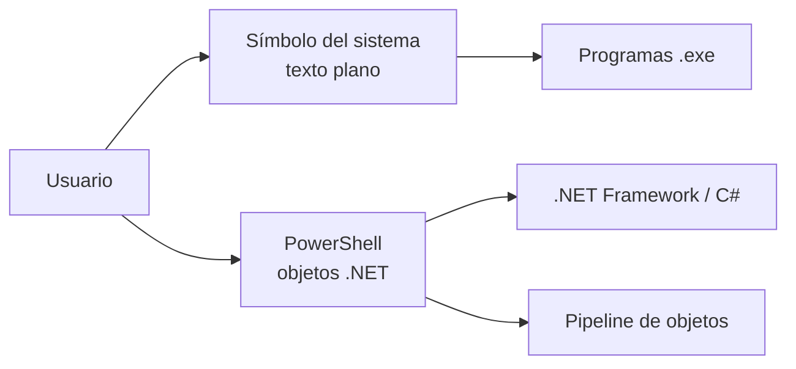

# ⌨️ Línea de Comandos (CMD y PowerShell)

> [!info] Módulo
> **Unidad 3 — Herramientas**
> **Tema:** CMD, PowerShell, cmdlets, Programador de tareas, schtasks
> **Ver también:** [[09-Fundamentos-del-SO|🧠 Fundamentos del SO]]

> [!info] Objetivo
> Conocer las dos consolas de Windows (CMD y PowerShell), sus comandos esenciales, y cómo automatizar tareas con el Programador de tareas. Equivalentes a la terminal de Linux o macOS.

---

## 📋 Tabla de contenidos

- [[#Windows PowerShell vs Símbolo del sistema]]

---

## Windows PowerShell vs Símbolo del sistema

Windows ofrece **dos consolas**. Visualmente parecidas, pero muy distintas en la práctica:

| | Símbolo del sistema (CMD) | Windows PowerShell |
|---|---|---|
| Origen | Recuerda a MS-DOS, pero **no es DOS** ni parte del SO | Shell y lenguaje de scripts sobre **.NET** (C#) |
| Modelo | Comandos sueltos (programas `.exe`) | **Cmdlets** (`Verbo-Sustantivo`), objetos en la pipeline |
| Automatización | Lotes `.bat` limitados | Scripts `.ps1` potentes, remoto, tareas en segundo plano |
| Apertura | `cmd` o Win+R | Win + X → PowerShell, o `powershell` |

> [!warning] CMD no es MS-DOS
> El símbolo del sistema es una aplicación de línea de comandos de Windows; no es el sistema operativo DOS ni forma parte del núcleo.

---

> [!info] Temas relacionados
> - [[08a-CMD|⌨️ CMD — Comandos esenciales]]
> - [[08b-PowerShell|⌨️ PowerShell — cmdlets y ejemplos]]

