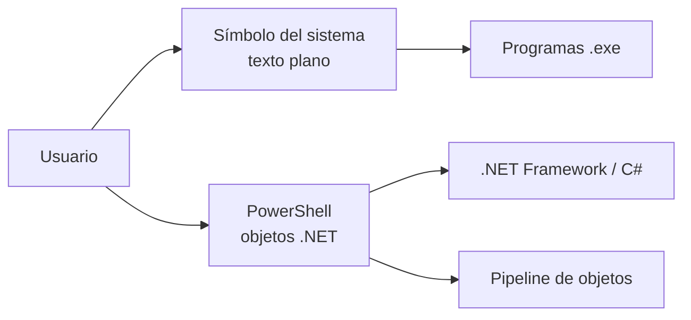

# ⌨️ Línea de Comandos (CMD y PowerShell)

> [!info] Módulo
> **Unidad 3 — Herramientas**
> **Tema:** CMD, PowerShell, cmdlets, Programador de tareas, schtasks
> **Ver también:** [[09-Fundamentos-del-SO|🧠 Fundamentos del SO]]

> [!info] Objetivo
> Conocer las dos consolas de Windows (CMD y PowerShell), sus comandos esenciales, y cómo automatizar tareas con el Programador de tareas. Equivalentes a la terminal de Linux o macOS.

---

## 📋 Tabla de contenidos

- [[#Windows PowerShell vs Símbolo del sistema]]
- [[#Programador de tareas — Asistente de creación]]
- [[#Programador de tareas — Pantalla principal]]
- [[#Programador de tareas — schtasks.exe]]

---

## Windows PowerShell vs Símbolo del sistema

Windows ofrece **dos consolas**. Visualmente parecidas, pero muy distintas en la práctica:

| | Símbolo del sistema (CMD) | Windows PowerShell |
|---|---|---|
| Origen | Recuerda a MS-DOS, pero **no es DOS** ni parte del SO | Shell y lenguaje de scripts sobre **.NET** (C#) |
| Modelo | Comandos sueltos (programas `.exe`) | **Cmdlets** (`Verbo-Sustantivo`), objetos en la pipeline |
| Automatización | Lotes `.bat` limitados | Scripts `.ps1` potentes, remoto, tareas en segundo plano |
| Apertura | `cmd` o Win+R | Win + X → PowerShell, o `powershell` |

> [!warning] CMD no es MS-DOS
> El símbolo del sistema es una aplicación de línea de comandos de Windows; no es el sistema operativo DOS ni forma parte del núcleo.



---

> [!info] Temas relacionados
> - [[08a-CMD|⌨️ CMD — Comandos esenciales]]
> - [[08b-PowerShell|⌨️ PowerShell — cmdlets y ejemplos]]

---

## Programador de tareas — Asistente de creación

> [!info] Captura del profesor: Asistente para crear tareas básicas (5 pestañas)
> Fuente: `4 programador de tareas.pdf` — wizard de creación de tareas con sus 5 pestañas:
>
> **1. General** — Nombre, ubicación, autor, descripción, opciones de seguridad:
> - Ejecutar solo cuando el usuario haya iniciado sesión / Ejecutar tanto si el usuario inició sesión como sino
> - No almacenar contraseña (solo recursos locales)
> - Ejecutar con los privilegios más altos
> - Configurar para: versión de Windows (ej. Windows 10 / Server 2016)
>
> **2. Desencadenadores** — Cuándo se ejecuta la tarea:
> - Una vez, Diariamente, Semanalmente, Mensualmente, Al iniciar sesión, Al iniciar el sistema, Al estar inactivo, Al crear/modificar tarea, Al conectar/desconectar sesión, Al bloquear/desbloquear estación
> - Repetir cada: horas/días/semanas durante: tiempo, con retraso máximo aleatorio
> - Expiración: fecha límite de ejecución
> - Configuración avanzada de desencadenadores
>
> **3. Acciones** — Qué hacer al ejecutarse:
> - Iniciar un programa (programa o script + argumentos + directorio de inicio)
> - Enviar un correo electrónico
> - Mostrar un mensaje (desusado)
>
> **4. Condiciones** — Condiciones de activación:
> - Iniciar solo si el equipo está inactivo durante X minutos
> - Iniciar solo si conectado a corriente alterna
> - Detener si usa batería
> - Iniciar solo si hay conexión de red disponible
>
> **5. Configuración** — Comportamiento avanzado:
> - Permitir ejecución a petición
> - Ejecutar lo antes posible si no hubo inicio programado
> - Reiniciar si no se ejecuta (cada X minutos, durante X veces)
> - Detener si se ejecuta más de X días
> - Detener tarea en ejecución si no finaliza cuando se solicite
> - Eliminar tareas no reprogramadas después de X días
> - Regla si ya está en ejecución: ejecutar nueva instancia en paralelo / en cola / no nueva
>
> ⚠️ **Importante para exámen:** Las 5 pestañas del wizard son General, Desencadenadores, Acciones, Condiciones y Configuración. Cada pestaña tiene opciones específicas que pueden aparecer en preguntas de selección múltiple.

---

## Programador de tareas — Pantalla principal

> [!info] Captura del profesor: Biblioteca del Programador de tareas
> Fuente: `4 programador de tareas.pdf` — pantalla principal con la lista de tareas:
>
> | Columna | Contenido |
> |---------|-----------|
> | **Nombre** | Nombre de la tarea registrada (ej. `RtkAudUServi`) |
> | **Estado** | Listo, En ejecución, etc. |
> | **Desencadenadores** | Condiciones de activación programadas |
> | **Hora próxima ejecución** | Próxima fecha/hora prevista |
> | **Hora última ejecución** | Última vez que se ejecutó |
> | **Creado** | Fecha de creación de la tarea |
>
> **Menú contextual** (clic derecho sobre tarea): Ejecutar, Finalizar, Deshabilitar, Exportar, Propiedades, Eliminar.
>
> **Barra de tareas superior**: Crear tarea básica, Crear tarea, Importar tarea, Mostrar todas las tareas en ejecución, Deshabilitar el historial de todas las tareas, Nueva carpeta, Ver.

---

## Programador de tareas — schtasks.exe

Desde la línea de comandos, las tareas también se pueden crear y administrar con `schtasks`:

```cmd
:: Crear tarea básica
schtasks /create /tn "MiTarea" /tr "C:\ruta\script.bat" /sc diario /st 08:00

:: Listar todas las tareas
schtasks /query /fo TABLE /v

:: Ejecutar una tarea
schtasks /run /tn "MiTarea"

:: Eliminar una tarea
schtasks /delete /tn "MiTarea" /f
```

---


