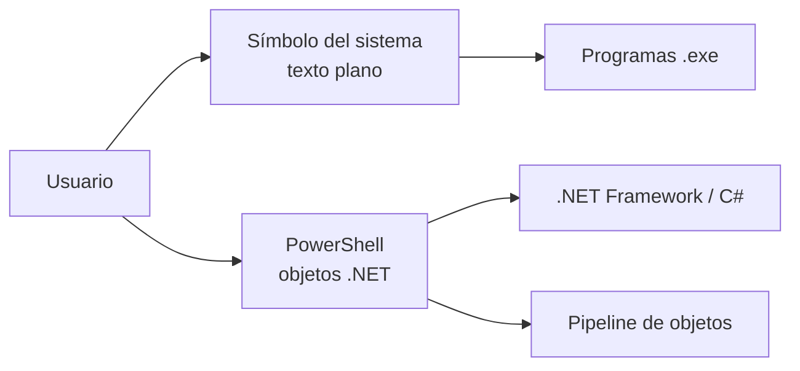
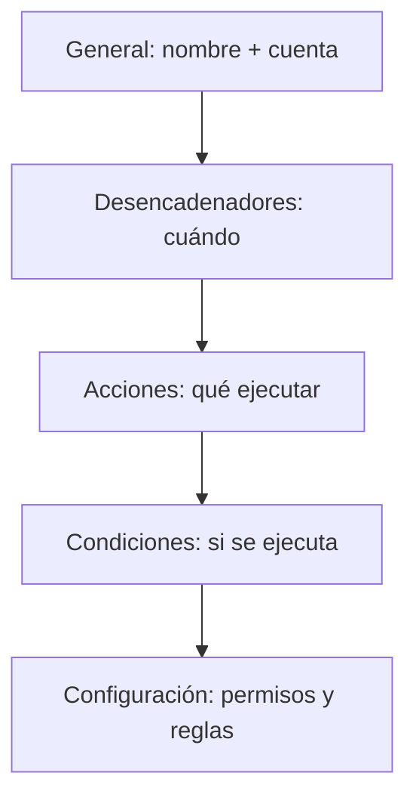

# ⌨️ Línea de comandos, PowerShell y automatización

> [!info] Objetivo
> Conocer las dos consolas de Windows (CMD y PowerShell), sus comandos esenciales, y cómo automatizar tareas con el Programador de tareas. Equivalentes a la terminal de Linux o macOS.

---

## 📋 Tabla de contenidos

- [[#Windows PowerShell vs Símbolo del sistema]]
- [[#CMD — Comandos esenciales]]
- [[#PowerShell — cmdlets y ejemplos]]
- [[#Programador de tareas (Task Scheduler)]]
- [[#Consejos de productividad]]
- [[#📝 Autoevaluación]]
- [[#⚠️ Errores comunes]]

---

## Windows PowerShell vs Símbolo del sistema

Windows ofrece **dos consolas**. Visualmente parecidas, pero muy distintas en la práctica:

| | Símbolo del sistema (CMD) | Windows PowerShell |
|---|---|---|
| Origen | Recuerda a MS-DOS, pero **no es DOS** ni parte del SO | Shell y lenguaje de scripts sobre **.NET** (C#) |
| Modelo | Comandos sueltos (programas `.exe`) | **Cmdlets** (`Verbo-Sustantivo`), objetos en la pipeline |
| Automatización | Lotes `.bat` limitados | Scripts `.ps1` potentes, remoto, tareas en segundo plano |
| Apertura | `cmd` o Win+R | Win + X → PowerShell, o `powershell` |

> [!warning] CMD no es MS-DOS
> El símbolo del sistema es una aplicación de línea de comandos de Windows; no es el sistema operativo DOS ni forma parte del núcleo.



---

## CMD — Comandos esenciales

### 1️⃣ Navegación de directorios y archivos
| Comando | Descripción | Ejemplo |
|---|---|---|
| `cd` / `chdir` | Cambiar directorio | `cd C:\Users\IngeAmigo\Documentos` |
| `cd ..` | Subir un nivel | `cd ..` |
| `cd \` | Ir a la raíz | `cd \` |
| `dir` | Listar archivos y carpetas | `dir /w` (en ancho) |
| `tree` | Estructura de carpetas en árbol | `tree /F` (incluye archivos) |
| `pushd` / `popd` | Guardar y recuperar directorio | `pushd D:\Proyectos` |

### 2️⃣ Manejo de archivos y carpetas
| Comando | Descripción | Ejemplo |
|---|---|---|
| `mkdir` / `md` | Crear carpeta | `mkdir Proyecto1` |
| `rmdir` / `rd` | Eliminar carpeta vacía | `rmdir CarpetaVieja` |
| `del` / `erase` | Eliminar archivos | `del archivo.txt` |
| `copy` | Copiar archivos | `copy archivo.txt D:\Backup` |
| `xcopy` | Copiar carpetas y subcarpetas | `xcopy C:\Proyectos D:\Backup /E /I` |
| `robocopy` | Copia robusta (reanudable) | `robocopy C:\Proyectos D:\Backup /MIR /Z` |
| `move` | Mover archivos o carpetas | `move archivo.txt D:\Documentos` |
| `ren` / `rename` | Cambiar nombre | `rename archivo.txt nuevo.txt` |
| `attrib` | Atributos (solo lectura, oculto, sistema) | `attrib +h archivo.txt` |

### 3️⃣ Visualización y edición
| Comando | Descripción | Ejemplo |
|---|---|---|
| `type` | Mostrar contenido de texto | `type notas.txt` |
| `more` | Texto paginado | `type notas.txt \| more` |
| `echo` | Mostrar texto | `echo Hola mundo` |
| `find` | Buscar texto en archivos | `find "error" log.txt` |
| `findstr` | Patrones avanzados (regex) | `findstr /i "error warning" log.txt` |
| `fc` | Comparar archivos | `fc a.txt b.txt` |

### 4️⃣ Red y conectividad
| Comando | Descripción | Ejemplo |
|---|---|---|
| `ping` | Probar conectividad | `ping google.com` |
| `ipconfig` | Configuración de red | `ipconfig /all` |
| `tracert` | Rastrear ruta a un host | `tracert google.com` |
| `netstat` | Conexiones activas | `netstat -an` |
| `nslookup` | Consultar DNS | `nslookup ejemplo.com` |
| `arp` | Tabla ARP | `arp -a` |
| `net` | Usuarios, shares, grupos | `net user` / `net share` |
| `pathping` | Mezcla ping + tracert | `pathping google.com` |

### 5️⃣ Procesos y tareas
| Comando | Descripción | Ejemplo |
|---|---|---|
| `tasklist` | Listar procesos | `tasklist` |
| `taskkill` | Finalizar procesos | `taskkill /IM notepad.exe /F` |
| `start` | Abrir programas/ventanas | `start notepad.exe` |
| `shutdown` | Apagar o reiniciar | `shutdown /s /t 60` |
| `schtasks` | Programar tareas | `schtasks /create /tn Backup /tr "backup.bat" /sc daily /st 15:30` |

### 6️⃣ Información del sistema
| Comando | Descripción | Ejemplo |
|---|---|---|
| `systeminfo` | Info detallada del sistema | `systeminfo` |
| `wmic` | Administración de Windows | `wmic cpu get name,NumberOfCores` |
| `driverquery` | Controladores instalados | `driverquery /v /fo list` |
| `chkdsk` | Revisar y reparar discos | `chkdsk C: /F /R` |
| `sfc` | Archivos de sistema | `sfc /scannow` |
| `dism` | Reparar la imagen de Windows | `DISM /Online /Cleanup-Image /RestoreHealth` |
| `diskpart` | Discos y particiones | `diskpart` → `list disk` |
| `powercfg` | Energía/batería | `powercfg /batteryreport` |
| `fsutil` | Sistema de archivos avanzado | `fsutil volume diskfree C:` |

### 7️⃣ Avanzados y utilidades
| Comando | Descripción | Ejemplo |
|---|---|---|
| `reg` | Registro de Windows | `reg query HKLM\SYSTEM\CurrentControlSet\Services` |
| `assoc` | Asociar extensión a tipo | `assoc .txt=txtfile` |
| `ftype` | Programa asociado al tipo | `ftype txtfile="notepad.exe %1"` |
| `compact` | Comprimir archivos NTFS | `compact /c archivo.txt` |
| `mklink` | Enlaces simbólicos | `mklink /D Link CarpetaDestino` |
| `whoami` | Usuario actual | `whoami` |
| `hostname` | Nombre del equipo | `hostname` |

---

## PowerShell — cmdlets y ejemplos

PowerShell usa **cmdlets** con formato `Verbo-Sustantivo` y trabaja con **objetos** (no solo texto), lo que permite encadenarlos en una *pipeline*.


### CMD ↔ PowerShell (alias comunes)
| CMD | PowerShell (cmdlet) | Alias PS |
|---|---|---|
| `dir` | `Get-ChildItem` | `gci`, `ls` |
| `cd` | `Set-Location` | `sl` |
| `type` | `Get-Content` | `gc`, `cat` |
| `copy` | `Copy-Item` | `cpi`, `cp` |
| `del` | `Remove-Item` | `ri`, `rm` |
| `move` | `Move-Item` | `mi`, `mv` |
| `cls` | `Clear-Host` | `clear` |
| `tasklist` | `Get-Process` | `gps` |
| `ipconfig` | `Get-NetIPAddress` | — |
| `help` | `Get-Help` | `gh` |

### Ejemplos útiles
```powershell
# Listar procesos
Get-Process

# Solo lo que inicia con M
Get-ChildItem M*

# Info de BIOS
Get-WmiObject -Class Win32_BIOS

# Primeras 50 líneas a otro archivo
Get-Content "nuevo.txt" -TotalCount 50 | Set-Content "jaja.txt"

# Servicios a HTML
Get-Service | ConvertTo-Html -Property Name,Status > Servicios.htm

# Ver todos los alias
Get-Alias
```

> [!tip] Ayuda integrada
> `Get-Help <cmdlet>` (o `help`) abre la documentación, incluso conectándose a la web. `Get-Alias` lista todos los alias disponibles.

### Actualizar PowerShell con `winget`

```cmd
winget install --id Microsoft.Powershell.Preview --source winget
```

Alternativa: descargar el instalador de la última versión directamente desde la
[documentación oficial de instalación](https://learn.microsoft.com/es-es/powershell/scripting/install/installing-powershell-on-windows).

### Tabla completa de alias PowerShell → cmdlet

> [!info] Del documento fuente
> Captura de `Get-Alias` en una instalación estándar de Windows PowerShell (referencia completa).

| Alias | Cmdlet | | Alias | Cmdlet |
|---|---|---|---|---|
| `%` | `ForEach-Object` | | `gsv` | `Get-Service` |
| `?` | `Where-Object` | | `gtz` | `Get-TimeZone` |
| `ac` | `Add-Content` | | `gu` | `Get-Unique` |
| `asnp` | `Add-PSSnapin` | | `gv` | `Get-Variable` |
| `cat` | `Get-Content` | | `gwmi` | `Get-WmiObject` |
| `cd` | `Set-Location` | | `h` / `history` | `Get-History` |
| `chdir` | `Set-Location` | | `icm` | `Invoke-Command` |
| `clc` | `Clear-Content` | | `iex` | `Invoke-Expression` |
| `clear` | `Clear-Host` | | `ihy` | `Invoke-History` |
| `cli` | `Clear-Item` | | `ii` | `Invoke-Item` |
| `cls` | `Clear-Host` | | `ipal` | `Import-Alias` |
| `clv` | `Clear-Variable` | | `ipcsv` | `Import-Csv` |
| `compare` | `Compare-Object` | | `ipmo` | `Import-Module` |
| `copy` / `cp` / `cpi` | `Copy-Item` | | `irm` | `Invoke-RestMethod` |
| `curl` / `iwr` / `wget` | `Invoke-WebRequest` | | `ise` | `powershell_ise.exe` |
| `del` / `erase` / `rd` / `ri` / `rm` / `rmdir` | `Remove-Item` | | `kill` | `Stop-Process` |
| `diff` | `Compare-Object` | | `ls` / `dir` / `gci` | `Get-ChildItem` |
| `echo` / `write` | `Write-Output` | | `man` | `help` |
| `epal` | `Export-Alias` | | `md` / `mkdir` | (función) |
| `epcsv` | `Export-Csv` | | `measure` | `Measure-Object` |
| `fc` | `Format-Custom` | | `mi` / `move` / `mv` | `Move-Item` |
| `fl` | `Format-List` | | `mount` | `New-PSDrive` |
| `foreach` | `ForEach-Object` | | `ni` | `New-Item` |
| `ft` | `Format-Table` | | `nv` | `New-Variable` |
| `fw` | `Format-Wide` | | `ogv` | `Out-GridView` |
| `gal` | `Get-Alias` | | `popd` / `pushd` | `Pop-/Push-Location` |
| `gc` / `type` | `Get-Content` | | `ps` / `gps` | `Get-Process` |
| `gcb` | `Get-Clipboard` | | `pwd` / `gl` | `Get-Location` |
| `gcm` | `Get-Command` | | `r` | `Invoke-History` |
| `gi` | `Get-Item` | | `rni` / `ren` | `Rename-Item` |
| `gin` | `Get-ComputerInfo` | | `sajb` | `Start-Job` |
| `gjb` | `Get-Job` | | `sal` | `Set-Alias` |
| `gm` | `Get-Member` | | `saps` / `start` | `Start-Process` |
| `gmo` | `Get-Module` | | `sasv` | `Start-Service` |
| `gp` / `gpv` | `Get-ItemProperty(Value)` | | `sc` | `Set-Content` |
| `group` | `Group-Object` | | `select` | `Select-Object` |
| `set` / `sv` | `Set-Variable` | | `shcm` | `Show-Command` |
| `si` | `Set-Item` | | `sl` | `Set-Location` |
| `sleep` | `Start-Sleep` | | `sls` | `Select-String` |
| `sort` | `Sort-Object` | | `sp` | `Set-ItemProperty` |
| `spjb` / `spps` / `spsv` | `Stop-Job/Process/Service` | | `tee` | `Tee-Object` |
| `where` | `Where-Object` | | `wjb` | `Wait-Job` |

### Herramientas y comandos adicionales de PowerShell

- **Historial persistente:** PowerShell recuerda 4096 comandos en texto plano, por usuario, en
  `%userprofile%\AppData\Roaming\Microsoft\Windows\PowerShell\PSReadline\ConsoleHost_history.txt`.
  Consultar su configuración: `Get-PSReadlineOption | select HistoryNoDuplicates, MaximumHistoryCount, HistorySearchCursorMovesToEnd, HistorySearchCaseSensitive, HistorySavePath, HistorySaveStyle`.
- **Extraer el serial de Windows:**
  ```powershell
  (Get-WmiObject -query 'select * from SoftwareLicensingService').OA3xOriginalProductKey
  ```
  o desde CMD: `wmic path softwarelicensingservice get OA3xOriginalProductKey`.
- **Información del equipo:** `systeminfo.exe` (CMD) o `Get-ComputerInfo` (PowerShell).
- **PowerShell ISE** (`powershell_ise.exe`): editor gráfico para escribir y guardar scripts `.ps1` con varios comandos.
- **Diagnóstico de RAM:** `MdSched.exe` (Diagnóstico de memoria de Windows, desde Windows 7). Ofrece
  reiniciar y testear de inmediato, o testear en el próximo reinicio; el resultado se muestra tras reiniciar.

> [!info] Imágenes de referencia (documento fuente)
> El PDF de origen incluye capturas de: la tabla de alias de `Get-Alias`, la ruta del historial en el
> explorador de archivos, la ventana de **Diagnóstico de memoria de Windows** con sus dos opciones, y el
> resultado del test de RAM sin errores.

---

## SFC, DISM y CHKDSK — diagnóstico y reparación (Taller No. 1)

Tres herramientas de mantenimiento, con un **orden de ejecución que importa**:

1. **`sfc /scannow`** (System File Checker) — repara archivos de sistema individuales dañados o
   modificados. Se puede correr desde CMD o PowerShell.
2. Si `sfc` falla con un error como *"La protección de recursos de Windows encontró archivos
   corruptos pero no pudo reparar algunos de ellos"* → **`DISM`** (Deployment Image Servicing and
   Management), que repara el **almacén de componentes** (la imagen base) del que `sfc` depende
   para reparar:
   ```cmd
   DISM /Online /Cleanup-Image /CheckHealth
   DISM /Online /Cleanup-Image /ScanHealth
   DISM /Online /Cleanup-Image /RestoreHealth
   ```
3. **`chkdsk C: /F /R`** (CHKDSK) — verifica y repara el **disco** en sí: marca sectores dañados y
   recupera datos. Se ejecuta al final porque opera a un nivel más bajo (el medio físico), no los
   archivos del SO.

> [!important] Por qué ese orden
> `sfc` depende de que la imagen de Windows (que `DISM` repara) esté sana; si el propio disco tiene
> sectores dañados (lo que `chkdsk` detecta), ni `sfc` ni `DISM` pueden garantizar una reparación
> confiable. Por eso: primero intenta `sfc` (rápido, específico) → si falla, sube de nivel a `DISM`
> (imagen del SO) → `chkdsk` ataca el disco físico, el nivel más bajo.

### Switches adicionales de `sfc`

| Switch | Efecto |
|---|---|
| `/scannow` | Analiza y repara todos los archivos de sistema protegidos. |
| `/verifyonly` | Solo escanea (no repara). |
| `/scanfile <archivo>` | Analiza y repara un archivo específico. |
| `/verifyfile <archivo>` | Solo verifica un archivo específico (no repara). |
| `/offwindir <dir>` | Ubicación del directorio de Windows para reparación sin conexión. |
| `/offbootdir <dir>` | Ubicación del directorio de arranque para reparación sin conexión. |
| `/offlogfile=<ruta>` | Dónde guardar el archivo de registro de la operación. |

---

## Comandos DOS heredados (legado, referencia rápida)

> [!note] Cultura general
> Documento fuente: *"3 clase Comandos SIMBOLO, POWER SHELL y SOFTWARE.pdf"*. Ayuda para cualquiera:
> `HELP <comando>` (nuevos Windows) o `<comando> /?` (método tradicional). La mayoría son reliquias de
> MS-DOS que ya no se usan a diario, pero aparecen en exámenes de cultura general de la materia.

| Comando | Qué hace |
|---|---|
| `ASSOC` | Muestra/modifica asociaciones de extensión de archivo con programas |
| `ATTRIB` | Muestra/modifica atributos de archivos |
| `AT` | Programa ejecución de comandos a una hora/fecha (requiere el servicio de programación) |
| `ANSI.SYS` | Carga el código ANSI vía `Device=` en `Config.sys` |
| `APPEND` | Indica en qué directorios buscar archivos de datos (complementa `PATH`) |
| `ASSIGN` | Redirige un disco a otro (eliminado desde DOS 6) |
| `BACKUP` / `RESTORE` | Copia de seguridad de archivos y su restauración (eliminado desde DOS 6) |
| `BASIC` | Invoca el lenguaje BASIC de IBM en DOS IBM |
| `.BAT` | Extensión de archivos de procedimientos (ej. `AUTOEXEC.BAT`, se ejecuta al arrancar) |
| `BREAK` | Activa/desactiva interrupción con Ctrl+Pausa |
| `BUFFERS` | En `config.sys`, define capacidad del búfer de disco |
| `CALL` | Llama a otro `.bat` como subprograma desde un `.bat` |
| `CD` / `CHDIR` | Cambia de directorio |
| `CHCP` | Selecciona la tabla de códigos de caracteres |

---

## Programador de tareas (Task Scheduler)

Automatiza la ejecución de programas a hora, evento o condición. Se abre desde Herramientas administrativas.

### Asistente visual (Crear tarea)
1. **General** — nombre, descripción, nivel de seguridad (cuenta que ejecuta la tarea, privilegio).
2. **Desencadenadores** — *cuándo*: Una vez, Diaria, Semanal, Mensual, al iniciar sesión, al bloquear, etc.
3. **Acciones** — *qué* ejecutar: Iniciar un programa, enviar un correo, mostrar un mensaje. Ruta + argumentos.
4. **Condiciones** — *si* se ejecuta: solo si el equipo está inactivo, con corriente alterna, con red local.
5. **Configuración** — permisos, reglas de ejecución, eliminación automática.



### Desde consola (schtasks)
```cmd
:: Crear tarea diaria a las 15:30
schtasks /create /tn Backup /tr "backup.bat" /sc daily /st 15:30

:: Consultar
schtasks /query /tn "Backup"

:: Eliminar
schtasks /delete /tn "Backup"
```

> [!warning] Auditoría
> Habilita el **historial** de tareas programadas: es clave para auditorías y para saber por qué algo corrió (o no).

> [!info] Captura del profesor: arranque y entorno del Programador de tareas
> El PDF *"4 programador de tareas.pdf"* abre con el diálogo **Ejecutar** mostrando
> `taskschd.msc` como comando de arranque. Luego muestra la consola **Programador
> de tareas** de tres columnas: izquierda = árbol "Programador de tareas (local)"
> → "Biblioteca del Programador de tareas"; centro = "Resumen del Programador de
> tareas" con estado de tareas ejecutadas en últimas 24h (ejemplo real: 0 total,
> 0 en ejecución, 0 sin errores, 0 detenido, 0 con errores); derecha = panel
> **Acciones** (Conectarse a otro equipo, Crear tarea básica, Crear tarea,
> Importar tarea, Mostrar todas las tareas en ejecución, Deshabilitar el
> historial de todas las tareas, Configuración de cuenta de servicio AT).
> La Biblioteca lista tareas reales del sistema (`MicrosoftEdgeUpdateTaskMachineCore`,
> `GoogleUpdateTaskMachineCore`, `OneDrive Reporting`, `OneDrive Backup`, etc.) con
> columnas Estado/Desencadenadores/Hora próxima ejecución/Hora última ejecución/
> Resultados.

> [!info] Captura del profesor: pestaña por pestaña — ventana "Crear tarea"
> Ejemplo real usado en el PDF: una tarea llamada **EJEMPLO** para reproducir un
> video a ciertas horas.
> - **General**: campos Nombre (`EJEMPLO`), Ubicación (`\`), Autor
>   (`DIRTIC\SISTEMAS`), Descripción (`TAREAS EJEMPLO PARA EJECUTAR UN VIDEO A
>   CIERTAS HORAS DEL DÍA`); radios "Ejecutar solo cuando el usuario haya
>   iniciado sesión" / "Ejecutar tanto si el usuario inició sesión como si no";
>   checkbox "Ejecutar con los privilegios más altos"; dropdown "Configurar
>   para: Windows Vista™, Windows Server™ 2008".
> - **Desencadenadores**: lista vacía + botones Nuevo/Editar/Eliminar. La
>   ventana "Nuevo desencadenador" muestra dropdown "Iniciar la tarea" con
>   opciones **Según una programación, Al iniciar la sesión, Al iniciar el
>   sistema, Al estar inactivo, Al producirse un evento, Al crear o modificar
>   tarea, Al conectarse a una sesión de usuario, Al desconectarse de una
>   sesión de usuario, Al bloquearse/desbloquearse la estación de trabajo**.
>   Con "Según una programación" elegido: radios Una vez/Diariamente/
>   **Semanalmente**/Mensualmente — el ejemplo semanal muestra Inicio
>   `21/02/2024 9:00:00 a.m.`, "Repetir cada: 1 semanas en:" con los 7 días de
>   la semana marcados. Sección "Configuración avanzada": Retraso máx.
>   (retraso aleatorio), Repetir cada 1 hora durante 1 día, Detener tarea si
>   se ejecuta más de 3 días, Expiración, checkbox Habilitado.
> - **Acciones**: dropdown "Acción" con **Iniciar un programa / Enviar un
>   correo electrónico (desusado) / Mostrar un mensaje (desusado)**. Ejemplo
>   real de "Programa o script": `"D:\Instalación NVMe.mp4"` (campos
>   Agregar argumentos / Iniciar en, ambos opcionales).
> - **Condiciones**: sección "Inactivo" (iniciar solo si el equipo está
>   inactivo X minutos, detener si deja de estar inactivo, reiniciar si se
>   reanuda inactividad); sección "Energía" (iniciar solo con corriente
>   alterna ✓, detener si empieza a usar batería ✓, activar el equipo para
>   ejecutar esta tarea ✓); sección "Red" (iniciar solo si hay conexión de
>   red disponible, dropdown "Cualquier conexión").
> - **Configuración**: checkboxes Permitir que la tarea se ejecute a
>   petición ✓, Ejecutar tarea lo antes posible si no hubo inicio programado,
>   Si la tarea no se ejecuta reiniciarla cada 1 minuto (máx. 3 veces),
>   Detener la tarea si se ejecuta más de 3 días, Detener tarea en ejecución
>   si no finaliza cuando se solicite, Eliminar tareas no reprogramadas
>   después de 30 días; dropdown "Aplicar la siguiente regla si la tarea ya
>   está en ejecución": **Ejecutar una instancia nueva en paralelo**.
>
> Tras Aceptar, la tarea EJEMPLO aparece en la Biblioteca con su próxima
> ejecución calculada ("A las 9:00 a. m. cada Domingo, Martes, Miércoles...").
> El PDF cierra recordando `schtasks /query /tn "NombreDeLaTarea"` y
> `schtasks /delete /tn "NombreDeLaTarea"` para gestionar la tarea por consola.

---

## Consejos de productividad

- **Redirecciones:** `>` (sobrescribe) y `>>` (agrega). `systeminfo > info.txt`
- **Pipes `|`:** `dir *.exe /b | findstr "notepad"`
- **Combinar:** `dir /s /b > lista.txt` (todo el árbol a un archivo)
- **Ayuda:** `help` o `comando /?` en CMD; `Get-Help` en PowerShell.
- **Concatenar archivos:** `copy a.txt + b.txt c.txt`

---

## 📝 Autoevaluación

```flipcard
**Pregunta 1 — ¿Qué es CMD realmente?**
¿El símbolo del sistema es el sistema operativo DOS?
---
No. CMD es una aplicación de línea de comandos de Windows; recuerda a MS-DOS pero no es DOS ni parte del núcleo.
```

```flipcard
**Pregunta 2 — ¿Qué diferencia a PowerShell de CMD?**
¿Por qué PowerShell es más potente para automatizar?
---
PowerShell usa cmdlets (Verbo-Sustantivo) y trabaja con objetos .NET en la pipeline, no solo texto; permite scripts, remoto y tareas en segundo plano.
```

```flipcard
**Pregunta 3 — ¿Para qué sirve schtasks?**
¿Cómo programo una copia de seguridad diaria?
---
Con `schtasks /create /tn Backup /tr "backup.bat" /sc daily /st 15:30`, o con el asistente del Programador de tareas (General → Desencadenadores → Acciones).
```

---

## ⚠️ Errores comunes

> [!warning] Error 1: Creer que CMD es MS-DOS
> CMD es una consola de Windows, no el sistema operativo DOS.

> [!warning] Error 2: Usar `>` cuando se quería `>>`
> `>` sobrescribe el archivo; `>>` agrega. `systeminfo > info.txt` reemplaza; `>>` acumula.

> [!warning] Error 3: Pensar que PowerShell es solo "CMD con otro nombre"
> PowerShell procesa objetos y tiene cientos de cmdlets; un alias como `dir` en realidad es `Get-ChildItem`.

---

## Referencias

> [!info] Recursos externos
> - [Microsoft — Símbolo del sistema (referencia)](https://learn.microsoft.com/es-es/windows-server/administration/windows-commands/cmd)
> - [Microsoft — Documentación de PowerShell](https://docs.microsoft.com/es-es/powershell/)
> - [Microsoft — Schtasks](https://learn.microsoft.com/es-es/windows-server/administration/windows-commands/schtasks)
