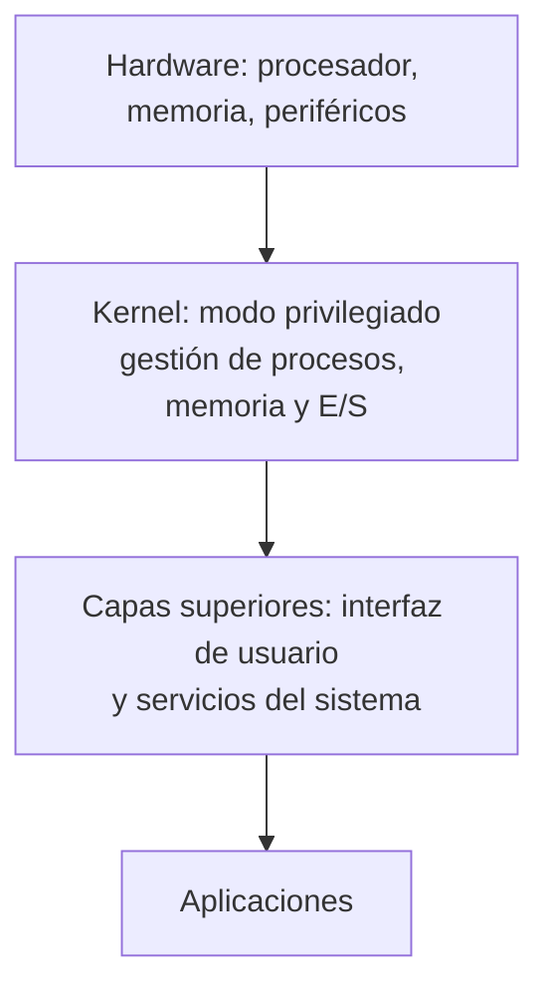
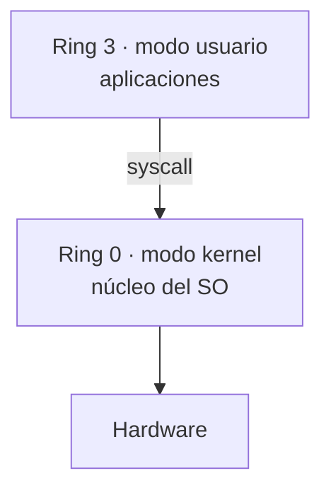
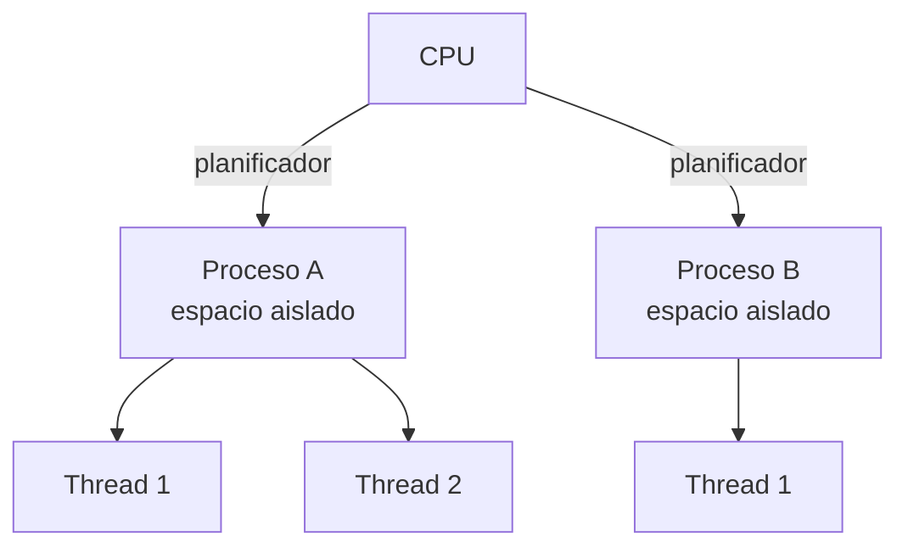
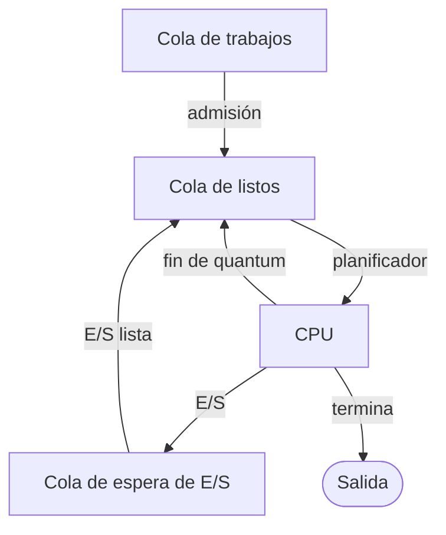
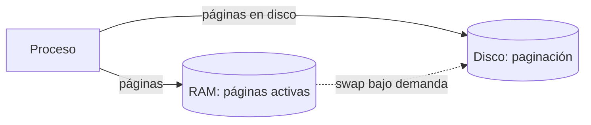
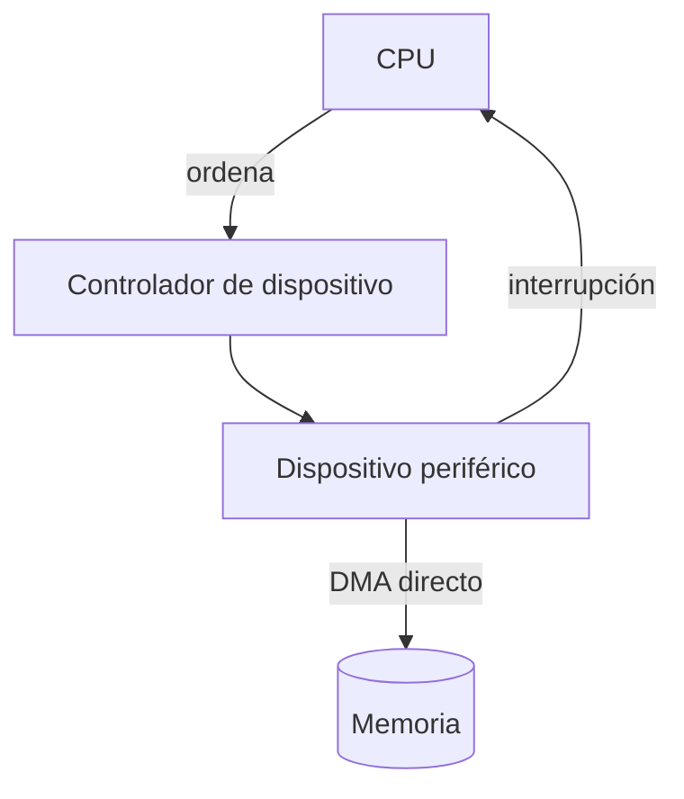
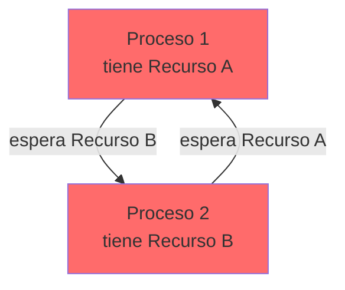
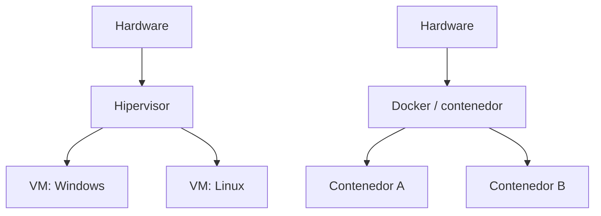
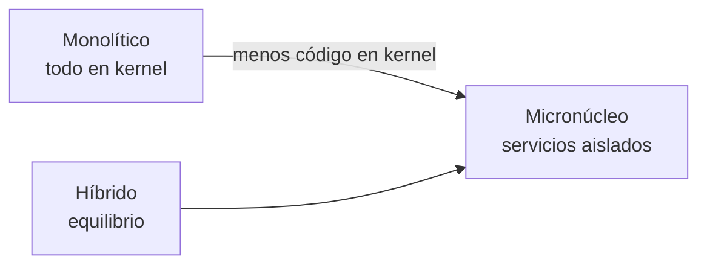

# 🧠 Fundamentos del Sistema Operativo

> [!info] Objetivo
> Conceptos centrales que el SO gestiona en tiempo de ejecución: procesos, memoria, E/S, concurrencia y virtualización, más los tipos de kernel. Base para entender cualquier SO moderno.

---

## 📋 Tabla de contenidos

- [[#¿Qué es un Sistema Operativo?]]
- [[#Arquitectura por capas]]
- [[#Modo-kernel-anillos-HAL-y-syscall]]
- [[#Procesos y Threads]]
- [[#Herramientas-de-inspección-de-procesos]]
- [[#Gestión de memoria]]
- [[#Entrada/Salida (E/S)]]
- [[#Sincronización y concurrencia]]
- [[#Virtualización]]
- [[#Tipos de kernel]]
- [[#Mono-vs-Multi-(proceso-tarea-usuario)]]
- [[#📝 Autoevaluación]]
- [[#⚠️ Errores comunes]]

---

## ¿Qué es un Sistema Operativo?

El SO se define desde tres ángulos:

- **Intermediario:** puente entre las aplicaciones de usuario y el hardware subyacente.
- **Gestor de recursos:** administra CPU, memoria RAM y dispositivos de E/S de forma eficiente.
- **Abstracción:** proporciona servicios básicos y la noción de *máquina virtual* al programador, ocultando los detalles del hardware.

> [!note] Programa vs proceso
> Un **programa** es código compilado y enlazado: un actor *pasivo*. Al ejecutarlo, el SO lo carga en memoria y se vuelve un **proceso** (actor *activo*) que ocupa un espacio propio, fijo o variable.

---

## Arquitectura por capas



El kernel aísla al hardware; las capas superiores ofrecen la interfaz y los servicios que usan las aplicaciones.

---

## Modo kernel, anillos, HAL y syscall

> [!info] Del laboratorio (Clase 3)
> El SO se organiza en **modo kernel** (privilegiado) y **modo usuario** (restringido). *Todos los sistemas operativos funcionan así*; es el hilo conductor de todo el semestre.

### Anillos de protección (Rings)

- **Ring 0 — modo kernel:** máximo privilegio, acceso total al hardware. Aquí vive el núcleo.
- **Ring 3 — modo usuario:** aquí corren las aplicaciones, sin acceso directo al hardware.
- **Rings 1 y 2:** existen físicamente (nivel de firmware/hardware) pero el SO **solo usa los anillos 0 y 3**.



### HAL — Capa de abstracción de hardware

La **HAL** (Hardware Abstraction Layer) traduce el hardware para el SO: le dice *"aquí hay teclado, aquí hay disco…"* para que monte los *drivers* adecuados **sin** tener que conocer de antemano cada componente. Sin HAL, el SO tendría que saber exactamente qué hardware hay en cada equipo.

> [!info] Captura del profesor: las 9 capas (robelstecnologia.com)
> El PDF *"1 Introducción General.pdf"* muestra un diagrama de **9 discos concéntricos
> apilados** (vista 3D tipo torta/pastel), de centro a borde exterior:
>
> | # | Capa | Color |
> |---|------|-------|
> | 1 | **HW** | Celeste/cian (disco central) |
> | 2 | **FIRMWARE** | Gris azulado |
> | 3 | **HAL** | Púrpura/magenta |
> | 4 | **DRIVERS** | Verde |
> | 5 | **KERNEL** | Amarillo |
> | 6 | **SYSCALL** | Rojo |
> | 7 | **API** | Amarillo-verdoso |
> | 8 | **SHELL** | Rojo oscuro |
> | 9 | **APPLICATIONS** | Azul (disco exterior/base) |
>
> Debajo del diagrama, el profesor traza el corte privilegio/no-privilegio
> directamente sobre estas 9 capas:
> - **Mode Kernel → Layer 3-5 / Ring 0** (HAL, Drivers, Kernel)
> - **Mode User → Layer 6-9 / Ring 3** (Syscall, API, Shell, Applications)
>
> Nótese que aquí la **syscall se ubica en modo usuario** (capa 6, frontera
> inmediatamente sobre el kernel) — es la puerta de entrada al modo kernel,
> no parte de él. Una diapositiva anterior en el mismo PDF muestra una versión
> simplificada de 5 capas (HW → KERNEL → API → SHELL → APLICACIONES, mismos
> colores) antes de expandirla a las 9 capas de arriba.

> [!info] Captura del profesor: diagrama oficial de arquitectura de Windows NT
> Dos diapositivas después (misma fuente, `1 Introducción General.pdf`, tras la
> explicación de **NTDLL.DLL**), el profesor muestra el diagrama clásico de
> Microsoft (citado de `learn.microsoft.com/.../overview-of-windows-components`
> y `social.technet.microsoft.com/.../architecture-of-windows-10.aspx`), de
> arriba a abajo:
>
> - **Fila superior, modo usuario**, 4 columnas de procesos apilados:
>   **System Processes** (Service control mgr., LSASS, Winlogon, Session
>   manager) · **Services** (SvcHost.exe, WinMgt.exe, SpoolSv.exe,
>   Services.exe) · **Applications** (Task Manager, Explorer, User
>   application, Subsystem DLLs) · **Environment Subsystems** (recuadros
>   **Windows**, **OS/2**, **POSIX** sobre "Windows DLLs").
> - Todas esas columnas bajan a una barra ancha **NTDLL.DLL** — la línea
>   **User mode / Kernel mode** pasa justo debajo de esa barra.
> - En modo kernel: **System threads** entra por la izquierda al
>   **System Service Dispatcher**, que reparte a una fila de "Kernel mode
>   callable interfaces": **I/O Mgr** (con "Device & File Sys. Drivers"
>   debajo), **File System Cache**, **Object Mgr**, **Plug and Play Mgr**,
>   **Security Reference Monitor**, **Virtual Memory**, **Threads &
>   Processes**, **Configuration Mgr (registry)**, **Local Procedure Call**
>   — y, aparte a la derecha, **Windows USER, GDI** + **Graphics drivers**.
> - Todo ese bloque se apoya sobre una caja **Kernel**, y esa a su vez sobre
>   **Hardware Abstraction Layer (HAL)** — la fila más baja del diagrama.
> - Debajo de HAL: **"Hardware interfaces (buses, I/O devices, interrupts,
>   interval timers, DMA, memory cache control, etc.)"**.
>
> Esta es la referencia **oficial de Microsoft** para dónde vive exactamente
> la HAL en Windows: justo encima del hardware físico y justo debajo del
> Kernel — ambos en **modo kernel (Ring 0)**, por debajo de toda la pila de
> gestores, subsistemas y procesos de modo usuario descritos arriba.

### Llamada al sistema (syscall)

La API **no** toca el kernel directamente: la API llama a la **syscall**, y la syscall es quien habla con el kernel.

> [!example] Analogía (Java)
> Cuando haces `System.out.print(...)` llamas a un **método** de una clase de la que **no ves el código fuente**: le pasas un parámetro y funciona. Igual pasa con API → syscall → kernel: llamas, pasas parámetros, y el kernel hace el trabajo.

### Shell, `cmd.exe` y `conhost.exe`

Al abrir la consola se ejecutan **dos procesos**:

- `cmd.exe` — el **shell**: espera tus comandos e interpreta.
- `conhost.exe` — **pinta la ventana** (tamaño, color, ruta).

> [!warning] No confundas
> Cambiar el tamaño/color de la ventana lo hace `conhost.exe`, no `cmd.exe`. El shell solo interpreta comandos.

---

## Procesos y Threads

| Concepto | Definición |
|---|---|
| **Proceso** | Programa en ejecución con espacio de memoria aislado y recursos propios asignados por el SO. |
| **Thread (hilo)** | Unidad de ejecución *dentro* de un proceso; los threads comparten memoria y recursos entre sí. |
| **Multiprogramación / multitarea** | Capacidad del SO de mantener varios procesos en memoria y ejecutarlos concurrentemente. |



> [!warning] Multitarea cooperativa vs preventiva
> **Cooperativa:** cada proceso conserva la CPU hasta que la cede (una falla congela el equipo). **Preventiva:** el reloj del sistema interrumpe periódicamente y el SO elige el siguiente proceso (tiempo compartido).

### Colas de planificación



El SO mueve los procesos entre la **cola de trabajos**, la **cola de listos** (esperando CPU), la **cola de espera de E/S** y la salida según su estado.

### Herramientas de inspección de procesos

> [!info] Del laboratorio (Clase 3)
> El profesor inspecciona el escritorio con **Windows R** (Ejecutar), **Task Manager** y **explorer.exe**.

#### Windows R (Ejecutar)
`Windows R` abre el cuadro **Ejecutar**. Allí puedes lanzar aplicaciones, utilidades oFolderPath:
- `explorer.exe` — el **explorador de archivos**.
- `tarea` / `taskmgr` — el **Administrador de tareas**.
- `msconfig`, `regedit`, `tpm.msc`, `cmd`, `powershell` — utilidades.

#### `explorer.exe`: dos caras
`explorer.exe` es *una sola* aplicación que cumple **dos roles**:
1. **Explorador de archivos** (navegador de carpetas).
2. **Shell del escritorio** (la barra de tareas y el fondo).

> [!warning] Finalizar el explorador cierra el escritorio
> Si "finalizas" `explorer.exe` en el Administrador de tareas, desaparece el escritorio; si lo
> "reinicias" (no finalizas) vuelve. El **modo ventana** de Task Manager está montado sobre él.

#### Task Manager — tres grandes categorías
Task Manager clasifica los procesos en:

| Categoría | Qué muestra |
|-----------|-------------|
| **Aplicaciones** | Programas con ventana (p. ej. Word, Edge). |
| **Procesos en segundo plano** | Servicios y apps sin ventana (98 en el ejemplo). |
| **Procesos de Windows** | Núcleo y componentes críticos del SO (116 en el ejemplo). |

> [!note] Finalizar vs reiniciar
> *Finalizar* un proceso mata la tarea; *reiniciar* cierra y vuelve a abrir (p. ej. el Explorador).

#### Task Manager — el resto de las pestañas (Taller No. 1)

Más allá de Procesos, el Administrador de tareas tiene varias pestañas con valor práctico y de
diagnóstico:

| Pestaña | Qué muestra |
|---|---|
| **Rendimiento** | Gráficas de CPU, Memoria, Memoria auxiliar (HDD/SSD), Ethernet/Wi-Fi y GPU en tiempo real. |
| **Historial de aplicaciones** | Consumo de recursos por aplicación desde una fecha definida — útil, por ejemplo, para saber cuánto tiempo usa un empleado cada app. |
| **Aplicaciones de inicio** (arranque) | Qué programas cargan al iniciar Windows y si están Habilitados/Deshabilitados; permite ver propiedades y abrir la ubicación del archivo. |
| **Usuarios** | Qué usuarios tienen sesión activa, qué procesos ejecuta cada uno y cuántos recursos consume; permite desconectar un usuario. |
| **Detalles** | Todos los procesos con: PID, estado, usuario que lo ejecuta, RAM consumida, arquitectura y una descripción corta. |
| **Servicios** | Listado completo de los servicios del sistema operativo. |

> [!info] Memoria reservada para hardware
> Parte de la RAM se bloquea para el hardware — forma parte de la **VRAM** (memoria compartida
> con la GPU), archivos temporales y caché. Para ver cuánta VRAM usa el controlador de pantalla:
> `Ejecutar → dxdiag.exe`. También se puede ajustar desde BIOS/UEFI o `msconfig` (cantidad máxima
> de memoria).

#### RESMON (Monitor de recursos) y PERFMON (Monitor de rendimiento)

`resmon.exe` da una vista más detallada que Task Manager, en particular de la pestaña **Memoria**:

| Métrica RAM (RESMON) | Significado |
|---|---|
| **En uso** | Consumida por el SO a nivel de kernel/shell y gestión de procesos-hardware. |
| **Modificada** | Datos cambiados desde que se cargaron del disco pero aún no guardados (ej. portapapeles). |
| **En espera** | Datos leídos recientemente del disco que se mantienen en RAM por si se vuelven a pedir (buffer de caché); **no cuenta como "en uso"**, pero mejora el rendimiento — se puede liberar para dejar más RAM libre. |
| **Libre** | RAM sin utilizar. |

`perfmon.exe` (Monitor de rendimiento) es una herramienta adicional y más completa; `perfmon /report`
genera un informe con secciones: Resultados del diagnóstico, Configuración de software/hardware,
CPU, Red, Disco, Memoria y Estadísticas.

> [!tip] Liberar la memoria en espera vía PowerShell
> Termina los 20 procesos que más memoria consumen (⚠️ úsalo con cuidado, cierra procesos activos):
> ```powershell
> Get-Process | Sort-Object -Property WorkingSet64 -Descending | Select-Object -First 20 |
>   ForEach-Object { Start-Process -FilePath 'taskkill.exe' -ArgumentList '/F', '-PID', $_.Id }
> ```
> `taskkill.exe /F /PID <id>` fuerza (`/F`) la terminación de un proceso por su PID.

#### Herramientas de optimización y benchmark

- **Windows PC Manager** (Microsoft) — optimizador oficial: limpieza, salud del sistema,
  aceleración de arranque, todo configurable desde una sola app.
- **Cinebench** — benchmark de estrés de CPU/GPU; útil para observar en vivo cómo suben CPU,
  memoria y GPU en Rendimiento/RESMON bajo carga máxima, y comparar el resultado (puntaje) entre
  equipos.

#### Administrador de tareas del navegador y Service Workers

> [!info] Del Taller No. 1
> La mayoría de navegadores tienen **su propio administrador de tareas**, independiente del de
> Windows, con distinta información: Chrome (`⋮` → Más herramientas → Administrador de tareas)
> muestra CPU, memoria, red y proceso por pestaña; **Firefox es más limitado** (solo CPU y RAM).
> Cada pestaña/extensión de Chrome corre como su propio proceso — se puede ver a qué pestaña
> corresponde cada entrada.

Un **Service Worker** es un script que el navegador ejecuta **en segundo plano**, independiente
de la pestaña que lo registró, para dar capacidades que una página normal no tiene:

- **Gestión de caché** — guarda HTML/CSS/JS/imágenes localmente para cargar más rápido (o
  funcionar offline) en visitas futuras.
- **Notificaciones push** — el sitio puede notificar al usuario aunque no esté abierto.
- **Background sync** — sincroniza datos con el servidor aunque el usuario no esté usando el sitio.
- **Actualizaciones automáticas** — mantiene la app web al día en segundo plano.
- **Trabajo offline** — sirve recursos cacheados con red lenta o sin conexión.

> [!tip] Por qué importa para un ingeniero de sistemas
> Un Service Worker es, en esencia, un **proceso en segundo plano gestionado por el navegador**,
> igual en concepto a un servicio de Windows: consume recursos, corre sin interacción directa del
> usuario, y aparece en el administrador de tareas del navegador — no en el de Windows.

---

## Gestión de memoria

- **RAM:** acceso rápido pero capacidad física limitada.
- **Memoria virtual:** extiende la capacidad usando el disco mediante **paginación**.
- **Paginación:** divide la memoria en páginas que se mueven entre RAM y disco según demanda, permitiendo usar más memoria de la físicamente disponible.
- **Protección:** garantiza el aislamiento entre los espacios de direcciones de distintos procesos.



---

## Entrada/Salida (E/S)

- **Periféricos:** discos, red, impresoras, etc.
- **Controladores de dispositivo:** interfaz de software entre el SO y el hardware específico.
- **Interrupciones:** señal asíncrona que notifica al procesador un evento de E/S.
- **DMA (Direct Memory Access):** transferencia de datos a memoria **sin intervención continua de la CPU**.



---

## Sincronización y concurrencia

- **Condición de carrera:** acceso simultáneo a un recurso compartido genera inconsistencias.
- **Mutex:** exclusión mutua (un solo hilo a la vez en la sección crítica).
- **Semáforos / monitores:** coordinan el acceso exclusivo a secciones críticas.
- **Deadlock (interbloqueo):** procesos se bloquean mutuamente esperando recursos que el otro retiene.



> [!warning] Deadlock
> P1 tiene A y espera B; P2 tiene B y espera A → ninguno avanza. Evítalo con orden de adquisición de recursos o *timeout*.

---

## Virtualización

| Paradigma | Característica |
|---|---|
| **Máquinas virtuales** | Varios SO completos sobre un hardware con aislamiento total. |
| **Contenedores** | Aislamiento ligero de aplicaciones que comparten el kernel del SO anfitrión. |
| **Hipervisores** | Software que gestiona y asigna recursos físicos entre las VMs (Type 1/Type 2). |



---

## Tipos de kernel

| Tipo | Descripción | Ejemplos |
|---|---|---|
| **Monolítico** | Drivers y extensiones en el espacio central, acceso total al hardware; alto rendimiento. | Linux, DOS, Unix |
| **Micronúcleo** | Servicios en entornos aislados; más estable y fácil de depurar. | QNX, Symbian, Genode |
| **Híbrido** | Combina mono + micro: partes críticas en kernel, servicios en usuario. | Windows, macOS modernos |
| **Nanonúcleo** | Mínimo código en kernel (memoria + IPC). | GNU Hurd |
| **Exonúcleo** | Solo recursos básicos (CPU, memoria física); el resto en bibliotecas de usuario. | Exokernel (MIT) |



> [!info] Qué se saca del kernel en un micronúcleo
> En el modelo monolítico, el **manejador de interrupciones**, el **planificador de procesos** y el **gestor de memoria** viven en modo kernel. En un **micronúcleo** se mueven al **modo usuario**, porque es el usuario quien los define y administra.

> [!note] ¿En qué lenguaje está escrito Windows?
> Es un híbrido de **C, C++, C# / Visual C++**; el **núcleo es C**. (Para contraste: Java desciende de C++.)

---

## Mono vs Multi (proceso, tarea, usuario)

| Concepto | Mono… | Multi… |
|----------|--------|---------|
| **Monoproceso** | Un solo procesador físico atendiendo | **Multiproceso**: varios núcleos/workloads a la vez |
| **Monotarea** | Ejecuta una sola cosa; no avanza hasta terminar | **Multitarea**: el planificador alterna procesos (tiempo compartido) |
| **Monousuario** | Una sola sesión/persona | **Multiusuario**: varias sesiones abiertas a la vez |

> [!info] Windows es multiusuario
> Aunque en tu equipo eres tú, Windows soporta varias sesiones abiertas. Por eso al apagar a veces avisa: *"hay otro usuario con sesión abierta"*.

---

## 📝 Autoevaluación

```flipcard
**Pregunta 1 — Proceso vs thread**
¿Cuál es la diferencia entre un proceso y un thread?
---
El proceso tiene espacio de memoria aislado y recursos propios; el thread es una unidad de ejecución dentro del proceso y comparte su memoria con los demás threads.
```

```flipcard
**Pregunta 2 — ¿Qué es la paginación?**
¿Para qué sirve la memoria virtual y la paginación?
---
Extienden la memoria disponible usando el disco: la memoria se divide en páginas que se mueven entre RAM y disco según demanda, permitiendo ejecutar procesos mayores que la RAM física.
```

```flipcard
**Pregunta 3 — ¿Qué es un deadlock?**
Dos procesos se bloquean esperando recursos que el otro retiene. ¿Cómo se llama?
---
Deadlock (interbloqueo). Se evita con orden de adquisición de recursos, timeouts o detección.
```

---

## ⚠️ Errores comunes

> [!warning] Error 1: Proceso = thread
> El proceso aísla memoria; el thread la comparte. No son lo mismo.

> [!warning] Error 2: Memoria virtual = RAM
> La memoria virtual usa disco (paginación); no es RAM física. Es más lenta pero más amplia.

> [!warning] Error 3: DMA usa la CPU
> El DMA transfiere datos a memoria sin intervención continua de la CPU; la CPU solo se entera vía interrupción al terminar.

> [!warning] Error 4: Cambiar el nombre de cuenta renombra la carpeta de usuario
> Al instalar Windows se crea la carpeta `C:\Users\<usuario>` con el nombre que diste. Si luego cambias el **nombre de cuenta** en Configuración, la **carpeta NO se renombra**. Renombrar la carpeta a mano rompe rutas y puede dejarte fuera de sesión. El nombre de cuenta, el de la carpeta y el del equipo en red son cosas distintas.

> [!warning] Error 5: EFS es tan seguro como BitLocker
> **EFS** cifra archivos/carpetas de forma individual con una llave **local** ligada a tu cuenta; es menos robusto que **BitLocker** (que cifra el volumen completo usando el TPM). Ver [[03-Arranque-y-Seguridad|🛡️ Arranque y seguridad]].

---

## Referencias

> [!info] Recursos externos
> - [TutorialsPoint — Operating System](https://www.tutorialspoint.com/operating_system/)
> - [Microsoft — Componentes de Windows](https://learn.microsoft.com/en-us/windows-hardware/drivers/kernel/overview-of-windows-components)
