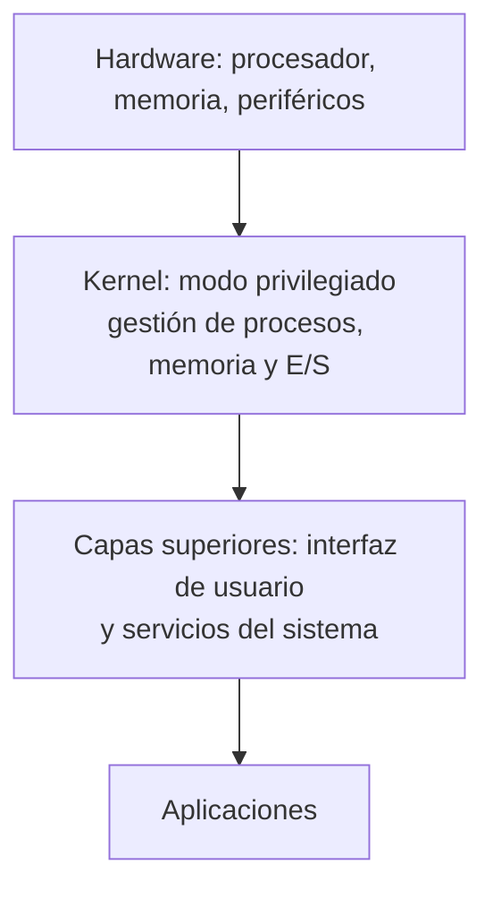

# 🧠 Fundamentos del Sistema Operativo

> [!info] Módulo
> **Clase 2** — Fundamentos del Sistema Operativo
> **Tema:** Conceptos centrales: procesos, memoria, E/S, sincronización, virtualización, tipos de kernel
> **Ver también:** [[07-Introduccion-SO|📘 Introducción a los S.O.]]
>
> [!info] Objetivo
> Conceptos centrales que el SO gestiona en tiempo de ejecución: procesos, memoria, E/S, concurrencia y virtualización, más los tipos de kernel. Base para entender cualquier SO moderno.

---

## 📋 Tabla de contenidos

- [[#¿Qué es un Sistema Operativo?]]
- [[#Arquitectura por capas]]

---

## ¿Qué es un Sistema Operativo?

El SO se define desde tres ángulos:

- **Intermediario:** puente entre las aplicaciones de usuario y el hardware subyacente.
- **Gestor de recursos:** administra CPU, memoria RAM y dispositivos de E/S de forma eficiente.
- **Abstracción:** proporciona servicios básicos y la noción de *máquina virtual* al programador, ocultando los detalles del hardware.

> [!note] Programa vs proceso
> Un **programa** es código compilado y enlazado: un actor *pasivo*. Al ejecutarlo, el SO lo carga en memoria y se vuelve un **proceso** (actor *activo*) que ocupa un espacio propio, fijo o variable.

---

## Arquitectura por capas

El kernel aísla al hardware; las capas superiores ofrecen la interfaz y los servicios que usan las aplicaciones.

---

> [!info] Continúa en
> [[09b-Procesos-Memoria-Kernel|🧠 Procesos y Kernel]] — procesos, memoria, E/S, sincronización, virtualización y tipos de kernel.
