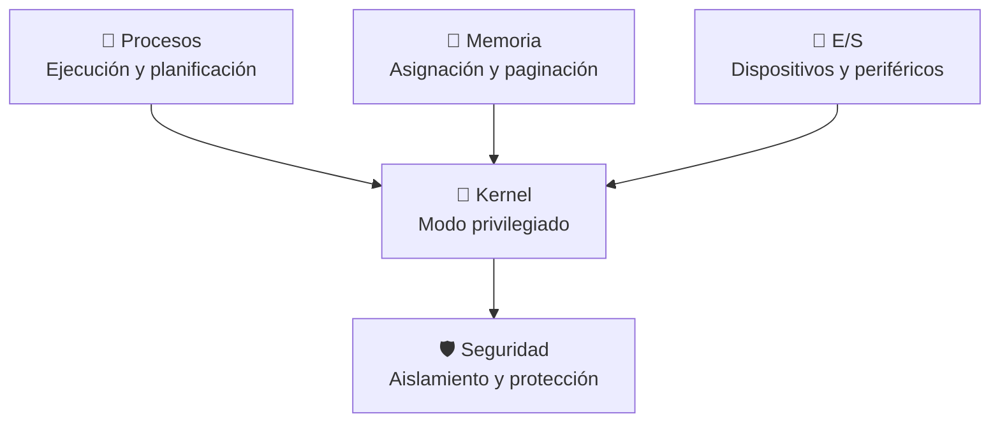

# 🧠 Fundamentos del Sistema Operativo — Procesos, Memoria y Kernel

> [!info] Módulo
> **Clase 2** — Procesos, Memoria y Kernel
> **Tema:** Procesos, memoria, E/S, sincronización, virtualización y tipos de kernel
> **Ver también:** [[09-Fundamentos-del-SO|🧠 Fundamentos del SO]]
>
> [!info] Objetivo
> Conceptos centrales que el SO gestiona en tiempo de ejecución: procesos, memoria, E/S, concurrencia y virtualización, más los tipos de kernel. Base para entender cualquier SO moderno.

> [!tip] Prerrequisitos
> - Conceptos básicos de sistemas operativos
> - [[09-Fundamentos-del-SO|🧠 Fundamentos del SO]] — arquitectura y modos de ejecución

---

> [!info] Temas relacionados
> - [[09b-Procesos|🧠 Procesos y Threads]]
> - [[09c-Memoria-y-Sincronizacion|🧠 Memoria, E/S y Sincronización]]
> - [[09d-Virtualizacion-Kernel|🧠 Virtualización, Kernel y Conceptos]]

## Visión general

El núcleo de cualquier sistema operativo se reduce a tres grandes ejes:

- **Procesos y threads** — qué es un proceso, cómo se diferencia de un hilo,
  cómo los programas se convierten en instancias en ejecución y cómo el SO los
  planifica en el CPU.
- **Memoria, E/S y sincronización** — gestión de RAM, memoria virtual y
  paginación, controladores de dispositivo, interrupciones, DMA, condiciones de
  carrera, mutex, semáforos y deadlock.
- **Virtualización, kernel y conceptos** — tipos de kernel (monolítico,
  micronúcleo, híbrido, nanonúcleo, exonúcleo), máquinas virtuales, contenedores
  y la arquitectura por capas del SO.

> [!tip] ¿Por qué importa?
> Estos tres ejes aparecen en prácticamente todo examen y en cualquier
> entrevista técnica sobre sistemas operativos. Dominarlos permite entender no
> solo *cómo* funciona Windows o Linux, sino *por qué* se diseñaron así.

