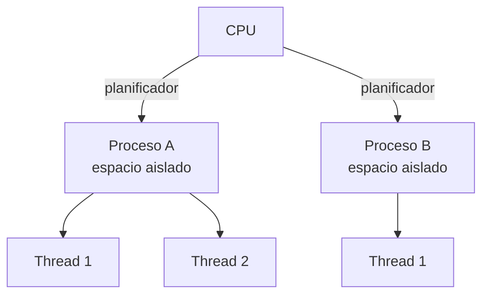
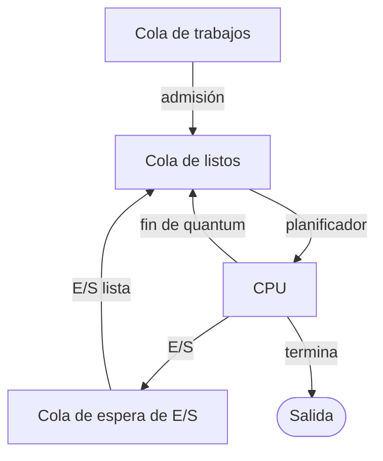

# 🧠 Procesos y Threads

> [!info] Módulo
> **Clase 2** — Procesos, memoria, E/S, sincronización, virtualización y tipos de kernel
> **Tema:** 🧠 Procesos y Threads
> **Ver también:** [[09b-Procesos-Memoria-Kernel|🧠 Fundamentos del SO — Procesos, Memoria y Kernel]]

> [!tip] Prerrequisitos
> - Conceptos básicos de sistemas operativos
> - [[09b-Procesos-Memoria-Kernel|🧠 Fundamentos del SO — Procesos, Memoria y Kernel]] — visión general

---

> [!info] Anterior
> [[09b-Procesos-Memoria-Kernel|🧠 Fundamentos del SO — Procesos, Memoria y Kernel]] — visión general

| Concepto | Definición |
|---|---|
| **Proceso** | Programa en ejecución con espacio de memoria aislado y recursos propios asignados por el SO. |
| **Thread (hilo)** | Unidad de ejecución *dentro* de un proceso; los threads comparten memoria y recursos entre sí. |
| **Multiprogramación / multitarea** | Capacidad del SO de mantener varios procesos en memoria y ejecutarlos concurrentemente. |



> [!info] Captura del profesor: "PROGRAMA (pasivo) → PROCESO (activo)" con el disco de P1–P5
> Diapositiva titulada *"… explicación antes de explicar Tipos S.O."*. A la
> izquierda, un **disco gris en perspectiva 3D** rotulado **"S.O."** en su
> borde frontal y **"PROCESOS"** en el centro de la superficie; sobre él,
> **5 pastillas ovaladas de colores** con las etiquetas y posiciones exactas:
>
> | Etiqueta | Color | Posición sobre el disco |
> |---|---|---|
> | **P1** | azul/morado | arriba-izquierda |
> | **P2** | amarillo oliva | arriba-derecha |
> | **P4** | naranja/terracota | izquierda |
> | **P3** | turquesa | derecha |
> | **P5** | magenta | abajo-centro |
>
> A la derecha, el texto literal de la diapositiva, en 4 párrafos:
> 1. *"Un PROGRAMA se construye a partir de un código en un lenguaje de
>    programación que se compila y se enlaza para crear un ejecutable."*
> 2. *"Este PROGRAMA se considera un actor PASIVO, el cual para ser ACTIVO se
>    debe ejecutar el cual será cargado a través del S.O. en la memoria de
>    trabajo del equipo."*
> 3. *"Al pasar a ser un actor ACTIVO se convierte en PROCESO"*
> 4. *"Un SISTEMA OPERATIVO ejecuta uno o varios procesos a través de la
>    capacidad de memoria, el cual ocupa un espacio que puede ser fijo o
>    variable y puede o no cargarse por completo o una parte."*

> [!warning] Para memorizar — riesgo de examen
> La cadena exacta es **código → se compila → se enlaza → ejecutable
> (PROGRAMA, actor PASIVO) → el S.O. lo carga en memoria de trabajo → PROCESO
> (actor ACTIVO)**. Trampas típicas:
> - Invertir pasivo/activo: el **programa** es el pasivo, el **proceso** el activo.
> - Olvidar el paso **"se enlaza"** (linking) entre compilar y ejecutable.
> - Decir que el proceso siempre se carga completo: la diapositiva dice
>   explícitamente que el espacio puede ser **fijo o variable** y que puede
>   cargarse **por completo o solo una parte**.

> [!warning] Multitarea cooperativa vs preventiva
> **Cooperativa:** cada proceso conserva la CPU hasta que la cede (una falla congela el equipo). **Preventiva:** el reloj del sistema interrumpe periódicamente y el SO elige el siguiente proceso (tiempo compartido).

### Colas de planificación



El SO mueve los procesos entre la **cola de trabajos**, la **cola de listos** (esperando CPU), la **cola de espera de E/S** y la salida según su estado.

### Herramientas de inspección de procesos

> [!info] Del laboratorio (Clase 3)
> El profesor inspecciona el escritorio con **Windows R** (Ejecutar), **Task Manager** y **explorer.exe**.

#### Windows R (Ejecutar)
`Windows R` abre el cuadro **Ejecutar**. Allí puedes lanzar aplicaciones, utilidades oFolderPath:
- `explorer.exe` — el **explorador de archivos**.
- `tarea` / `taskmgr` — el **Administrador de tareas**.
- `msconfig`, `regedit`, `tpm.msc`, `cmd`, `powershell` — utilidades.

#### `explorer.exe`: dos caras
`explorer.exe` es *una sola* aplicación que cumple **dos roles**:
1. **Explorador de archivos** (navegador de carpetas).
2. **Shell del escritorio** (la barra de tareas y el fondo).

> [!warning] Finalizar el explorador cierra el escritorio
> Si "finalizas" `explorer.exe` en el Administrador de tareas, desaparece el escritorio; si lo
> "reinicias" (no finalizas) vuelve. El **modo ventana** de Task Manager está montado sobre él.

#### Task Manager — tres grandes categorías
Task Manager clasifica los procesos en:

| Categoría | Qué muestra |
|-----------|-------------|
| **Aplicaciones** | Programas con ventana (p. ej. Word, Edge). |
| **Procesos en segundo plano** | Servicios y apps sin ventana (98 en el ejemplo). |
| **Procesos de Windows** | Núcleo y componentes críticos del SO (116 en el ejemplo). |

> [!note] Finalizar vs reiniciar
> *Finalizar* un proceso mata la tarea; *reiniciar* cierra y vuelve a abrir (p. ej. el Explorador).

#### Task Manager — el resto de las pestañas (Taller No. 1)

Más allá de Procesos, el Administrador de tareas tiene varias pestañas con valor práctico y de
diagnóstico:

| Pestaña | Qué muestra |
|---|---|
| **Rendimiento** | Gráficas de CPU, Memoria, Memoria auxiliar (HDD/SSD), Ethernet/Wi-Fi y GPU en tiempo real. |
| **Historial de aplicaciones** | Consumo de recursos por aplicación desde una fecha definida — útil, por ejemplo, para saber cuánto tiempo usa un empleado cada app. |
| **Aplicaciones de inicio** (arranque) | Qué programas cargan al iniciar Windows y si están Habilitados/Deshabilitados; permite ver propiedades y abrir la ubicación del archivo. |
| **Usuarios** | Qué usuarios tienen sesión activa, qué procesos ejecuta cada uno y cuántos recursos consume; permite desconectar un usuario. |
| **Detalles** | Todos los procesos con: PID, estado, usuario que lo ejecuta, RAM consumida, arquitectura y una descripción corta. |
| **Servicios** | Listado completo de los servicios del sistema operativo. |

> [!info] Memoria reservada para hardware
> Parte de la RAM se bloquea para el hardware — forma parte de la **VRAM** (memoria compartida
> con la GPU), archivos temporales y caché. Para ver cuánta VRAM usa el controlador de pantalla:
> `Ejecutar → dxdiag.exe`. También se puede ajustar desde BIOS/UEFI o `msconfig` (cantidad máxima
> de memoria).

#### RESMON (Monitor de recursos) y PERFMON (Monitor de rendimiento)

`resmon.exe` da una vista más detallada que Task Manager, en particular de la pestaña **Memoria**:

| Métrica RAM (RESMON) | Significado |
|---|---|
| **En uso** | Consumida por el SO a nivel de kernel/shell y gestión de procesos-hardware. |
| **Modificada** | Datos cambiados desde que se cargaron del disco pero aún no guardados (ej. portapapeles). |
| **En espera** | Datos leídos recientemente del disco que se mantienen en RAM por si se vuelven a pedir (buffer de caché); **no cuenta como "en uso"**, pero mejora el rendimiento — se puede liberar para dejar más RAM libre. |
| **Libre** | RAM sin utilizar. |

`perfmon.exe` (Monitor de rendimiento) es una herramienta adicional y más completa; `perfmon /report`
genera un informe con secciones: Resultados del diagnóstico, Configuración de software/hardware,
CPU, Red, Disco, Memoria y Estadísticas.

> [!tip] Liberar la memoria en espera vía PowerShell
> Termina los 20 procesos que más memoria consumen (⚠️ úsalo con cuidado, cierra procesos activos):
> ```powershell
> Get-Process | Sort-Object -Property WorkingSet64 -Descending | Select-Object -First 20 |
>   ForEach-Object { Start-Process -FilePath 'taskkill.exe' -ArgumentList '/F', '-PID', $_.Id }
> ```
> `taskkill.exe /F /PID <id>` fuerza (`/F`) la terminación de un proceso por su PID.

#### Herramientas de optimización y benchmark

- **Windows PC Manager** (Microsoft) — optimizador oficial: limpieza, salud del sistema,
  aceleración de arranque, todo configurable desde una sola app.
- **Cinebench** — benchmark de estrés de CPU/GPU; útil para observar en vivo cómo suben CPU,
  memoria y GPU en Rendimiento/RESMON bajo carga máxima, y comparar el resultado (puntaje) entre
  equipos.

#### Administrador de tareas del navegador y Service Workers

> [!info] Del Taller No. 1
> La mayoría de navegadores tienen **su propio administrador de tareas**, independiente del de
> Windows, con distinta información: Chrome (`⋮` → Más herramientas → Administrador de tareas)
> muestra CPU, memoria, red y proceso por pestaña; **Firefox es más limitado** (solo CPU y RAM).
> Cada pestaña/extensión de Chrome corre como su propio proceso — se puede ver a qué pestaña
> corresponde cada entrada.

Un **Service Worker** es un script que el navegador ejecuta **en segundo plano**, independiente
de la pestaña que lo registró, para dar capacidades que una página normal no tiene:

- **Gestión de caché** — guarda HTML/CSS/JS/imágenes localmente para cargar más rápido (o
  funcionar offline) en visitas futuras.
- **Notificaciones push** — el sitio puede notificar al usuario aunque no esté abierto.
- **Background sync** — sincroniza datos con el servidor aunque el usuario no esté usando el sitio.
- **Actualizaciones automáticas** — mantiene la app web al día en segundo plano.
- **Trabajo offline** — sirve recursos cacheados con red lenta o sin conexión.

> [!tip] Por qué importa para un ingeniero de sistemas
> Un Service Worker es, en esencia, un **proceso en segundo plano gestionado por el navegador**,
> igual en concepto a un servicio de Windows: consume recursos, corre sin interacción directa del
> usuario, y aparece en el administrador de tareas del navegador — no en el de Windows.

---

