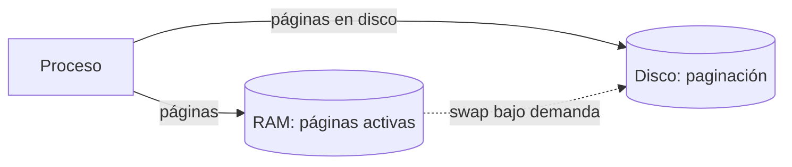
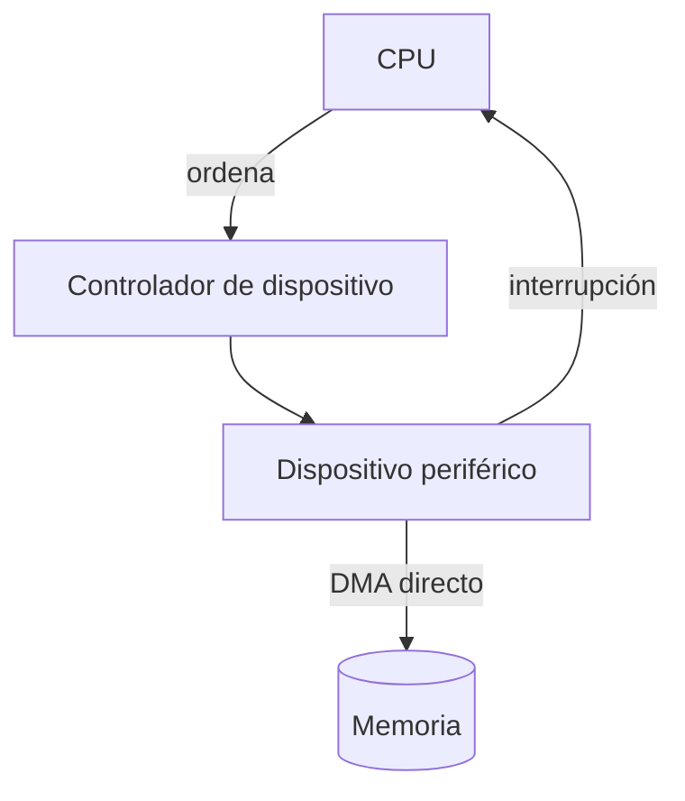
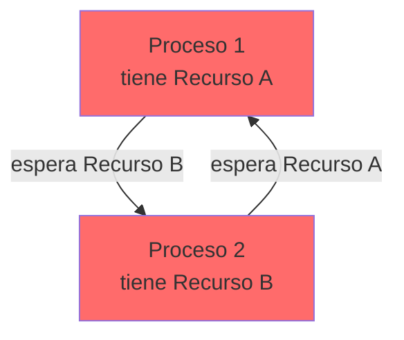

# 🧠 Memoria, E/S y Sincronización

> [!info] Módulo
> **Clase 2** — Procesos, memoria, E/S, sincronización, virtualización y tipos de kernel
> **Tema:** 🧠 Memoria, E/S y Sincronización
> **Ver también:** [[09b-Procesos-Memoria-Kernel|🧠 Fundamentos del SO — Procesos, Memoria y Kernel]]

> [!tip] Prerrequisitos
> - Conceptos básicos de sistemas operativos
> - [[09b-Procesos-Memoria-Kernel|🧠 Fundamentos del SO — Procesos, Memoria y Kernel]] — visión general

---

> [!info] Anterior
> [[09b-Procesos-Memoria-Kernel|🧠 Fundamentos del SO — Procesos, Memoria y Kernel]] — visión general

- **RAM:** acceso rápido pero capacidad física limitada.
- **Memoria virtual:** extiende la capacidad usando el disco mediante **paginación**.
- **Paginación:** divide la memoria en páginas que se mueven entre RAM y disco según demanda, permitiendo usar más memoria de la físicamente disponible.
- **Protección:** garantiza el aislamiento entre los espacios de direcciones de distintos procesos.

---

## Entrada/Salida (E/S)

- **Periféricos:** discos, red, impresoras, etc.
- **Controladores de dispositivo:** interfaz de software entre el SO y el hardware específico.
- **Interrupciones:** señal asíncrona que notifica al procesador un evento de E/S.
- **DMA (Direct Memory Access):** transferencia de datos a memoria **sin intervención continua de la CPU**.

---

## Sincronización y concurrencia

- **Condición de carrera:** acceso simultáneo a un recurso compartido genera inconsistencias.
- **Mutex:** exclusión mutua (un solo hilo a la vez en la sección crítica).
- **Semáforos / monitores:** coordinan el acceso exclusivo a secciones críticas.
- **Deadlock (interbloqueo):** procesos se bloquean mutuamente esperando recursos que el otro retiene.

> [!warning] Deadlock
> P1 tiene A y espera B; P2 tiene B y espera A → ninguno avanza. Evítalo con orden de adquisición de recursos o *timeout*.

---

