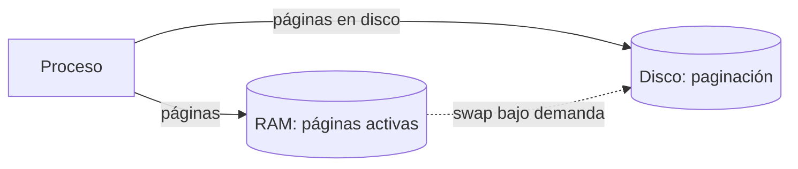
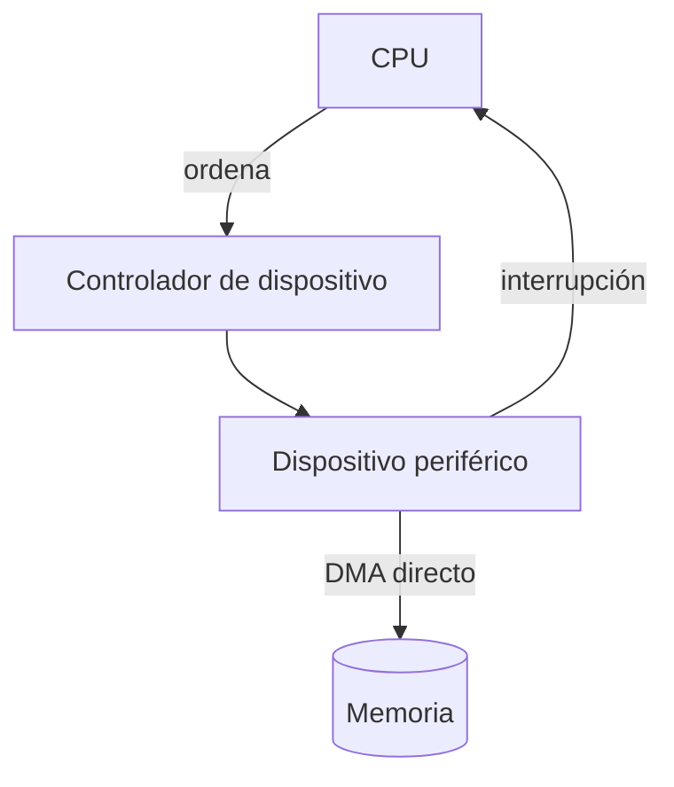
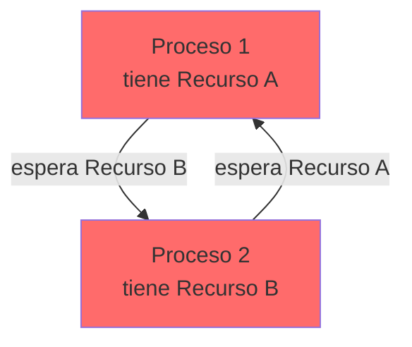

# 🧠 Memoria, E/S y Sincronización

> [!info] Módulo
> **Clase 2** — Procesos, memoria, E/S, sincronización, virtualización y tipos de kernel
> **Tema:** 🧠 Memoria, E/S y Sincronización
> **Ver también:** [[09b-Procesos-Memoria-Kernel|🧠 Fundamentos del SO — Procesos, Memoria y Kernel]]

> [!tip] Prerrequisitos
> - Conceptos básicos de sistemas operativos
> - [[09b-Procesos-Memoria-Kernel|🧠 Fundamentos del SO — Procesos, Memoria y Kernel]] — visión general

---

> [!info] Anterior
> [[09b-Procesos-Memoria-Kernel|🧠 Fundamentos del SO — Procesos, Memoria y Kernel]] — visión general

- **RAM:** acceso rápido pero capacidad física limitada.
- **Memoria virtual:** extiende la capacidad usando el disco mediante **paginación**.
- **Paginación:** divide la memoria en páginas que se mueven entre RAM y disco según demanda, permitiendo usar más memoria de la físicamente disponible.
- **Protección:** garantiza el aislamiento entre los espacios de direcciones de distintos procesos.

> [!info] Captura del profesor: "Estructura del S.O. — Linux" (slideserve), el mapa interno del núcleo
> Diagrama de bloques del kernel Linux dividido en **tres bandas rotuladas al
> margen derecho**: `Modo usuario` (arriba), `Alto nivel del núcleo` (centro) y
> `Bajo nivel del núcleo` (abajo), con `HARDWARE` como barra **negra** al pie.
> De arriba abajo, con sus colores exactos:
>
> 1. Barra **rosa** ancha: `Interfaz de llamadas de alto nivel` → es la banda
>    **Modo usuario**.
> 2. Barra **azul clara** ancha: `Validación de argumentos de las llamadas al sistema`
> 3. Barra **azul oscura**, más corta y centrada: `Conmutador de sistemas de archivo`
> 4. Fila de cajas **azul celeste** (de izquierda a derecha):
>    `Manejador de memoria` (la más ancha y alta) · `Manejador de procesos` ·
>    `Manejador de archivos` (encima de tres columnas verticales estrechas:
>    `Sistemas` / `de` / `archivo`) · `Manejador de terminales` ·
>    `Interfaz de sockets y streams` sobre `Pila de red` ·
>    y una columna vertical estrecha `Bibliotecas del kernel`.
> 5. A la derecha de esa fila, tres cajas **verde azulado (teal)** apiladas:
>    `Manejador de callouts` · `Estructuras del núcleo (alto nivel)` ·
>    `Estructuras de datos compartidas entre el alto y el bajo nivel` — esta
>    última **cruza la línea amarilla** que separa alto de bajo nivel.
> 6. Barra **roja** ancha: `Manejadores de dispositivo` — es la frontera; justo
>    debajo corre la **línea amarilla horizontal** de separación.
> 7. Fila de cajas **verde menta** (banda **Bajo nivel del núcleo**):
>    un bloque de tres renglones apilados —`Manejador de interrupciones` /
>    `Manejador de traps de llamadas al sistema` / `Manejador de excepciones`—
>    y a su derecha: `Tabla de dispatch` · `Manejador de procesos de bajo nivel` ·
>    `Callout de bajo nivel` · `Cambio de contexto`.
> 8. Barra **negra** al fondo: `HARDWARE`.

> [!warning] Para memorizar — riesgo de examen (fill-in-the-blank)
> Reconstrúyelo **de abajo hacia arriba**: `HARDWARE` → bajo nivel
> (interrupciones / traps / excepciones + dispatch + procesos de bajo nivel +
> callout + **cambio de contexto**) → `Manejadores de dispositivo` (la barra
> roja, la frontera) → alto nivel (memoria / procesos / archivos / terminales /
> red) → `Conmutador de sistemas de archivo` → `Validación de argumentos` →
> `Interfaz de llamadas de alto nivel` → modo usuario.
>
> Trampas:
> - **`Cambio de contexto` va en el BAJO nivel**, no junto al "Manejador de
>   procesos" del alto nivel — hay un manejador de procesos en cada banda.
> - El **Manejador de memoria** es de **alto** nivel (es la caja más grande de
>   esa fila), pese a "sonar" a hardware.
> - La única caja que **atraviesa** la frontera es *Estructuras de datos
>   compartidas entre el alto y el bajo nivel* — por eso se llama así.
> - `Manejadores de dispositivo` (roja) NO está en el bajo nivel: es la banda
>   que los separa.

---

## Entrada/Salida (E/S)

- **Periféricos:** discos, red, impresoras, etc.
- **Controladores de dispositivo:** interfaz de software entre el SO y el hardware específico.
- **Interrupciones:** señal asíncrona que notifica al procesador un evento de E/S.
- **DMA (Direct Memory Access):** transferencia de datos a memoria **sin intervención continua de la CPU**.

---

## Sincronización y concurrencia

- **Condición de carrera:** acceso simultáneo a un recurso compartido genera inconsistencias.
- **Mutex:** exclusión mutua (un solo hilo a la vez en la sección crítica).
- **Semáforos / monitores:** coordinan el acceso exclusivo a secciones críticas.
- **Deadlock (interbloqueo):** procesos se bloquean mutuamente esperando recursos que el otro retiene.

> [!warning] Deadlock
> P1 tiene A y espera B; P2 tiene B y espera A → ninguno avanza. Evítalo con orden de adquisición de recursos o *timeout*.

---

