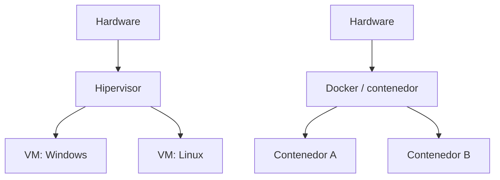
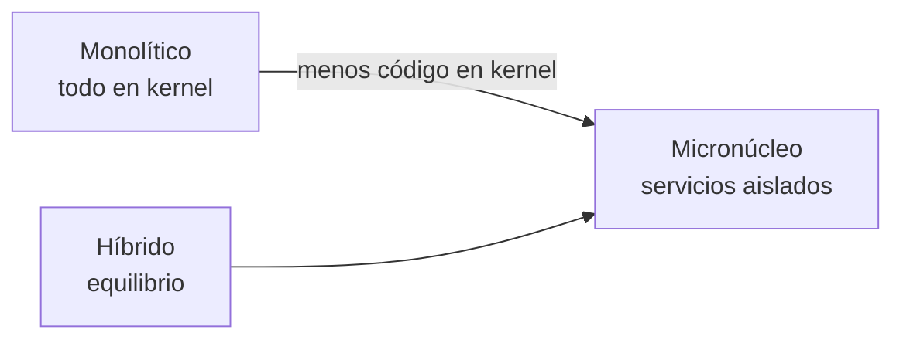

# 🧠 Virtualización, Kernel y Conceptos

> [!info] Módulo
> **Clase 2** — Procesos, memoria, E/S, sincronización, virtualización y tipos de kernel
> **Tema:** 🧠 Virtualización, Kernel y Conceptos
> **Ver también:** [[09b-Procesos-Memoria-Kernel|🧠 Fundamentos del SO — Procesos, Memoria y Kernel]]

> [!tip] Prerrequisitos
> - Conceptos básicos de sistemas operativos
> - [[09b-Procesos-Memoria-Kernel|🧠 Fundamentos del SO — Procesos, Memoria y Kernel]] — visión general

---

> [!info] Anterior
> [[09b-Procesos-Memoria-Kernel|🧠 Fundamentos del SO — Procesos, Memoria y Kernel]] — visión general

| Paradigma | Característica |
|---|---|
| **Máquinas virtuales** | Varios SO completos sobre un hardware con aislamiento total. |
| **Contenedores** | Aislamiento ligero de aplicaciones que comparten el kernel del SO anfitrión. |
| **Hipervisores** | Software que gestiona y asigna recursos físicos entre las VMs (Type 1/Type 2). |



---

## Tipos de kernel

| Tipo | Descripción | Ejemplos |
|---|---|---|
| **Monolítico** | Drivers y extensiones en el espacio central, acceso total al hardware; alto rendimiento. | Linux, DOS, Unix |
| **Micronúcleo** | Servicios en entornos aislados; más estable y fácil de depurar. | QNX, Symbian, Genode |
| **Híbrido** | Combina mono + micro: partes críticas en kernel, servicios en usuario. | Windows, macOS modernos |
| **Nanonúcleo** | Mínimo código en kernel (memoria + IPC). | GNU Hurd |
| **Exonúcleo** | Solo recursos básicos (CPU, memoria física); el resto en bibliotecas de usuario. | Exokernel (MIT) |



> [!info] Qué se saca del kernel en un micronúcleo
> En el modelo monolítico, el **manejador de interrupciones**, el **planificador de procesos** y el **gestor de memoria** viven en modo kernel. En un **micronúcleo** se mueven al **modo usuario**, porque es el usuario quien los define y administra.

> [!note] ¿En qué lenguaje está escrito Windows?
> Es un híbrido de **C, C++, C# / Visual C++**; el **núcleo es C**. (Para contraste: Java desciende de C++.)

> [!info] Captura del profesor: Monolítico vs MicroKernel, con logos reales (naps.com.mx)
> Dos diagramas lado a lado, cada uno con 3 filas horizontales (de arriba abajo):
>
> **Monolítico** (logos **MS-DOS, Linux (pingüino), Unix, Android** junto al
> título):
> - Fila amarilla **"Procesos (modo usuario)"**: `Compilador` · `Aplicación` · `Navegador`
> - Fila roja **"Núcleo (modo privilegiado)"**, 2 sub-filas: `Comunicación entre
>   procesos` · `Controlador de video` · `Subsistema de red` — y debajo:
>   `Sistema de archivos` · `Planificador de procesos` · `Manejo de
>   interrupciones` · `Memoria virtual`
> - Fila gris **"Hardware"**: `Disco duro` · `Procesador` · `Tarjeta de video`
>   · `Memoria` · `Tarjeta de red`
> - Texto bajo el título: *"La modificación de cualquier componente de un
>   núcleo monolítico implica que sea necesario compilar el núcleo por
>   completo."*
>
> **MicroKernel** (logos **Genode, QNX, Symbian**):
> - Fila amarilla **"Procesos (modo usuario)"**: `Compilador` · `Aplicación` ·
>   `Navegador` (idéntica a la de Monolítico)
> - Fila naranja **"Software de sistema"** (capa que NO existe en el
>   monolítico): `Sistema de archivos` · `Controlador de video` ·
>   `Comunicación entre procesos` · `Subsistema de red`
> - Fila roja **"Núcleo (modo privilegiado)"**, mucho más pequeña: solo
>   `Manejo de interrupciones` · `Planificador de procesos` · `Memoria virtual`
> - Fila gris **"Hardware"**: `Disco duro` · `Tarjeta de video` · `Procesador`
>   · `Memoria` · `Tarjeta de red` (mismos 5 componentes, orden distinto)
>
> **La diferencia clave visual**: en Monolítico, "Sistema de archivos",
> "Controlador de video", "Comunicación entre procesos" y "Subsistema de red"
> están DENTRO de la fila roja (núcleo); en MicroKernel esos mismos 4
> elementos se sacan a su propia fila naranja de "Software de sistema",
> fuera del núcleo — dejando el núcleo con solo 3 elementos.

> [!info] Captura del profesor: los 4 tipos de kernel en un solo diagrama (pchardwarepro.com)
> Cuadrícula 2×2, cada tipo con su propia caja "Kernel" (celeste) y flechas
> hacia/desde una caja "Software" (rosa):
> - **Micronúcleo** (arriba-izq): `Kernel` ↕ `Servers` ↔ `Software`, con
>   doble flecha punteada horizontal etiquetada **"IPC"** entre `Servers` y
>   `Software` — el kernel se comunica con Servers y con Software por
>   separado (flechas verticales), y Servers se comunica con Software vía IPC.
> - **Mononúcleo** (arriba-der): `Kernel` ↕ `Software` directo — sin caja
>   intermedia.
> - **Híbrido** (abajo-izq): una caja `Kernel` que **contiene** una sub-caja
>   `Servers` dentro de sí misma (Servers vive dentro del rectángulo del
>   Kernel), y de ahí baja a `Software`.
> - **Exonúcleo** (abajo-der): `Kernel` ↕ 3 cajas `Library` en paralelo
>   (`Library` · `Library` · `Library`) ↕ `Software` — las bibliotecas
>   median entre kernel y software.
>
> Pie de diapositiva: *"Leer documento COMPLEMENTO — TIPOS DE KERNEL"*.

> [!warning] Para memorizar — riesgo de examen (fill-in-the-blank)
> Si piden dibujar estos 4 de memoria, el detalle que más se confunde es
> **dónde vive la caja intermedia**:
> - Micronúcleo → intermediario = **Servers**, comunicado con Software por
>   **IPC** (flecha doble punteada).
> - Mononúcleo → **sin intermediario**, Kernel habla directo con Software.
> - Híbrido → Servers está **dentro** del Kernel (anidado), no al lado.
> - Exonúcleo → el intermediario son **Libraries** (plural, 3 cajas en
>   paralelo), no un único bloque.

---

## Mono vs Multi (proceso, tarea, usuario)

| Concepto | Mono… | Multi… |
|----------|--------|---------|
| **Monoproceso** | Un solo procesador físico atendiendo | **Multiproceso**: varios núcleos/workloads a la vez |
| **Monotarea** | Ejecuta una sola cosa; no avanza hasta terminar | **Multitarea**: el planificador alterna procesos (tiempo compartido) |
| **Monousuario** | Una sola sesión/persona | **Multiusuario**: varias sesiones abiertas a la vez |

> [!info] Windows es multiusuario
> Aunque en tu equipo eres tú, Windows soporta varias sesiones abiertas. Por eso al apagar a veces avisa: *"hay otro usuario con sesión abierta"*.

### Modos de ejecución: los 4 conceptos con ejemplos reales

> [!info] Captura del profesor: Monoprogramación / Monoprocesamiento / Multiprogramación / Multiprocesamiento
> Diagrama de 4 cajas verdes en cuadrícula 2×2, con flecha horizontal
> Monoprogramación→Monoprocesamiento y Multiprogramación→Multiprocesamiento:
>
> | Concepto | Definición literal de la diapositiva | Ejemplo |
> |---|---|---|
> | **Monoprogramación** | 1 programa en memoria, 1 CPU | MS-DOS |
> | **Monoprocesamiento** | 1 CPU ejecuta 1 o varios programas | Intel 8086 |
> | **Multiprogramación** | Varios programas en memoria, 1 CPU los intercambia | UNIX, Win95 |
> | **Multiprocesamiento** | Varios programas, múltiples CPUs | Intel i7, Servidores |
>
> Bajo "Monoprogramación" el profesor lista sus características: *un solo
> programa en memoria · no existe planificación compleja · no existe cambio
> de contexto · muy bajo aprovechamiento del procesador · gran tiempo ocioso
> de la CPU*.

> [!info] Captura del profesor: la analogía del mesero/restaurante
> Misma cuadrícula 2×2, ahora con dibujos de mesero(s) y mesa(s):
> - **Monoprogramación**: 1 mesero, 1 mesa (1 solo cliente sentado).
> - **Monoprocesamiento**: 1 mesero (marcado "CPU"), pero ahora 2 mesas — el
>   mesero atiende ambas alternando (números 1 y 2 sobre las mesas).
> - **Multiprogramación**: varios meseros, 1 grupo de mesas juntas.
> - **Multiprocesamiento**: varios meseros, varios grupos de mesas separados.

> [!info] Captura del profesor: comparación 50% vs 100% de utilización (P1/P2)
> Dos líneas de tiempo apiladas, la de arriba **sin multiprogramación**: el
> Proceso P1 corre completo (Inicio → Inactivo/Espera ×3 → Fin) y **solo
> cuando P1 termina** arranca P2 ("En espera" ocupa todo el ancho de P1) —
> **Utilización: 50%**. La de abajo **con multiprogramación**: P1 y P2 se
> intercalan con flechas cruzadas verticales entre ambas líneas — cuando uno
> queda "Inactivo; Espera" el otro toma la CPU — **Utilización: 100%**.

---

## 📝 Autoevaluación

```flipcard
**Pregunta 1 — Proceso vs thread**
¿Cuál es la diferencia entre un proceso y un thread?
---
El proceso tiene espacio de memoria aislado y recursos propios; el thread es una unidad de ejecución dentro del proceso y comparte su memoria con los demás threads.
```

```flipcard
**Pregunta 2 — ¿Qué es la paginación?**
¿Para qué sirve la memoria virtual y la paginación?
---
Extienden la memoria disponible usando el disco: la memoria se divide en páginas que se mueven entre RAM y disco según demanda, permitiendo ejecutar procesos mayores que la RAM física.
```

```flipcard
**Pregunta 3 — ¿Qué es un deadlock?**
Dos procesos se bloquean esperando recursos que el otro retiene. ¿Cómo se llama?
---
Deadlock (interbloqueo). Se evita con orden de adquisición de recursos, timeouts o detección.
```

---

## ⚠️ Errores comunes

> [!warning] Error 1: Proceso = thread
> El proceso aísla memoria; el thread la comparte. No son lo mismo.

> [!warning] Error 2: Memoria virtual = RAM
> La memoria virtual usa disco (paginación); no es RAM física. Es más lenta pero más amplia.

> [!warning] Error 3: DMA usa la CPU
> El DMA transfiere datos a memoria sin intervención continua de la CPU; la CPU solo se entera vía interrupción al terminar.

> [!warning] Error 4: Cambiar el nombre de cuenta renombra la carpeta de usuario
> Al instalar Windows se crea la carpeta `C:\Users\<usuario>` con el nombre que diste. Si luego cambias el **nombre de cuenta** en Configuración, la **carpeta NO se renombra**. Renombrar la carpeta a mano rompe rutas y puede dejarte fuera de sesión. El nombre de cuenta, el de la carpeta y el del equipo en red son cosas distintas.

> [!warning] Error 5: EFS es tan seguro como BitLocker
> **EFS** cifra archivos/carpetas de forma individual con una llave **local** ligada a tu cuenta; es menos robusto que **BitLocker** (que cifra el volumen completo usando el TPM). Ver [[03-Arranque-y-Seguridad|🛡️ Arranque y seguridad]].

---

## Referencias

> [!info] Recursos externos
> - [TutorialsPoint — Operating System](https://www.tutorialspoint.com/operating_system/)
> - [Microsoft — Componentes de Windows](https://learn.microsoft.com/en-us/windows-hardware/drivers/kernel/overview-of-windows-components)

