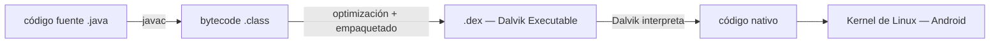
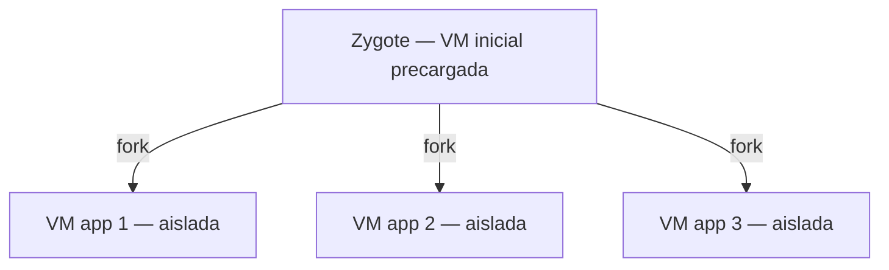
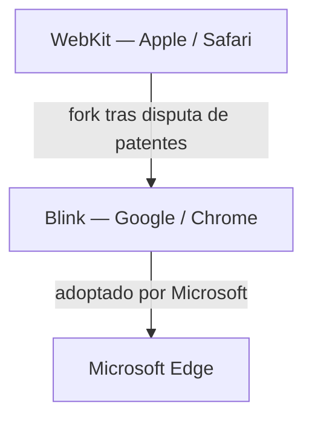

# 🤖 Arquitectura Android y Dalvik

> [!info] Módulo
> **Clase 3** — Laboratorio y comparativa de plataformas
> **Tema:** Máquina virtual de Android (Dalvik) frente a la JVM de Java; motor de renderizado web (WebKit vs Blink)
> **Ver también:** [[09-Fundamentos-del-SO|🧠 Fundamentos del SO]], [[06-Mercado-OS|📊 Mercado de OS]]

> [!tip] Contexto de la clase
> El profesor lo presenta en respuesta a la pregunta "¿cuál es el sistema operativo número uno del
> mundo?": la respuesta depende del dispositivo — **Android** en general/móviles, **Windows** en
> escritorio, **Linux** en servidores (ver [[06-Mercado-OS|📊 Mercado de OS]]). A partir de ahí explica
> por qué Android, basado en el **kernel de Linux**, no ejecuta Java de la misma forma que un JDK
> estándar.

---

## 📋 Tabla de contenidos

- [[#Java-Virtual-Machine-(JVM)]]
- [[#Android-Virtual-Machine-(Dalvik)]]
- [[#Dalvik-y-Multi-JVM]]
- [[#Memoria-en-Dalvik]]
- [[#Android-vs-Java-SDK]]
- [[#WebKit-vs-Blink]]

---

## Java Virtual Machine (JVM)

En Java, el código fuente (`.java`) se compila con `javac` a bytecode (`.class`), que la **JVM**
interpreta y convierte en código nativo que el sistema operativo entiende.

> [!info] Imagen de referencia (documento fuente)
> El PDF *"Arquitectura Android y Dalvik.pdf"* incluye un diagrama de este flujo
> (fuente: arquitecturajava.com), reproducido arriba como esquema equivalente.

---

## Android Virtual Machine (Dalvik)

Android usa el mismo código fuente Java, pero **no la misma máquina virtual**: en vez de la JVM,
usa **Dalvik**, que convierte el bytecode en código nativo para el **kernel de Linux** que sostiene
la plataforma Android.

Android añade un paso intermedio de optimización (crítico en un dispositivo móvil, con recursos
limitados): todos los ficheros `.class` se agrupan en un único archivo **`.dex`** (*Dalvik
Executable*). Un `.dex` descomprimido ocupa **la mitad** del tamaño de las mismas clases en formato
`.jar` (comprimido).

> [!important] Diferencia clave con Java estándar
> Java: `.class` → JVM → nativo. Android: `.class` → **`.dex`** (empaquetado + optimizado) → Dalvik →
> nativo sobre kernel Linux.

---

## Dalvik y Multi JVM

En un servidor de aplicaciones Java tradicional (JBoss, WebSphere, WebLogic), **todas las
aplicaciones corren sobre la misma máquina virtual**.

En Android **no**: cada aplicación corre en **su propia máquina virtual Dalvik aislada**. Esto
aumenta el consumo de recursos, pero mejora el aislamiento entre aplicaciones — si una falla o es
comprometida, no arrastra a las demás.

Para no pagar el costo completo de arrancar una VM por cada app, Android optimiza con
**Zygote**: una máquina virtual inicial precargada que se usa como plantilla para arrancar
rápidamente el resto de VMs de aplicación.

---

## Memoria en Dalvik

A pesar del aislamiento por proceso/VM, **todas las máquinas virtuales Dalvik comparten la memoria
del terminal** (RAM física del dispositivo) — el aislamiento es de ejecución, no de memoria física
subyacente.

---

## Android vs Java SDK

Un error común: pensar que, salvo por el paso `.dex`, "se trabaja como con Java normal". Es una
verdad a medias.

- El **JDK de Java** guarda sus clases principalmente en `rt.jar`, con **todos** los paquetes.
- El **Android SDK** no necesita tantas clases como el JDK estándar — hay paquetes que sobran por
  completo (ej. `Swing`, pensado para GUI de escritorio, no para móvil).

Los paquetes del JDK, vistos desde Android, se dividen en tres categorías:

| Categoría | Color (documento fuente) | Significado |
|---|---|---|
| Implementados completamente | 🟢 Verde | Disponibles igual que en el JDK estándar |
| Implementados parcialmente | 🔵 Azul | Subconjunto de la API disponible |
| No implementados | 🔴 Rojo | Ausentes del Android SDK |

> [!info] Imagen de referencia (documento fuente)
> El PDF incluye el gráfico de cobertura de paquetes JDK por color (verde/azul/rojo) mencionado
> arriba — no reproducido pixel a pixel aquí, pero resumido en la tabla.

> [!important] Conclusión
> Android está basado en Java, pero **no es Java**: puede que una clase del JDK estándar que se
> quiera usar simplemente no esté disponible en el Android SDK.

---

## WebKit vs Blink

Tema adicional cubierto en la Clase 3 al hilo de motores de navegador, relevante para entender el
ecosistema de Android/Google frente a Apple y Microsoft.

- **WebKit** es el motor de renderizado web de **Apple** (usado en Safari). Android usaba
  originalmente una variante de WebKit.
- Tras una disputa de patentes con Apple (relacionada con la tecnología *touch*), Google separó su
  propio fork: **Blink** (usado en Chrome y, por extensión, en el navegador de Android).
- **Microsoft Edge** adoptó después el motor **Blink/Chromium** (código abierto tras la separación
  de Google), reemplazando su motor propio anterior — por eso Edge y Chrome comparten motor de
  renderizado hoy.

---

## 🎯 Próximo paso

> [!info] Continuar con
> **[[06-Mercado-OS|📊 Mercado de OS]]** — Retoma la pregunta de qué sistema operativo domina según
> el tipo de dispositivo (móvil, escritorio, servidor).

---

## Referencias

> [!info] Recursos externos
> - Documento fuente: *"Arquitectura Android y Dalvik.pdf"* (arquitecturajava.com)
> - [Android Developers — ART and Dalvik](https://source.android.com/docs/core/runtime)
